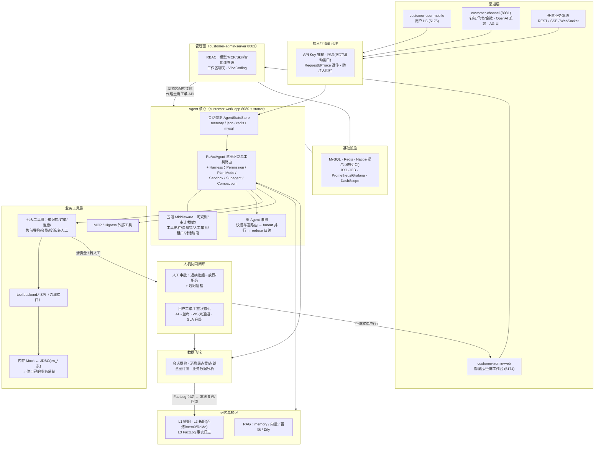
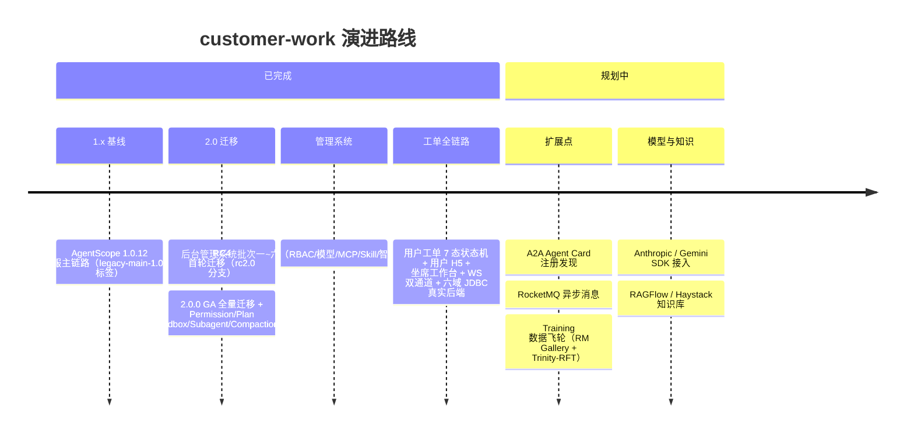

# customer-work · 基于 AgentScope Java 的生产级智能客服系统

[](https://github.com/liulangjietou/customer_work/actions/workflows/ci.yml)
[](LICENSE)
[](#快速开始)
[](https://github.com/agentscope-ai/agentscope-java)

> 🚀 **新人从这里开始**：[docs/新人必读.md](docs/新人必读.md)（15 分钟跑起来 + 看懂结构 + 知道改哪里）
> 📖 **功能总表 / 接口速查 / 配置项 / 各功能用法**：[docs/功能与配置全量参考.md](docs/功能与配置全量参考.md)

## 一、这个项目是做什么的

**把一张典型的电商客服业务流程图，落成一套可以直接上生产的代码实现。**

它覆盖一个真实智能客服系统的完整生命周期——用户从任意渠道进来，经过接入治理，由 AI Agent
理解意图并调用业务工具解决问题；解决不了的转人工坐席走工单闭环；全程的对话、审批、质检数据
沉淀下来形成数据飞轮。同时配套一个后台管理系统，让运营人员可视化地管理模型、MCP、技能与智能体。

技术底座是 **[AgentScope Java](https://github.com/agentscope-ai/agentscope-java) 2.0.0 GA**
（`io.agentscope:agentscope-harness`），模型默认对接**阿里云百炼（DashScope / 通义千问）**，
支持 OpenAI / Anthropic / Gemini / Ollama 多厂商切换与私有化兜底。

### 核心能力（四条主线）

| 主线 | 内容 |
|---|---|
| **AI 对话主链路** | ReAct 智能体 + 七大业务工具组（知识库/订单/售后/售前导购/会员/投诉/人工）、SSE 流式输出、结构化意图识别、多 Agent 编排（快慢车道路由 → 真并行 fanout → reduce 归纳）、三层记忆（短期/长期/事实日志）、RAG 知识检索、上下文压缩 |
| **人机协同闭环** | 涉资金操作人工审批（挂起 → 人工放行 → 执行）、人机切换工单、面向终端用户的 **7 态工单状态机**（用户 H5 ↔ AI ↔ 坐席工作台，WebSocket 双通道实时消息 + SLA 巡检） |
| **生产工程化** | 会话持久化四后端可切（memory/json/redis/mysql）、鉴权限流、防注入围栏、模型重试/兜底/成本熔断、全链路可观测（Prometheus 指标 + MDC + Tracing）、优雅停机、Nacos 提示词热更新、XXL-JOB 调度 |
| **数据飞轮 + 管理面** | 会话质检、消息级用户反馈、意图自动化评测、业务数据分析聚合；后台管理系统提供 RBAC、模型/MCP/Skill/智能体管理、在线聊天与 VibeCoding |

### 设计原则

- **每个能力都是「配置开关 + 可替换实现」**：内置进程内实现保证开箱即用与离线单测全绿，
  生产一行配置切到 Redis/MySQL/云端后端，业务代码零改动。
- **可改造为你自己的业务 Agent**：业务工具只暴露 Schema，真正逻辑委托给 `tool.backend.*` SPI 接口
  （订单/商品/售后/会员/投诉/知识库六域）。引入 starter 依赖 + 声明自己的 `*Backend` Bean，
  即可接入自有业务系统，无需改框架代码。
- **测试基线 873 个全绿**（starter 497 + app 56 + channel 8 + admin-server 312），
  外部依赖门控测试不可达自动跳过，任何环境 `mvn test` 都绿。

## 二、模块说明

| 模块 | 端口 | 说明 |
|---|---|---|
| `customer-work-spring-boot-starter` | — | **可复用智能体基础设施**（Maven 依赖）：模型/记忆/RAG/工具 SPI/五段 Middleware/审批/工单/调度等全部能力，`@AutoConfiguration` 自动装配，下游零扫描接入 |
| `customer-work-app` | 8080 | **可运行的客服应用**：HTTP/SSE/WebSocket 接口层 + 提示词/技能资源，能力全部来自 starter |
| `customer-admin-server` | 8082 | **后台管理系统·后端**（Spring MVC + MyBatis-Plus + Sa-Token，独立库 `customer_admin`）：RBAC、模型/MCP/Skill/智能体管理、工作区聊天/VibeCoding、用户工单代理 |
| `customer-admin-web` | 5174 | **后台管理系统·前端**（Vue3 + TS + Element Plus，非 Maven 模块）：动态路由/按钮级权限/坐席工单工作台 |
| `customer-user-mobile` | 5175 | **终端用户 H5**（Vue3 + Vant4，非 Maven 模块）：注册登录/AI 对话/我的工单，proxy → 8080 |
| `customer-channel` | 8081 | **多渠道接入演示**（非主链路必需）：OpenAI 兼容 `/v1/chat/completions`、AG-UI、admin 控制台、Studio、钉钉/飞书/企业微信 IM 接入 |

支撑目录：`mysql/`（三套建库脚本：主业务库/admin 库/XXL-JOB 库）、`docs/`（文档，见文末地图）、
`scripts/`（构建与启动脚本）、`Dockerfile` + `docker-compose.yml`（一键起 app + Redis + MySQL + Nacos）。

## 三、全景架构与业务流程



**一次典型的用户请求**：用户在 H5 发消息 → 鉴权限流与防注入检查 → 按 `(userId, sessionId)`
恢复会话状态 → ReAct 循环理解意图并调用业务工具（查订单/退款/查知识库…）→ 涉资金操作生成待审单
挂起等人工放行；用户说"转人工"则工单流转到坐席工作台，坐席经 WebSocket 与用户实时对话，结案后
会话回收给 AI 续接 → 全程指标、审计、质检、反馈落入数据飞轮。

## 四、Roadmap



> 规划中各项的落地路径、依赖与工作量评估见
> [docs/功能与配置全量参考.md §十](docs/功能与配置全量参考.md#十未实现--需外部基础设施的扩展点)。

## 五、快速开始

```bash
# 方式一：本地运行（默认内存模式，零外部依赖）
export DASHSCOPE_API_KEY=你的百炼密钥
mvn spring-boot:run

# 方式二：Docker Compose 一键起（app + Redis + MySQL + Nacos）
docker compose up -d

# 试一下
curl -X POST http://localhost:8080/api/customer/chat \
  -H "Content-Type: application/json" \
  -d '{"sessionId":"u1001","message":"帮我查一下订单 20260613001 的状态和物流"}'
```

启动后打开 **http://localhost:8080/swagger-ui.html** 在线调试全部接口。
后台管理系统与用户 H5 的启动方式见 [docs/功能与配置全量参考.md](docs/功能与配置全量参考.md)（§6.21 / §6.22）。

## 六、文档地图

| 想了解什么 | 去读 |
|---|---|
| 15 分钟跑起来 + 看懂结构 | [docs/新人必读.md](docs/新人必读.md) |
| 功能总表 / 接口速查 / 配置项 / 各功能用法与测试 | [docs/功能与配置全量参考.md](docs/功能与配置全量参考.md) |
| 架构原理 / 时序图 / UML / 用户工单系统设计 | [docs/详细技术文档.md](docs/详细技术文档.md) |
| 1.x→2.0 API 映射与不可迁移能力 | [docs/MIGRATION-2.0.md](docs/MIGRATION-2.0.md) |
| 生产部署步骤 / 环境变量 / 灰度回滚 | [docs/部署手册.md](docs/部署手册.md) |
| 接入方对接（鉴权/端点示例/故障排查） | [docs/生产接口使用手册.md](docs/生产接口使用手册.md) |
| 框架 open issues 与本项目链路交叉评估 | [docs/生产就绪评估.md](docs/生产就绪评估.md) |
| 多渠道接入（钉钉/飞书/企微/AG-UI/Studio） | [docs/customer-channel操作文档.md](docs/customer-channel操作文档.md) |

## 关注作者

如果你对 AI 及本项目感兴趣，欢迎关注我的微信公众号 **AI赛博炼丹炉**，将带来更多高质量文章和干货。

<p align="center">
  
</p>
