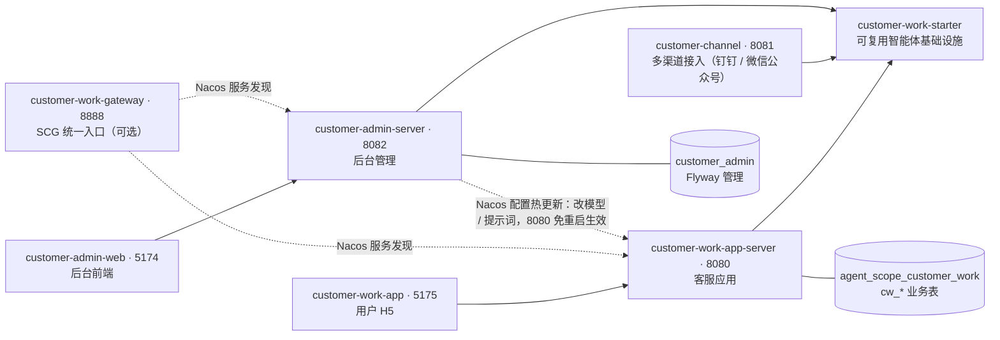
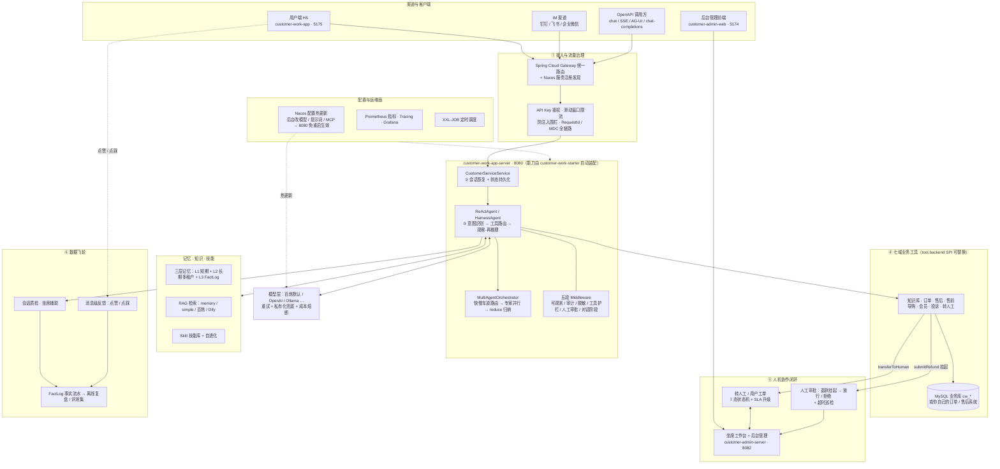
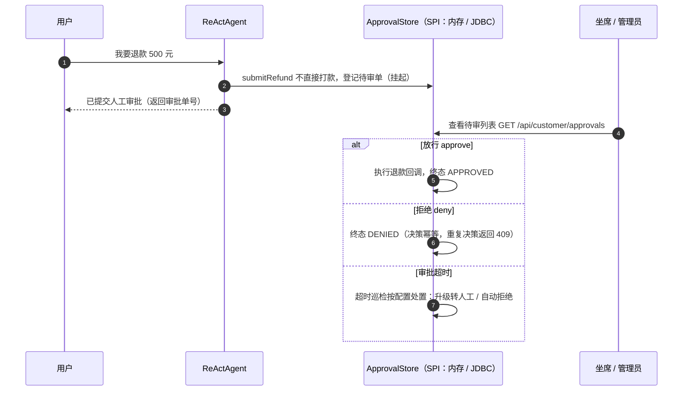
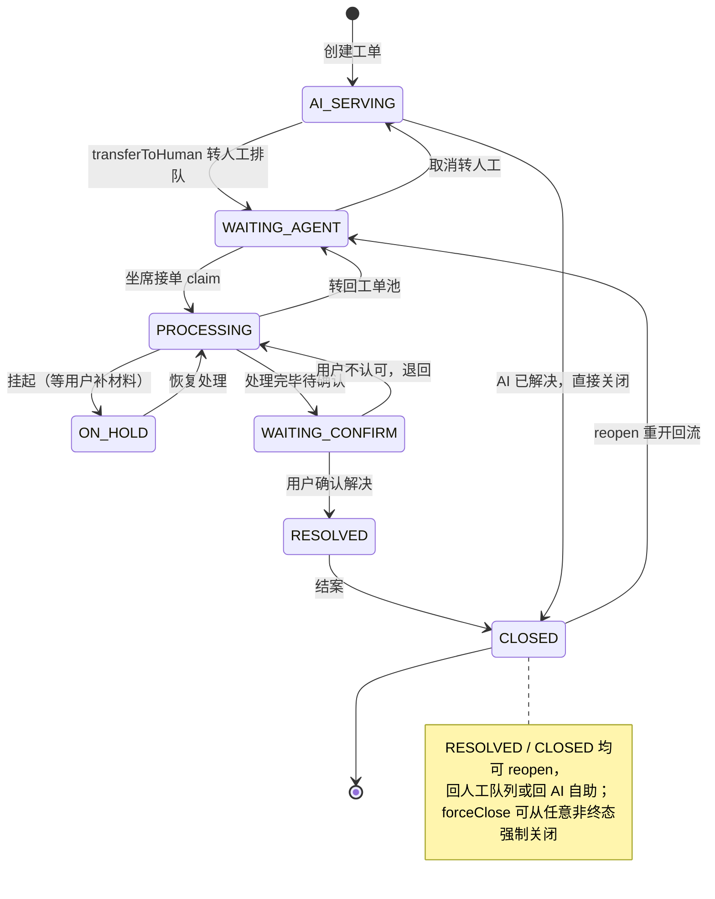
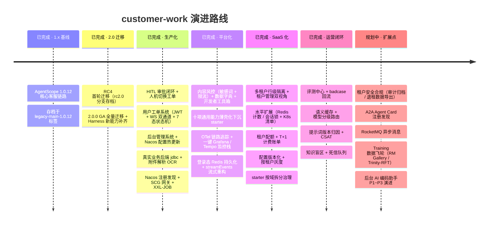

# customer-work · 基于 AgentScope Java 的生产级智能客服系统

[](https://github.com/liulangjietou/customer_work/actions/workflows/ci.yml)
[](LICENSE)
[](docs/新人必读.md)
[](https://github.com/agentscope-ai/agentscope-java)

> 🚀 **新人从这里开始**：[docs/新人必读.md](docs/新人必读.md)（15 分钟跑起来 + 看懂结构 + 知道改哪里）
> 📚 **功能 / 配置 / 接口的全部细节**：[docs/功能与配置全量参考.md](docs/功能与配置全量参考.md)（本 README 只讲"是什么、长什么样"，"怎么用"都在那里）

## 一、这个项目是做什么的

**把一张典型的客服业务流程图，落成一套可上生产的代码**：从接入与流量治理、会话恢复、意图识别与路由、
七域业务工具执行，到人工审批 / 转人工工单的人机协作闭环，再到质检反馈驱动的数据飞轮——全链路可运行、可测试、可部署。

- **技术底座**：`io.agentscope:agentscope-harness:2.0.0`（GA 正式版），模型默认对接**阿里云百炼（DashScope / 通义千问）**，
  完整用上 2.0 新能力（Permission / Plan Mode / Compaction / Sandbox / Subagent / 五段 Middleware）。
- **设计原则**：**每个能力 = 一个配置开关 + 一个可替换实现**。默认内置实现保证离线开箱即用、单测全绿；
  改一行配置或声明一个 Bean，即可切到 Redis / MySQL / 百炼 / Nacos 等真实后端，业务代码零改动。
- **可改造为你自己的业务 Agent**：业务工具壳只暴露 Schema，真正逻辑委托给 `tool.backend.*` SPI 接口
  （Order / AfterSales / Knowledge / Product / Member / Complaint），实现接口或覆盖 Bean 即可接入自有订单 / 售后 / 知识系统，
  无需改框架代码（用法见 [全量参考 §6.9](docs/功能与配置全量参考.md)）。
- **两套完整系统**：智能客服系统（AI 对话 + 用户工单 + 坐席协作）+ 后台管理系统（模型 / 提示词 / MCP / 渠道 /
  定时任务 / 工单工作台，改配置经 Nacos 热更新到运行中的客服应用，免重启）。
- **多租户 SaaS 就绪（默认关闭）**：共享库 + `tenant_id` 行级隔离（MyBatis-Plus 拦截器全局改写，缺上下文 fail-closed），
  配套租户配额与 T+1 计费账单、配置版本化与按租户灰度发布、多副本水平扩展（Redis 窗口计数 / 会话锁 + `deploy/k8s/` 清单）。
  不开启时单租户部署行为与升级前完全一致，设计见 [多租户架构设计](docs/多租户架构设计.md)。

## 二、模块结构

| 模块 | 端口 | 类型 | 说明 |
|---|---|---|---|
| `customer-work-starter` | — | Maven | **可复用智能体基础设施**：模型 / 会话 / 记忆 / RAG / 工具 SPI / Middleware / 审批 / 工单 / 用户 / 聊天记录…… `@AutoConfiguration` 自动装配，可作为依赖被任意工程引入 |
| `customer-work-app-server` | 8080 | Maven | **可运行客服应用**：HTTP + SSE + WebSocket 接口、用户工单系统、Swagger 文档 |
| `customer-channel` | 8081 | Maven | **多渠道接入**：官方五套前端能力演示（admin 控制台 / chat-completions / AG-UI / Studio / 钉钉·飞书·企业微信）+ 生产用渠道接入层（**钉钉 + 微信公众号**机器人 ↔ 后台工作区智能体，连接器 SPI 预留企业微信） |
| `customer-admin-server` | 8082 | Maven | **后台管理系统后端**：Spring MVC + MyBatis-Plus + Sa-Token，独立库 `customer_admin`，含坐席工单工作台与 AI 编码助手 |
| `customer-work-gateway` | 8888 | Maven | **统一入口网关（可选）**：Spring Cloud Gateway + Nacos 服务发现，把 8080 / 8082 聚合到同一入口 |
| `customer-admin-web` | 5174 | 前端 | **后台管理前端**：Vue3 + TS + Vite + Element Plus（非 Maven 模块） |
| `customer-work-app` | 5175 | 前端 | **终端用户 H5**：Vue3 + TS + Vite + Vant4，登录 / 聊天 / 我的工单（非 Maven 模块） |

模块间的依赖与数据边界（三个后端服务都只依赖 starter，两个库彻底分离）：



> 附属目录：`mysql/` 建库脚本（业务库 / admin 库 / XXL-JOB 库）、`docker/` 中间件编排（MinIO / PaddleOCR /
> [observability](docker/observability/README.md) 一键监控栈：Prometheus + Grafana + Alertmanager + Tempo + 钉钉告警）、
> [deploy/k8s/](deploy/k8s/README.md) 多副本 K8s 清单（Deployment / HPA / PDB / 探针 / 优雅停机）、
> `Dockerfile` + `docker-compose.yml` 一键起应用与依赖、`.github/workflows/ci.yml` CI。
> starter 的代码分层与"作为依赖引入"的方式见 [全量参考 §九](docs/功能与配置全量参考.md)。

**可观测性**：应用侧默认暴露 Prometheus 指标；开启 `customer-work.observability.otel.enabled`（starter）/
`admin.observability.otel.enabled`（admin）后接入 OpenTelemetry，按 agent/model/tool（starter 另加 HTTP 入口）
三段出 span 并经 OTLP 导出。配套的一键监控栈见 [docker/observability/README.md](docker/observability/README.md)，
预置 Prometheus + Grafana（4 张仪表盘）+ Alertmanager（13 条告警规则 + 钉钉转发）+ Tempo 链路追踪后端；
详细配置项见 [全量参考 §6.13c](docs/功能与配置全量参考.md#613c-otel-链路追踪最后一公里)，
生产部署步骤见 [部署手册 §九](docs/部署手册.md#九可观测性与告警)。

## 三、架构图与核心流程

### 3.1 全景架构

一次用户消息从渠道进来，到 AI 回复 / 人工接管 / 数据沉淀的完整链路（①~⑥ 对应客服业务流程图的六个阶段）：



### 3.2 退款人工审批闭环（挂起 → 人工决策 → 生效）

高风险工具不直接生效：`submitRefund` 只登记待审单，人工放行后才执行退款回调（详见 [全量参考 §6.11](docs/功能与配置全量参考.md)）：



### 3.3 用户工单 7 态状态机（AI 自助 ↔ 人工坐席全生命周期）

状态名与代码 `TicketStatus` 枚举一一对应，非法流转 fast-fail：



## 四、能力地图

细节（配置项、curl 示例、对应测试类）全部在 [功能与配置全量参考](docs/功能与配置全量参考.md)，此处只给地图：

| 能力域 | 内容 | 全量参考 |
|---|---|---|
| 对话与编排 | 同步 / SSE 流式 / 结构化意图 / AG-UI 协议 / 多 Agent 快慢车道路由 + 并行聚合 / 安全中断 | §6.1~6.3 |
| 会话与记忆 | 会话状态持久化（memory/json/redis/mysql）、多租户长期记忆（百炼/Mem0/ReMe）、三层记忆 + FactLog、上下文压缩 | §6.4~6.7 |
| 知识与技能 | RAG 四后端（内存/向量/百炼/Dify）、Skill 技能库 + 自进化 + 代码执行 | §6.8、§6.10 |
| 业务工具 | 七域工具组覆盖售前→售中→售后全旅程，`tool.backend.*` SPI 一键换成你的真实系统（jdbc 实现内置） | §6.9 |
| 人机协作 | 退款人工审批闭环（挂起→放行）、转人工工单、多轮槽位收集、审批/工单持久化 SPI + 超时/SLA 巡检 | §6.11 |
| 用户工单系统 | 终端用户 JWT 认证、7 态工单状态机、用户/坐席 WebSocket 双通道、事务化工单写入 + 数据库 Outbox 可靠事件、聊天消息落库、附件解析（OCR + 文档） | §6.21~6.23 |
| 模型层 | 多厂商（百炼/OpenAI/Anthropic/Gemini/Ollama）、私有化兜底、重试、成本熔断、token 告警 | §6.12~6.13b |
| 安全与治理 | API Key 鉴权、限流（全局兜底 + 后台可维护的路径规则层）、敏感词内容风控（一次拦截/打码/复核 + 命中看板）、入站防注入围栏、敏感信息脱敏、Permission 三态权限、沙箱 | §6.14~6.14.2、§6.18 |
| 可观测与运维 | Prometheus 业务指标、Outbox/死信队列健康与积压告警、原生 Tracing、OTel 链路追踪（真出 span + OTLP 导出）、MDC 全链路日志、慢请求留证、合成监控、优雅停机、一键 Grafana/Tempo/Alertmanager 监控栈 | §6.13~6.13c |
| 配置面 | Nacos 提示词/运行时配置热更新（后台 8082 改 → 客服 8080 免重启生效）、配置版本化快照 + 一键回滚 + 按租户灰度发布、MCP / Higress / Studio 接入 | §6.15~6.17、§6.30 |
| 多租户 SaaS | 租户行级隔离（拦截器全局改写 + fail-closed）、租户管理与双视角权限、水平扩展（Redis 窗口计数 / 会话锁 + K8s 清单）、租户 token 配额 + T+1 计费账单 | §6.27~6.29 |
| 数据飞轮 | 会话质检、坐席辅助、消息级点赞点踩、意图自动化评测（CI 可跑） | §6.11 末、§6.20 |
| 运营闭环 | 评测中心（触发/报告/与上一版对比归因）、badcase 回流（负反馈→采纳为知识条目或评测用例）、语义缓存（白名单意图，命中即省整条模型链）、提示词版本（内容指纹归因）、CSAT 满意度（邀请与回收分开记）、知识盲区 TopN、死信队列（指数退避重投，耗尽转 ABANDONED 不删） | §6.31 |
| 后台管理系统 | RBAC 权限、模型/MCP/Skill/智能体配置、工作区聊天 + VibeCoding、渠道、定时任务(XXL-JOB)、工单工作台、内容风控、数据字典、开发者工具箱（HTTP/证书/cron/JWT/diff/格式互转/SQL 客户端等）、调用统计（token + 缓存命中率）、AI 编码助手 | §6.21 |

## 五、快速开始

```bash
# 方式一：本地运行（示例应用默认使用本机 MySQL；纯内存宿主可按需关闭 JDBC 域与迁移）
export DASHSCOPE_API_KEY=你的百炼密钥      # 必填，密钥仅从环境变量读取
mvn -pl customer-work-app-server -am spring-boot:run

# 方式二：Docker Compose 一键起（app + Redis + MySQL + Nacos）
docker compose up -d

# 发一条消息试试
curl -X POST http://localhost:8080/api/customer/chat \
  -H "Content-Type: application/json" \
  -d '{"sessionId":"u1001","message":"帮我查一下订单 20260613001 的状态和物流"}'
```

- 启动后打开 **http://localhost:8080/swagger-ui.html** 在线调试全部接口。
- 跑测试（无需 API Key，任何环境全绿）：`mvn test` ——当前基线 **2222 个**（starter 1323 + admin-server 753 +
  app 80 + customer-channel 65 + gateway 1），外部依赖（Redis/MySQL/Nacos/百炼/OCR/MinIO）不可达的用例自动跳过。
- 环境要求、前端启动、构建坑位速查见 [新人必读](docs/新人必读.md)。

## 六、Roadmap



规划中的能力框架均已提供扩展点（保留为"配置即用"，不硬编入以保证开箱即用）：

| 方向 | 需要 | 说明 |
|---|---|---|
| A2A Agent Card 注册发现 | 新版 nacos-client AI API + `io.a2a` SDK | Nacos 配置中心层已落地，待 SDK 坐标 |
| RocketMQ 异步消息 / 消息总线 | RocketMQ broker | 任务解耦 / A2A over MQ |
| Training 数据飞轮 | RM Gallery + Trinity-RFT 平台 | FactLog 数据出口已就绪，待平台对接 |
| Anthropic / Gemini 模型 | 各厂商 SDK 依赖 | 代码已就绪，补依赖即可 |
| RAGFlow / Haystack 知识库 | 对应 client | 同 Dify 模式扩展 `KnowledgeProvider` |
| 远端云沙箱（k8s / e2b 等） | `agentscope-extensions-sandbox-*` | local / docker 沙箱已内置 |
| 后台 AI 编码助手 P1~P3 | P1-2 / P2-1~P2-3 已完成 | 交互式运行、Bug/日志诊断、自动化重构、沙箱管理与多 Agent 协作编程，见[需求文档 §8](docs/AI编码助手需求文档.md) |

## 七、文档地图

| 想解决的问题 | 去读 |
|---|---|
| 15 分钟跑起来、看懂结构、知道改哪里 | [docs/新人必读.md](docs/新人必读.md) |
| 功能总表、配置项、接口速查、各功能用法与测试 | [docs/功能与配置全量参考.md](docs/功能与配置全量参考.md) |
| 架构原理、时序图、UML 类图、扩展点 | [docs/详细技术文档.md](docs/详细技术文档.md) |
| 多租户隔离模型、逐表归属、身份链路 | [docs/多租户架构设计.md](docs/多租户架构设计.md) |
| 全部接口的请求 / 响应示例（生产调用方视角） | [docs/生产接口使用手册.md](docs/生产接口使用手册.md) |
| 生产部署步骤、环境变量、建表、灰度回滚 | [docs/部署手册.md](docs/部署手册.md) |
| 1.x→2.0 API 映射、RC4→GA 变更、issue 核对 | [docs/MIGRATION-2.0.md](docs/MIGRATION-2.0.md) |
| 框架 open issues 与本项目链路的交叉评估 | [docs/生产就绪评估.md](docs/生产就绪评估.md) |
| 五套官方前端能力接入（8081 演示模块） | [docs/customer-channel操作文档.md](docs/customer-channel操作文档.md) |
| 后台管理系统需求与实施路线 | [docs/AI编码助手需求文档.md](docs/AI编码助手需求文档.md) |

## 八、重要说明

- **分支策略**：`main` 有分支保护、禁止直接 push，开发从 `main` 切分支走 PR；`legacy-main-1.0.12` 标签与
  `rc2.0` 分支为历史存档，不再更新。
- 基于官方 GA 坐标 `io.agentscope:agentscope-harness:2.0.0`（`agentscope-bom` 统一管理版本）；框架高速迭代，
  升级遇 API 不匹配请对照该版本源码微调。
- API Key 支持配置项与环境变量两种来源，**生产请用环境变量注入**，勿把密钥留在仓库。
- 客服业务库由 starter 的 Flyway 管理；存量非空库以版本 `0` 接管后顺序执行增量迁移，迁移失败会阻断启动。
- 工单状态、事件轨迹和 Outbox 在同一本地事务中提交；消费语义为至少一次，处理器必须按稳定事件 ID 幂等。
- CI 会扫描当前提交中的常见密钥格式。若密钥曾进入 Git 历史，删除文件内容不足以止损，仍须立即吊销并轮换。
- 业务链路全异步（`Mono`/`Flux`，无 `.block()`）；所有外部后端均为配置开关，默认实现保证离线开箱即用与单测全绿。
- 包名按模块划分，根均为 `com.richard.fyoung`：starter `…customerwork`、app-server `…customerworkapp`、
  channel `…customerchannel`、admin-server `…customeradmin`、gateway `…customerworkgateway`。

## 关注作者

如果你对 AI 及本项目感兴趣，欢迎关注我的微信公众号 **AI赛博炼丹炉**，将带来更多高质量文章和干货。

<p align="center">
  
</p>
