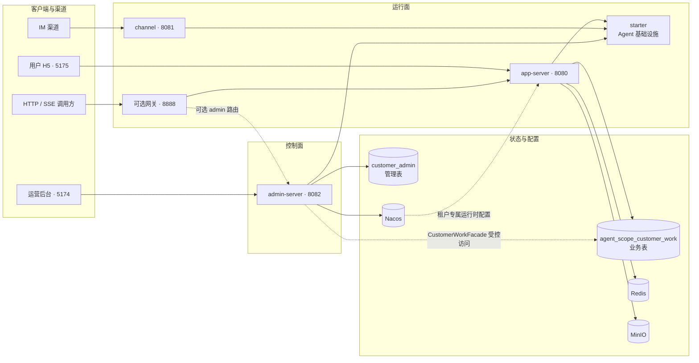
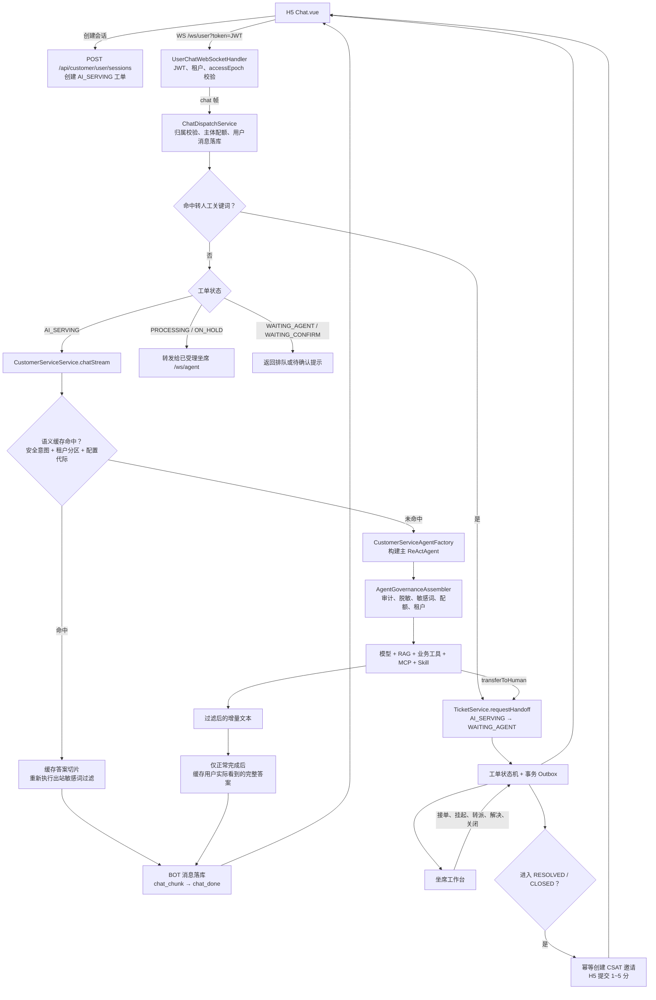
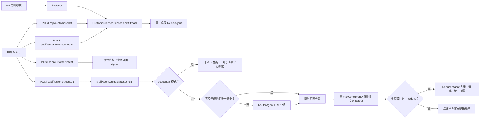
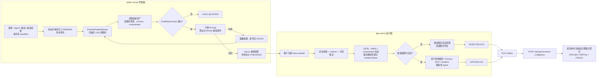
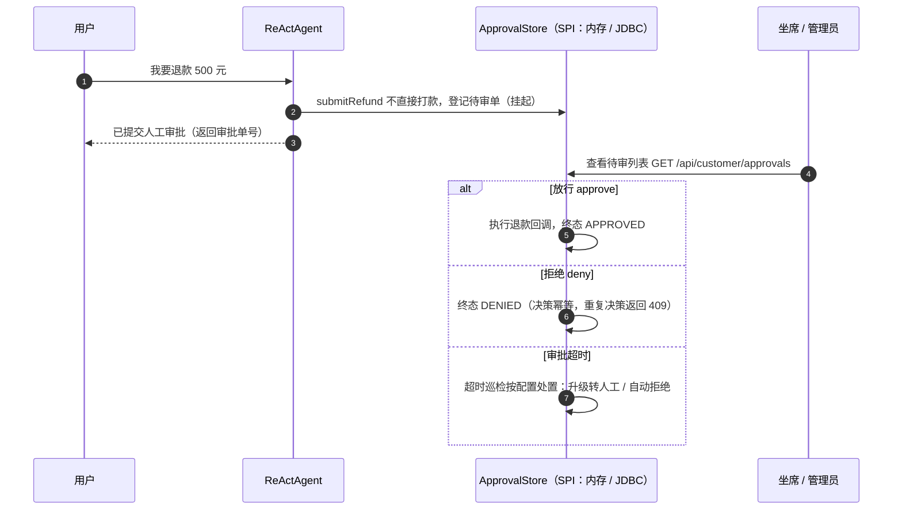
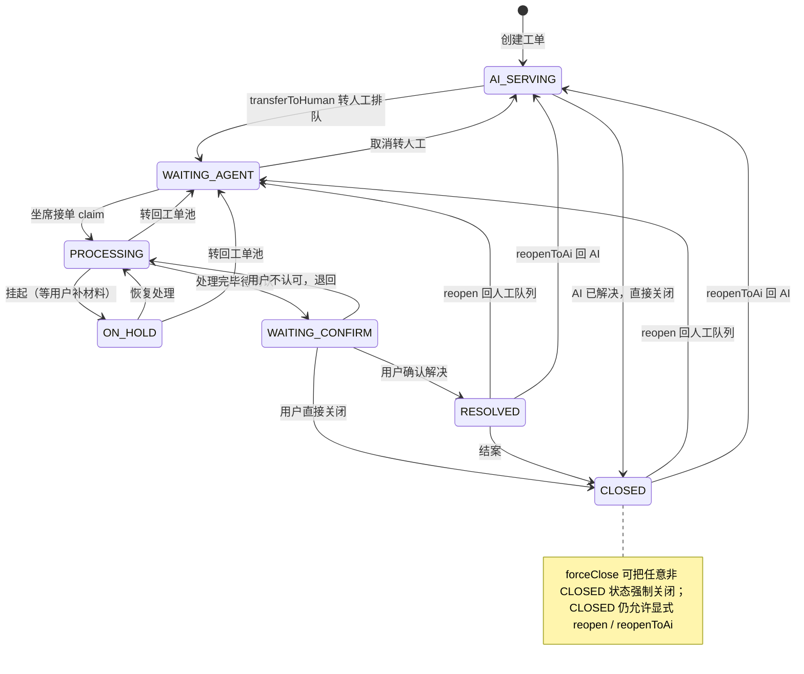
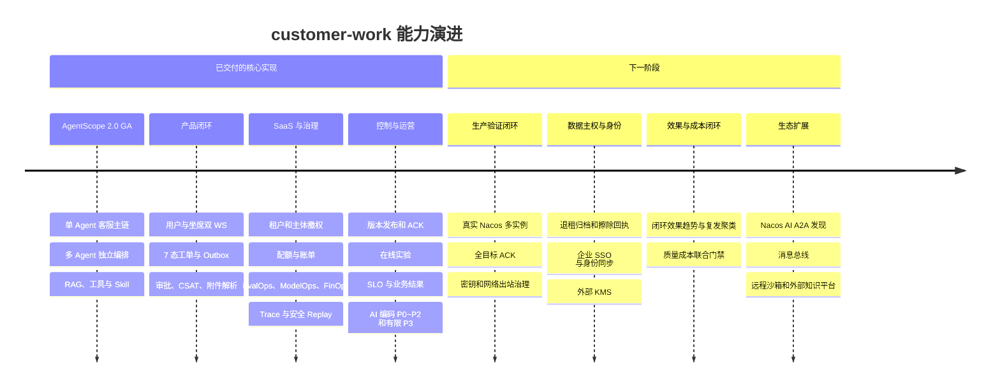

# customer-work · 基于 AgentScope Java 的企业级智能客服与 Agent 平台

[](https://github.com/liulangjietou/customer_work/actions/workflows/ci.yml)
[](https://github.com/liulangjietou/customer_work/releases)
[](LICENSE)
[](docs/新人必读.md)
[](https://github.com/agentscope-ai/agentscope-java)
[](https://spring.io/projects/spring-boot)
[](https://baomidou.com)
[](https://sa-token.cc)
[](https://vuejs.org)
[](https://element-plus.org)
[](https://vant-ui.github.io)
[](docker-compose.yml)
[](docker-compose.yml)
[](docker-compose.yml)
[](docker-compose.yml)
[](docker-compose.yml)
[](docker/paddleocr/docker-compose.yml)
[](https://opentelemetry.io)

> 🚀 **第一次使用**：[快速开始](#五快速开始) → [新人必读](docs/新人必读.md)<br>
> 📚 **查功能、配置和接口**：[功能与配置全量参考](docs/功能与配置全量参考.md) ·
> [生产接口使用手册](docs/生产接口使用手册.md) · [部署手册](docs/部署手册.md)<br>
> 🛡️ **评估生产边界**：[企业级 AI 智能体能力与运维边界](docs/企业级AI智能体能力与运维边界.md)

## 作品演示
[]([https://www.bilibili.com/video/BV1o6tJ69E6s](https://www.bilibili.com/video/BV1EdtE6REYo/?spm_id_from=333.1387.homepage.video_card.click&vd_source=03686e8b5675ab4a5314432c9c02feeb))

## 导航

- [项目定位](#一项目定位)
- [模块与运行边界](#二模块与运行边界)
- [架构图与核心流程](#三架构图与核心流程)
- [能力地图](#四能力地图)
- [快速开始](#五快速开始)
- [Roadmap](#六roadmap)
- [文档地图](#七文档地图)
- [重要边界](#八重要边界)

## 一、项目定位

customer-work 把典型客服流程落成一套可运行的 Java Agent 系统：从接入与身份校验、会话恢复、知识与工具调用，
到退款审批、转人工工单、CSAT，再到模型发布、评测门禁、FinOps、SLO 与多租户治理。它既能作为可运行的
客服产品参考实现，也能只引入 `customer-work-starter`，把 Agent 基础设施嵌入已有 Spring Boot 应用；
默认启动成功不等于已经完成真实业务、身份、数据主权与生产环境集成。

- **技术基线**：项目版本 `2.4.0`，JDK 17、Spring Boot 3.2.5、AgentScope Java 2.0.0 GA；默认模型为
  阿里云百炼，同时已接入 OpenAI、Anthropic、Gemini 与 Ollama 模型扩展。
- **两套产品面**：用户侧客服系统（H5 / HTTP / SSE / WebSocket / 工单）与运营控制台（模型、Agent、MCP、
  渠道、评测、发布、账单、工单与 AI 编码助手）。
- **可替换业务后端**：工具 Schema 与业务实现分离，订单、售后、知识、商品、会员、投诉等能力通过
  `tool.backend.*` SPI 接入真实系统；用法见[全量参考 §6.9](docs/功能与配置全量参考.md)。
- **SaaS 与治理**：共享库 `tenant_id` 行级隔离、角色数据范围、主体/租户配额、配置版本、灰度发布、
  访问 epoch 撤权、ModelOps / EvalOps / FinOps 与审计链路均已有代码和自动化测试。
- **默认值有明确边界**：客服端租户隔离默认关闭，后台租户隔离与数据范围默认开启；starter 的语义缓存默认关闭，
  示例 app 已显式开启；Nacos 热更新、OTel、合成健康巡检仍需显式配置。默认关闭不等于未实现。

### 1.1 成熟度口径

| 标记 | 含义 |
|---|---|
| ✅ 已交付 | 源码、接口/迁移契约和自动化测试均已落地 |
| 🟡 可选能力 | 已实现，但默认关闭或需要 MySQL、Redis、Nacos、模型凭据等外部条件 |
| 🧪 有限实现 | 主链路可用，但存在文档明确列出的能力或生产边界 |
| ⏳ 规划中 | 当前没有可直接启用的完整实现，Roadmap 只描述目标与验收出口 |

> “企业级 / 生产级”描述的是代码中的治理目标与交付能力，不代表任意部署已经自动通过生产验收。
> 真实 Nacos 往返、多 Pod ACK、生产模型凭据、网络出站策略和浏览器端到端验证仍需在目标环境留证。

### 1.2 核心术语

| 术语 | 本项目中的含义 |
|---|---|
| 主体（subject） | 已验签用户、匿名 IP、API Key 或后台用户，是配额、记忆与审计的身份边界 |
| access epoch | 租户 / 用户访问版本号；冻结、退租或撤权时递增，让旧 JWT / WebSocket 快照失效 |
| fencing | 发布 Worker 的单调令牌；旧 Worker 即使恢复，也不能覆盖新 Worker 已发布的配置 |
| contentHash / 缓存代际 | 配置内容指纹及其对应缓存版本，用来拒绝错配 ACK 和旧请求回写 |
| Outbox | 业务事务内先落事件，再异步至少一次投递；消费者必须按稳定事件 ID 幂等 |
| SecretRef | 只保存凭据引用和版本，不在业务表、接口或配置载荷中回显明文 |
| AG-UI / A2A | 前者是 Agent 与 UI 的事件协议；后者是 Agent 之间的发现与调用协议，两者不等同于模型 API |

## 二、模块与运行边界

| 模块 | 默认端口 | 职责 | 主要依赖 |
|---|---:|---|---|
| `customer-work-starter` | — | 可复用 Agent 基础设施：模型、会话、记忆、RAG、工具 SPI、治理中间件、审批与工单 | AgentScope Java、Spring Boot AutoConfiguration |
| `customer-work-app-server` | 8080 | 客服运行面：HTTP / SSE / WebSocket、用户工单与健康检查 | `customer-work-starter`、MySQL；Redis / 对象存储按能力启用 |
| `customer-channel` | 8081 | 协议与渠道适配：chat-completions、AG-UI、Studio、钉钉 / 飞书 / 企业微信；另含钉钉与微信公众号生产接入 | `customer-work-starter`、渠道连接器 |
| `customer-admin-server` | 8082 | 运营控制面：模型、Agent、MCP、评测、发布、账单、坐席工作台与 AI 编码助手 | `customer-work-starter`、独立 `customer_admin` 库 |
| `customer-work-gateway` | 8888 | 可选统一入口，通过 Nacos 发现并路由 app / admin | Spring Cloud Gateway、Nacos |
| `customer-admin-web` | 5174 | Vue 3 运营后台 | 8082 API |
| `customer-work-app` | 5175 | Vue 3 用户 H5：登录、聊天、工单、CSAT | 8080 API / WebSocket |



- 根目录 `docker-compose.yml` 只编排 app-server 与 Redis、MySQL、MinIO、Nacos、XXL-JOB、PaddleOCR，
  **不包含** admin-server、channel、gateway、两个前端和监控栈。
- app 业务表与 admin 管理表分库治理；admin 对业务库的跨边界访问必须经 `CustomerWorkFacade`，不能直接复用管理库 Mapper。
- Nacos 热更新默认关闭，且是“控制面发布、运行面消费”的单向配置链；租户配置缺失时保留最后安全值，不跨租户回退。
- [deploy/k8s/](deploy/k8s/README.md) 只提供 app / admin 的工作负载、Service、HPA、PDB 和探针，基础设施、Ingress、
  网关与前端需由部署环境另行提供。

应用默认暴露 Prometheus 指标；显式开启 OTel 后可导出 agent / model / tool / HTTP span。
[独立监控栈](docker/observability/README.md) 提供 Prometheus、Grafana、Alertmanager、Tempo 与钉钉告警，
启动前需先运行业务服务并配置监控栈自己的 `.env`。详细配置见
[全量参考 §6.13c](docs/功能与配置全量参考.md#613c-otel-链路追踪最后一公里)。

## 三、架构图与核心流程

### 3.1 H5 对话、转人工与 CSAT 闭环

H5 的逐消息主链路是单一客服 `ReActAgent`。多 Agent 编排是独立能力，不在 WebSocket 每条消息中隐式执行。



缓存查找发生在主 Agent 中间件之前：命中时不会再次跑入站 `SensitiveWordMiddleware`，但会执行专门的
出站敏感词过滤；未命中才进入完整 Agent 治理链。关键实现：
[`ChatDispatchService`](customer-work-app-server/src/main/java/com/richard/fyoung/customerworkapp/chat/ChatDispatchService.java)、
[`CustomerServiceService`](customer-work-starter/src/main/java/com/richard/fyoung/customerwork/core/service/CustomerServiceService.java)、
[`CsatTicketInviteListener`](customer-work-starter/src/main/java/com/richard/fyoung/customerwork/capability/csat/CsatTicketInviteListener.java)。

### 3.2 HTTP 与多 Agent 编排边界



`/ws/user` 不调用 `/consult` 或 `/intent`。语义缓存只复用 `fastRouteIntent()` 的纯规则结果判断可缓存意图，
不会触发 RouterAgent、专家 fanout 或 ReducerAgent。接口入口见
[`CustomerServiceController`](customer-work-app-server/src/main/java/com/richard/fyoung/customerworkapp/controller/CustomerServiceController.java)。

### 3.3 运行时配置发布、热更新与 ACK



- admin 与 app 两侧开关默认均为 `false`；namespace、group、base dataId 与 AES 密钥必须成对配置。
- 多租户实例必须指定 `NACOS_TENANT_CODE`；专属配置缺失或删除时保留旧值，不回退主 dataId。
- `PUBLISHED` 只表示 Nacos 已接受配置；发布任务入队时会冻结目标实例清单，集合外 ACK 被拒绝，只有冻结集合
  全部返回 `APPLIED` 才算整批生效。回滚通过 maker-checker 审批后重新发布旧快照完成，不删除历史版本。
- 模型密钥与 MCP headers 都只以密文进入配置载荷；消费端先校验 HMAC-SHA256、`contentHash` 与 keyId，
  再解密并构造候选运行态。签名 key 支持滚动轮换窗口。
- 当前发布器组装主模型、兜底 / 路由策略、系统提示词、MCP、在线实验与 `maxIters`；`retry`、temperature、
  maxTokens、topP、stream 尚未从后台资产完整下发，列入 Roadmap。

### 3.4 退款人工审批闭环（挂起 → 人工决策 → 生效）

高风险工具不直接生效：`submitRefund` 只登记待审单，人工放行后才执行退款回调（详见 [全量参考 §6.11](docs/功能与配置全量参考.md)）：



### 3.5 用户工单 7 态状态机（AI 自助 ↔ 人工坐席全生命周期）

状态名与代码 `TicketStatus` 枚举一一对应，非法流转 fast-fail：



## 四、能力地图

配置项、接口示例与测试入口见 [功能与配置全量参考](docs/功能与配置全量参考.md)；这里同时标明当前边界，
避免把“已有代码”误读成“目标环境已经验收”。

| 能力域 | 状态 | 已有能力 | 当前边界 |
|---|:---:|---|---|
| 对话与编排 | ✅ | 同步 / SSE / WS、结构化意图、AG-UI、单 Agent 主链路、独立多 Agent 快慢路由 / fanout / reduce | H5 不逐消息调用多 Agent |
| 模型与路由 | 🟡 | 百炼、OpenAI、Anthropic、Gemini、Ollama；重试、兜底、模型资产、连续失败/恢复阈值、冷却、人工 override、动态健康路由 overlay、不可变路由、主体 / 租户配额 | 没有“成本熔断器”；持续探测会产生真实调用费用，厂商凭据与可用性仍需环境验收 |
| 会话与记忆 | 🧪 | memory / json / Redis / MySQL 会话，按“租户 + 已验签主体 + Agent”隔离长期记忆，授权、查看、导出、删除、保留清理与 FactLog | 生产隐私闭环以 JDBC 为基线；外部记忆适配器尚未全部满足同等删除 / 导出契约 |
| 知识与 Skill | 🧪 | 内存 / simple / 百炼 / Dify RAG；KnowledgeOps 文档源、增量/删除同步、checkpoint、lineage、ACL、新鲜度/质量门禁；KB/Skill 不可变版本与 Agent 冻结绑定 | 首个托管文档源适配器仅支持 PUSH，向量暂存 MySQL JSON 并在应用层排序；大规模语料仍应接入专用向量库 |
| 业务工具 | ✅ | 知识、订单、售后、导购、会员、投诉、转人工七域工具，`tool.backend.*` SPI 与 JDBC 实现 | 接真实业务系统时必须替换示例后端并保留租户 / 权限上下文 |
| 人机协作 | ✅ | 退款审批挂起、幂等决策、超时巡检、7 态工单、用户 / 坐席 WS、SLA、事务 Outbox、CSAT | 外部退款回调与企业坐席组织需按 SPI 对接 |
| MCP 与工具安全 | 🧪 | MCP / Higress / Studio 接入、DNS/重定向/stdio 出站约束、tool/Agent/渠道/主体授权、SecretRef、工具审计与审批 | 真实 KMS/Vault 与生产网络策略仍需目标环境接入验收 |
| 多租户 SaaS | 🧪 | 行级隔离、双视角数据权限、access epoch 撤权、租户 / 主体配额、T+1 账单、预算告警 | 客服端隔离默认关闭；完整退租归档 / 擦除回执与敏感词租户分区仍在演进 |
| 配置发布 | 🟡 | 不可变版本、Eval gate、maker-checker、签名、冻结目标 ACK、租户灰度、fencing、重试与缓存代际失效 | 默认关闭；真实 Nacos 往返及密钥一致性仍需目标环境留证 |
| EvalOps / ModelOps / FinOps | 🧪 | 评测集 CRUD/导入导出/审核/命名版本/diff、KnowledgeGap/badcase 责任/SLA/制品/复评/可靠发布/线上 revision 效果闭环、双臂启动前离线评测、在线实验、Trace、安全 Replay、SLO 多副本周期评估/告警恢复/可靠通知、逐调用/会话精确成本、日账单对账与业务结果单位成本 | 线上改进结论要求达到最小 revision 曝光，低流量只报 `INCONCLUSIVE`；Replay 默认仅 MOCK；缺价、缺用量或混合币种只报告不完整，不伪造成本 |
| 渠道与 A2A | 🟡 | 多协议渠道适配；可信内网可显式开启直接 A2A 协议导出 | A2A 的 Nacos AI 注册发现未落地，直接导出默认关闭且不等于公网安全边界 |
| 后台与 AI 编码 | 🧪 | RBAC、模型 / Agent / MCP / Skill、渠道、工单、风控、任务、统计与开发工具；AI Coding P0~P2 及 P3-1 / P3-2 有限版本 | 完整暂停恢复、多 Agent 协作编程、远程沙箱、向量化增量索引仍在 Roadmap |

## 五、快速开始

### 5.1 环境要求

- JDK 17；Maven 3.9 推荐。
- Node.js 24 推荐；最低需满足 Vite 8 的 `^20.19.0 || >=22.12.0`。
- Docker Engine 与 `docker compose` v2 兼容 CLI。
- 真实百炼 `DASHSCOPE_API_KEY`；`.env` 只会被 Compose 自动读取，本地 Maven / IDE 启动仍需显式注入环境变量。

### 5.2 最小后端启动

```bash
# 1. app 默认将会话、工单、用户和运营数据写入 MySQL
docker compose up -d mysql

# 2. 在终端 A 注入真实模型密钥，构建并启动 app-server（进程会持续占用前台）
export DASHSCOPE_API_KEY=你的百炼密钥
mvn -pl customer-work-app-server -am -DskipTests package
java -jar customer-work-app-server/target/customer-work.jar

# 3. 另开终端 B 做依赖级健康检查；固定返回 OK 的 /api/customer/health 不能替代它
curl -fsS http://localhost:8080/actuator/health

# 4. 发一条 HTTP 单 Agent 消息；这不是 H5 JWT / WebSocket / 工单闭环验收
curl -fsS -X POST http://localhost:8080/api/customer/chat \
  -H "Content-Type: application/json" \
  -d '{"sessionId":"u1001","message":"帮我查一下订单 20260613001 的状态和物流"}'
```

成功时返回 HTTP 2xx，响应结构为
`{"sessionId":"u1001","reply":"...","messageId":"..."}`；完整 H5 登录、WebSocket、工单与 CSAT 烟测见 5.4。

开发环境可访问 [app Swagger](http://localhost:8080/swagger-ui.html)；`prod` profile 默认关闭 Swagger。
app 启动时会执行 starter 内置的 Flyway 迁移初始化业务表。默认本地配置把会话、语义缓存与主体等级落 JDBC，
分布式计数器仍为进程内实现，因此最小单实例路径不要求 Redis；MinIO / OCR 为惰性依赖，不上传附件时不阻断启动。

### 5.3 app-server 与基础设施 Compose 联调

```bash
cp .env.example .env
# 编辑 .env，将 DASHSCOPE_API_KEY 替换为真实值；不要提交 .env
docker compose up -d --build
docker compose ps
curl -fsS http://localhost:8080/actuator/health
docker compose logs --tail=200 app
```

根 Compose 首次使用空 MySQL 数据卷时创建业务、admin 与 XXL-JOB 三个数据库；initdb 脚本不会在已有数据卷重复执行。
业务表由 app Flyway 迁移，Compose **只创建 admin 数据库，不创建完整 admin 表结构**。首次构建 PaddleOCR 会下载模型且在
Apple Silicon 上经 `linux/amd64` 兼容层运行，耗时通常明显长于其他服务。
根 Compose 当前按默认库 `agent_scope_customer_work` 与 root 用户连库；若修改 `.env` 中的 `MYSQL_DATABASE` 或
`MYSQL_USERNAME`，还需同步扩展 app 的环境变量映射并创建普通用户，不能只改 `.env` 一侧。

已有数据卷若缺少 admin 库，不要删卷；先非破坏性建库，再按 5.4 用 dev profile 执行 admin Flyway：

```bash
docker compose exec mysql mysql -uroot -p \
  -e "CREATE DATABASE IF NOT EXISTS customer_admin CHARACTER SET utf8mb4 COLLATE utf8mb4_unicode_ci;"
```

密码提示出现后输入 `.env` 中的 `MYSQL_ROOT_PASSWORD`；终端不会回显密码。

### 5.4 可选 admin 与前端

```bash
# admin：dev profile 才执行 admin Flyway；Compose Redis 的本地默认密码为 123456
docker compose up -d mysql redis minio
mvn -pl customer-admin-server -am -DskipTests package
SPRING_PROFILES_ACTIVE=dev ADMIN_REDIS_PASSWORD=123456 \
  java -jar customer-admin-server/target/customer-admin-server-*.jar

# 开发环境种子账号 admin/admin，首次登录强制改密
```

两个前端分别在独立终端运行：

```bash
cd customer-admin-web
npm ci
npm run dev         # 5174，/api -> 8082
```

```bash
cd customer-work-app
npm ci
npm run dev         # 5175，/api、/ws -> 8080
```

H5 首次使用可在 5175 页面直接注册，也可先用 API 建立测试账号；登录响应中的 `token` 用于 H5 WebSocket 和
`/api/customer/user/**`：

```bash
curl -fsS -X POST http://localhost:8080/api/customer/auth/register \
  -H 'Content-Type: application/json' \
  -d '{"username":"demo-user","password":"demo123456","nickname":"Demo"}'

curl -fsS -X POST http://localhost:8080/api/customer/auth/login \
  -H 'Content-Type: application/json' \
  -d '{"username":"demo-user","password":"demo123456"}'

# 从登录响应复制 token
export CW_DEMO_TOKEN=eyJ...
curl -fsS -X POST http://localhost:8080/api/customer/user/sessions \
  -H "Authorization: Bearer ${CW_DEMO_TOKEN}"
```

admin 健康检查为 `http://localhost:8082/actuator/health`，开发 Swagger 为
`http://localhost:8082/swagger-ui.html`；生产 profile 同样默认关闭 Swagger。admin 的工单、坐席和部分运营功能会调用
8080，验收这些功能时必须同时保持 app-server 运行。

### 5.5 验证

```bash
# 本地全模块 Java 测试入口；无需模型 API Key
mvn -B -gs settings-central-direct.xml -s settings-central-direct.xml \
  clean test -Djacoco.skip=true

# 后台前端生产构建
cd customer-admin-web
npm ci
npm run build

# 回到仓库根，再构建 H5
cd ../customer-work-app
npm ci
npm run build

# Compose 结构与仓库密钥扫描
cd ..
docker compose config --quiet
bash scripts/verify-no-committed-secrets.sh
```

不在 README 固定测试数量，合并门禁以当前 CI 结果为准。依赖型集成测试会按环境条件执行或跳过；如果本机 6379 端口
已有不带项目密码的 Redis，先隔离该实例，避免把本地配置冲突误判为代码失败。更多坑位见
[新人必读](docs/新人必读.md)。

## 六、Roadmap



Roadmap 按风险与验收出口排序，不承诺未经评估的日期，也不把“留有 SPI”写成“配置即可用”。

| 优先级 | 目标 | 主要交付物 | 验收出口 |
|---|---|---|---|
| R0 | 生产验证闭环 | 冻结每次发布的目标实例集合；真实 Nacos 多 Pod 发布 / 回滚 / ACK；MCP headers SecretRef 与细粒度授权；推理 SDK DNS / 重定向出站约束；补齐后台下发 retry 和模型采样参数 | 所有目标实例 ACK 后才显示整批 APPLIED；故障实例、旧 Worker、跨租户 dataId 与密钥不一致均有可重复演练和证据 |
| R1 | 数据主权与企业身份 | 覆盖 MySQL、Redis、MinIO、向量库、外部记忆的租户归档 / 导出 / 擦除清单和回执；OIDC / SAML、SCIM、MFA；外部 KMS / Vault SecretRef | 单租户退租演练可证明数据完整交付且到期不可再访问；身份停用 SLA 在方案评审时量化并纳入自动化演练 |
| R2 | 效果、知识与成本运营 | 闭环效果趋势与语义复发聚类；质量成本联合门禁；知识入库、增量索引、租户级敏感词与初始化种子 | 发布门禁同时约束经业务确认的质量、SLO 和预算阈值；趋势可下钻到闭环、版本、租户、主体、调用与证据快照 |
| R3 | Agent 与基础设施生态 | Nacos AI A2A 注册发现、RocketMQ 消息总线、RAGFlow / Haystack、远程 K8s / E2B 沙箱、Training 平台 | 每个适配器提供契约测试、故障降级检查单、租户隔离测试和最小生产部署样例；直接 A2A 导出与注册发现分开验收 |
| R4 | AI 编码完整形态 | 可持久化暂停 / 恢复、远程沙箱生命周期、向量化增量代码索引、多 Agent 协作编程与冲突治理 | 进程重启后任务可恢复；越权、超时、并发写冲突和部分失败都有显式状态机与回归测试，恢复时限在方案评审时量化 |

更细的治理缺口与上线前置条件见
[企业级 AI 智能体能力与运维边界](docs/企业级AI智能体能力与运维边界.md)；AI 编码范围见
[AI 编码助手需求文档](docs/AI编码助手需求文档.md)。

## 七、文档地图

| 想解决的问题 | 去读 |
|---|---|
| 15 分钟跑起来、看懂结构、知道改哪里 | [docs/新人必读.md](docs/新人必读.md) |
| 功能总表、配置项、接口速查、各功能用法与测试 | [docs/功能与配置全量参考.md](docs/功能与配置全量参考.md) |
| 企业级 Agent 治理、运维闭环、上线前置条件与剩余边界 | [docs/企业级AI智能体能力与运维边界.md](docs/企业级AI智能体能力与运维边界.md) |
| 架构原理、时序图、UML 类图、扩展点 | [docs/详细技术文档.md](docs/详细技术文档.md) |
| 多租户隔离模型、逐表归属、身份链路 | [docs/多租户架构设计.md](docs/多租户架构设计.md) |
| 后台数据范围、租户与用户级行过滤 | [docs/数据权限设计.md](docs/数据权限设计.md) |
| 全部接口的请求 / 响应示例（生产调用方视角） | [docs/生产接口使用手册.md](docs/生产接口使用手册.md) |
| 生产部署步骤、环境变量、建表、灰度回滚 | [docs/部署手册.md](docs/部署手册.md) |
| 1.x→2.0 API 映射、RC4→GA 变更、issue 核对 | [docs/MIGRATION-2.0.md](docs/MIGRATION-2.0.md) |
| 框架 open issues 与本项目链路的交叉评估 | [docs/生产就绪评估.md](docs/生产就绪评估.md) |
| 五套官方前端能力接入（8081 演示模块） | [docs/customer-channel操作文档.md](docs/customer-channel操作文档.md) |
| AI 编码助手需求与实施路线 | [docs/AI编码助手需求文档.md](docs/AI编码助手需求文档.md) |
| 版本变化与兼容性 | [CHANGELOG.md](CHANGELOG.md) |
| 贡献流程与安全报告 | [CONTRIBUTING.md](CONTRIBUTING.md) · [SECURITY.md](SECURITY.md) |

## 八、重要边界

- **分支策略**：`main` 有分支保护、禁止直接 push，开发从 `main` 切分支走 PR；`legacy-main-1.0.12` 标签与
  `rc2.0` 分支为历史存档，不再更新。
- 基于官方 GA 坐标 `io.agentscope:agentscope-harness:2.0.0`（`agentscope-bom` 统一管理版本）；框架高速迭代，
  升级遇 API 不匹配请对照该版本源码微调。
- API Key 使用 `keyId + SHA-256 hash + scope + expiry + epoch`；生产门禁拒绝旧明文列表，原始 secret 只由调用方通过 Secret / KMS 保管。
- 客服业务库由 starter Flyway 管理；admin 在 dev / test 运行 Flyway、生产由 DBA 执行镜像 SQL。存量库升级只新增迁移，
  不修改已经部署的 Flyway 历史；迁移失败应阻断启动。
- 工单状态、事件轨迹和 Outbox 在同一本地事务中提交；消费语义为至少一次，处理器必须按稳定事件 ID 幂等。
- CI 会扫描当前提交中的常见密钥格式。若密钥曾进入 Git 历史，删除文件内容不足以止损，仍须立即吊销并轮换。
- app 的对话流采用 `Mono` / `Flux`，admin 是 Spring MVC 控制面；不要把 admin 的阻塞数据访问搬进响应式聊天线程。
- 默认 app 配置依赖 MySQL，真实对话依赖模型凭据；“外部服务不可达时部分测试跳过”不代表应用可以无依赖启动。
- 成本约束由主体 / 租户配额、预算与告警承担，当前没有自动切断模型调用的“成本熔断器”。
- 生产 profile 默认关闭 Swagger；健康检查以 `/actuator/health` 及 readiness / liveness 为准，不以端口监听或
  `/api/customer/health` 固定响应代替依赖就绪证明。
- 包名按模块划分，根均为 `com.richard.fyoung`：starter `…customerwork`、app-server `…customerworkapp`、
  channel `…customerchannel`、admin-server `…customeradmin`、gateway `…customerworkgateway`。

## 九、关注作者

如果你对 AI 及本项目感兴趣，欢迎关注我的微信公众号 **AI赛博炼丹炉**，将带来更多高质量文章和干货。

<p align="center">
  
</p>
