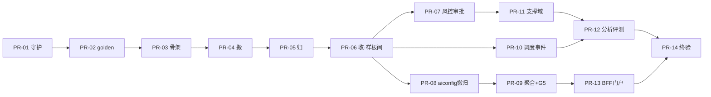

# customer-work DDD 演进 PR 计划表

> **文档状态：v1.0（随主文档 v0.7 制定，待 T0 出站后生效）**
> 本表是《DDD演进技术路线图》B0~B9 批次的**执行级拆解**：需求与文档定稿后，按本表顺序直接推进开发，不再临时决策"下一步做什么"。
> 本表同时是**执行状态跟踪器**：每个 PR 合并后更新对应状态位（在该 PR 内一并提交本表的状态变更）。

| 版本 | 日期 | 说明 |
|---|---|---|
| v1.0 | 2026-07-18 | 首版：B0~B9 拆解为 14 个 PR，三条并行泳道，启动条件清单 |

---

## 1. 启动条件（T0 出站清单，全部 ✅ 才能开工 PR-01）

| # | 条件 | 当前状态 |
|---|---|---|
| 1 | 《DDD架构设计文档》《DDD演进技术路线图》经你确认"文档没问题" | ⬜ 待确认 |
| 2 | D8 终裁（workspace/identity 战术重构是否降可选池） | ⬜ 挂起 |
| 3 | Q2 终裁（AgentProfile 单聚合，论证见架构文档 4.3.1） | ⬜ 待终裁 |
| 4 | Q4 终裁（Agent as Service 不现在引入 + 三条判断标准） | ⬜ 待终裁 |
| 5 | Q5 终裁（多租户最小共享内核，论证见架构文档 3.6） | ⬜ 待终裁 |
| 6 | Q7 结论（golden 测试脆弱性治理：快照粒度、契约字段白名单）——**PR-02 的硬前置** | ⬜ 挂起 |

> 条件 1~5 不齐可以先开工 PR-01（纯守护基线，与裁决项无耦合）——但这是唯一例外，且需你单独放行。

## 2. 约定

- **分支命名**：`ddd/<pr-id>-<slug>`（如 `ddd/b3a-ticket-move`），一律从**最新 main** 拉出；
- **一 PR 一回滚单元**：revert 单个 PR 即回到上一状态；PR 之间只允许表内声明的依赖；
- **每个 PR 必过五道门禁**（路线图 5.1）：全量单测 → ArchUnit → 兼容六项 → golden/冒烟与流程图相符 → 人工评审（含"是否越界做 BX 池的事"）；
- **PR 描述模板**：仓库 PR 模板 + 附兼容六项核对清单 + 本批冒烟记录；
- **状态图例**：⬜ 未开始 ｜ 🟨 进行中 ｜ 🟩 已合并 ｜ ⛔ 阻塞（注明原因）。

## 3. PR 总表（执行顺序自上而下，泳道内串行、泳道间并行）

| PR | 批次 | 分支 | 范围概要 | 前置 | 出口标准要点 | 规模 | 泳道 | 状态 |
|---|---|---|---|---|---|---|---|---|
| **PR-01** | B0 | `ddd/b0-arch-guard` | ArchUnit 模块（规则 A~E 冻结上线）+ enforcer + 接缝白名单校准（grep 实测比对 3.5.3）+ Nacos 发布语言 JSON Schema 文档化 + 既有 2 探针登记 | 启动条件 1（或单独放行） | 951 全绿；ArchUnit 全绿（冻结）；白名单与实际 import 一致 | 小 | 主干 | ⬜ |
| **PR-02** | B1 | `ddd/b1-golden-tests` | 六图全局特征测试（工单 19 转换表驱动/分发全分支/转人工闭环/审批/发布现状/敏感词三档）+ 高波动接缝探针 2~3 个，`@Tag("golden")` | PR-01；**Q7 结论** | 六图全覆盖且全绿；探针清单入 MIGRATION 文档 | 中 | 主干 | ⬜ |
| **PR-03** | B2 | `ddd/b2-maven-skeleton` | `customer-work-bc/` 聚合 pom + 9 个空模块（8 业务 + cw-bc-eval）+ starter 聚合门面改造（GAV 不变） | PR-02 | 951 全绿；双端启动冒烟；下游 pom 零改动 | 小 | 主干 | ⬜ |
| **PR-04** | B3-① | `ddd/b3a-ticket-move` | `ticket/`+`handoff/` 平移 `cw-bc-ticket`，同批原子改包名与全仓 import（D4 无桥接）；`TicketStore`→`TicketGateway` 直接改名 | PR-03 | 951+golden 全绿；旧包名 grep 零命中；下游构建零改动 | 中 | 主干 | ⬜ |
| **PR-05** | B3-② | `ddd/b3b-ticket-cola` | `TicketService` 拆 CmdExe/QryExe；事件归 domain/event；DO/Mapper/Store 实现归 infrastructure；装配归 starter 门面 | PR-04 | golden 逐字节相符；ArchUnit 解冻 BC1 层规则 | 中 | 主干 | ⬜ |
| **PR-06** | B3-③ | `ddd/b3c-ticket-rules` | dispatch 规则回收（`DispatchPolicy`+`HandoffKeywordDetector` 下沉，app-server 薄化）；D2+Q1 落地：双聚合同步事件 + 对账巡检（Ticket 为主，周期配置项）；聚合不变式单测 | PR-05 | 工单 7 态全链路冒烟；WS 帧协议回归；BFF 回归；对账一致性表驱动测试全绿 | 大 | 主干（**样板间完成点**） | ⬜ |
| **PR-07** | B4 | `ddd/b4-moderation-approval` | BC5 迁移+敏感词策略进 domain；回收 SelfCorrection/DynamicOptions 规则；BC3 审批迁移；middleware 业务规则清零核对 | PR-06 | 敏感词三档行为逐字节回归；HITL 冒烟；middleware 只剩胶水 | 中 | A（运行时） | ⬜ |
| **PR-08** | B5-① | `ddd/b5a-aiconfig-migrate` | `customer-admin-bc/` 骨架 + `ca-bc-aiconfig` 六子包三步法迁移（搬+归） | PR-06（方法论） | admin 317 全绿；管理台六模块页面冒烟 | 大 | B（admin） | ⬜ |
| **PR-09** | B5-② | `ddd/b5b-aiconfig-domain` | `AgentProfile` 聚合成型（Q2 终裁方案：绑定入聚合/本体独立/ID 引用）+ **G5 修复**（`ConfigPublishRequested` + AFTER_COMMIT）+ 事务回滚不发布负向测试 | PR-08 | 发布→Nacos→热生效端到端冒烟；负向测试全绿 | 大 | B（admin） | ⬜ |
| **PR-10** | B6 | `ddd/b6-routing-events` | BC2 迁移+`SeatRoutingScorer` 归位；`TicketClassifierPort` 端口化（实现平台侧，D7）；`DomainEvent`/`DomainEventPublisher` 统一；增强器挂载点事件化 | PR-06 | 抢单原子性并发测试双版通过；推荐链路 fail-open 回归 | 中 | C（事件） | ⬜ |
| **PR-11** | B7-① | `ddd/b7a-support-contexts` | BC4 conversation + BC6 record + BC7 account 三上下文三步法迁移 | PR-07 | golden 逐一相符；各域冒烟 | 大 | A（运行时） | ⬜ |
| **PR-12** | B7-② | `ddd/b7b-analytics-eval` | BC8 归位（Q6：直连只读库表+独立只读数据源+禁止写规则）+ BC17 评测归位（`eval/`→`cw-bc-eval`，JudgeModel 端口化） | PR-11、PR-10 | 报表数据比对回归；评测跑分行为回归 | 中 | A（运行时） | ⬜ |
| **PR-13** | B8 | `ddd/b8-admin-portal` | BC14 BFF 形态固化（ArchUnit：BFF 包禁 @TableName/Mapper）+ BC16 门户聚合独立（menu 改走 BC11 client，修 G6）+ 发布语言终稿 | PR-09 | 登录/RBAC/菜单/坐席工单链路冒烟 | 小 | B（admin） | ⬜ |
| **PR-14** | B9 | `ddd/b9-final-asbuilt` | 全链路终验；ArchUnit 冻结清零核对；两份主文档更新竣工版（As-Built）；CLAUDE.md 补 DDD 约定与升级预案入口；技术债清单移交 | PR-07~13 全部 | 分层 DoD 必达项全勾 | 小 | 收口 | ⬜ |

> BX 可选池（workspace/identity/sqlconfig 战术重构）**不在本表**——届时单独立项、单独出计划。

## 4. 依赖与并行泳道

- **主干（串行）**：PR-01→06，样板间未立不分叉；
- **PR-06 合并后三泳道并行**：A 运行时（07→11→12）、B admin（08→09→13）、C 事件（10，汇入 12）；
- 泳道间唯一共享资源是 starter 门面 pom——各 PR 的 pom 变更集中在"搬"步骤，合并冲突按先到先合、后者 rebase 处理（R6 缓解）。

## 5. 单个 PR 的固定执行流程（SOP）

1. 从最新 `main` 拉 `ddd/<pr-id>-<slug>` 分支；
2. 若本 PR 涉及行为变更：先确认 PR-02 的 golden 测试覆盖本范围，缺则**先补测试再动代码**；
3. 实施（遵迁移三步法与 COLA 物料规范）；
4. 本地全量验证：`clean test`（-gs+-s 同传等按 CLAUDE.md）+ golden 全量 + 旧包名 grep；
5. 提 PR：按仓库模板 + 兼容六项打勾 + 冒烟记录截图/日志；
6. 过五道门禁 → 合并 → **同 PR 或紧随提交更新本表状态位与评审记录**；
7. 若中途发现设计偏差：停止实施，回文档改版（T0 机制随时在线），文档更新合意后继续。

## 6. 与需求讨论的衔接

- 本表由《DDD演进技术路线图》推导，**路线图变、本表跟着变**（后续头脑风暴若调整批次/优先级，本表同轮改版并留版本记录）；
- 启动条件清单（第 1 节）就是"需求确定"的客观定义——六项全勾即视为需求定稿，随时可开工，无需再确认一轮。
