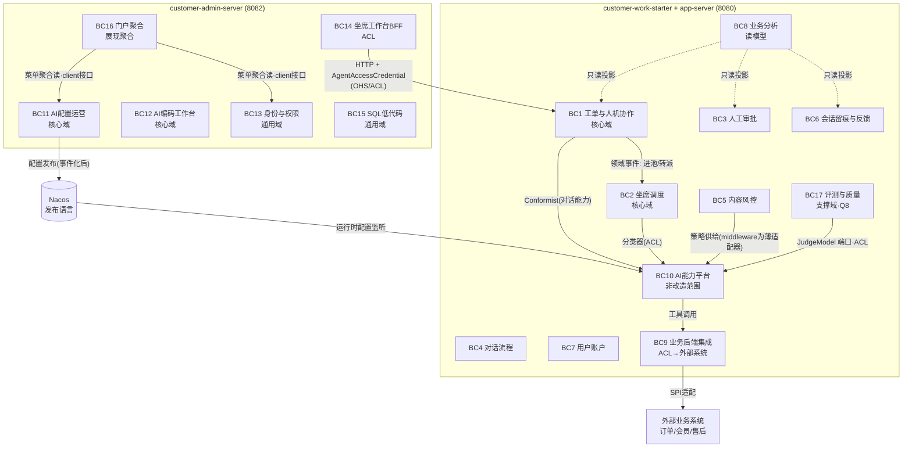
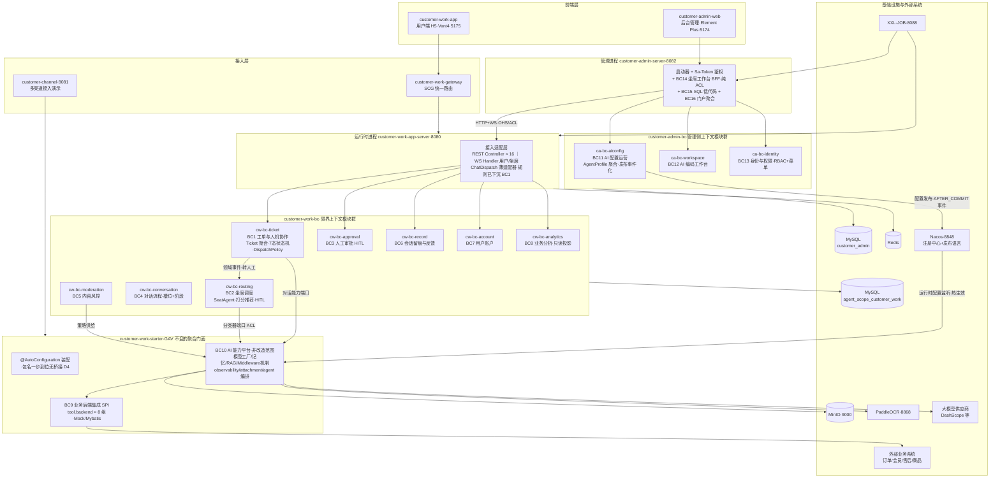
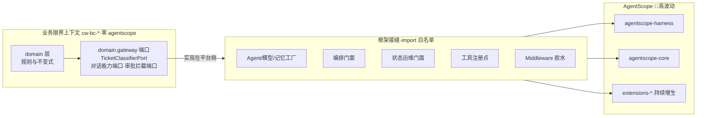
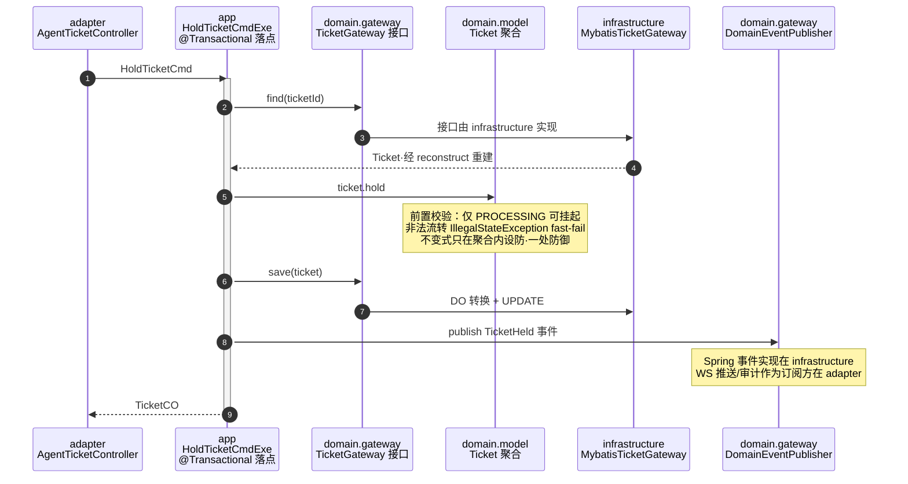
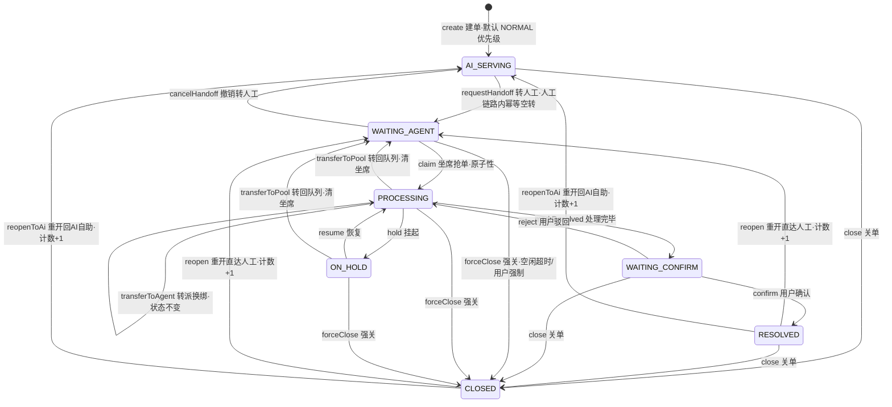
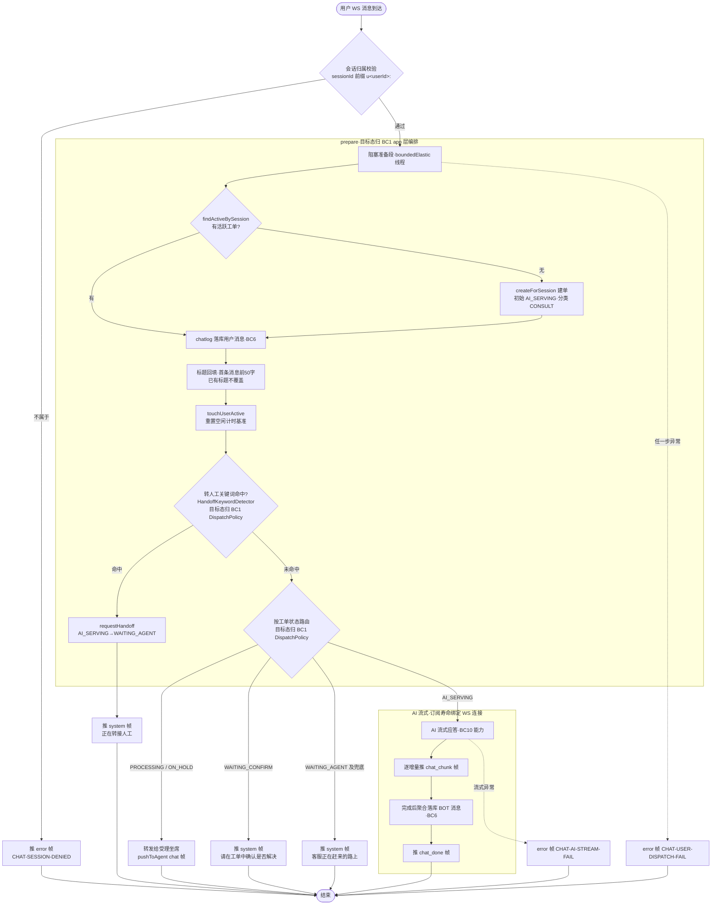
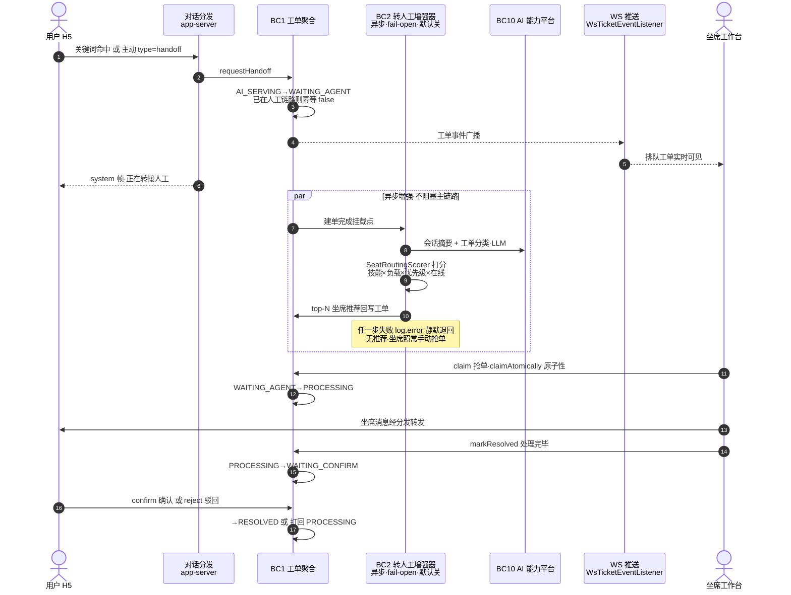
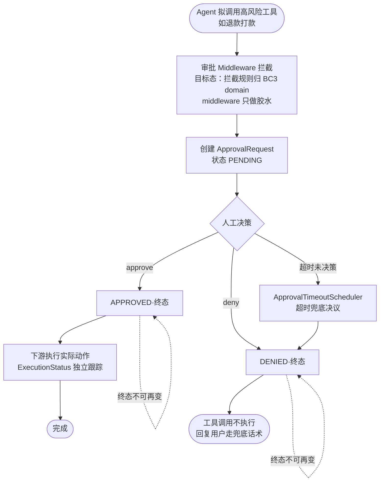
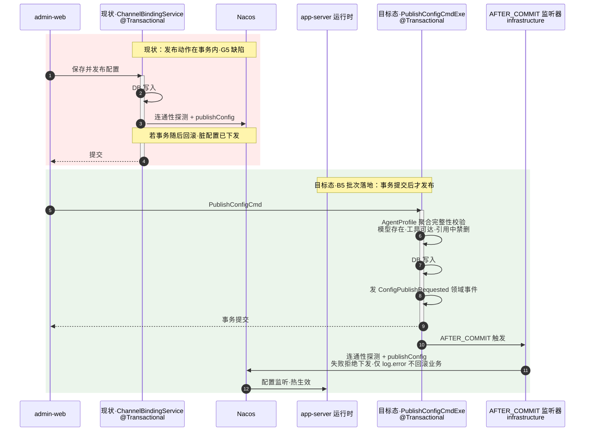
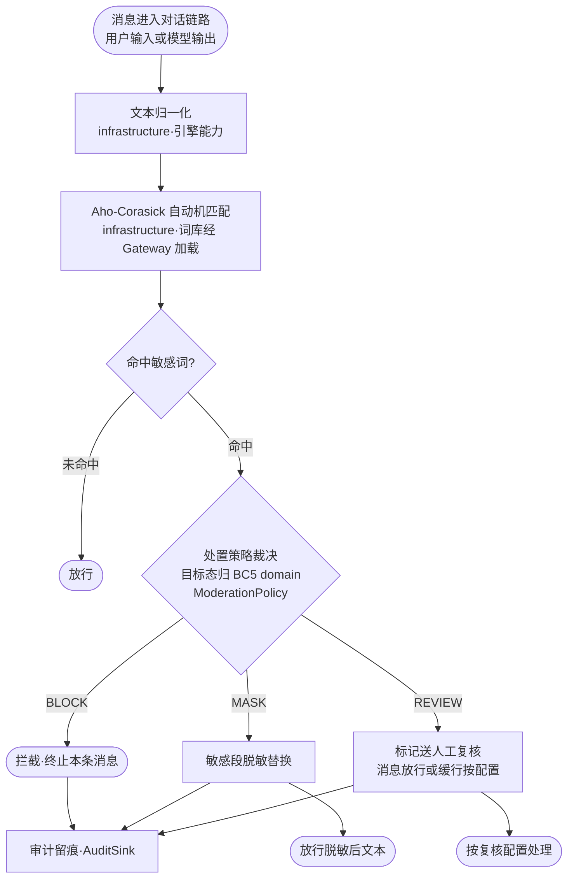

# customer-work DDD 架构设计文档

> **文档状态：v0.5 评审稿（未定稿，禁止据此开发）**
> 本文档与《DDD演进技术路线图》配套，需经多轮评审确认后方可进入开发。**文档没问题才能进入开发，有问题不能开发；理清思路和方向比盲目开发更重要。**
> 本文档以多轮头脑风暴持续演进：每轮讨论结论进版本表，任何章节允许被后续讨论推翻改写。
> 待确认决策点集中在 9.1，头脑风暴弹药库（开放问题清单）在 9.2。

| 版本 | 日期 | 说明 |
|---|---|---|
| v0.1 | 2026-07-17 | 首版评审稿：战略设计 + COLA 战术设计 + Maven 模块目标态 |
| v0.2 | 2026-07-17 | 增补系统全景架构图（3.4）、COLA 分层调用时序（4.7）、核心业务流程全景（第 7 章，全部按源码逐行核对）；流程图核对中发现两处事实修正：坐席调度为异步推荐制（HITL 点选 claim，fail-open 默认关）而非自动派单；审批状态机为 PENDING→APPROVED/DENIED 终态不可变 + 超时调度兜底 |
| v0.3 | 2026-07-17 | 增补 3.5「AgentScope 演进预判与防腐战略」：基于本仓库 1.0.12→RC4→GA 两轮迁移实证（MIGRATION-2.0.md）给出六项预判 P1~P6 与框架接缝清单；架构守护新增规则 E（agentscope import 白名单）与 enforcer 依赖声明约束；新增决策点 D7 |
| v0.4 | 2026-07-17 | 增补 3.5.4「Python 版先行指标」：拉取 AgentScope Python 2.0.5dev 文档与上游仓库实况（Python 2026-05 发 2.0、已迭代到 2.0.4.post1，43 个 release），用 Python 侧已落地能力交叉验证 P1~P5，并新增预判 P7（框架上探服务层）；升级预案触发时机增加"Python 版先行预警" |
| v0.5 | 2026-07-17 | **按三轮讨论结论重排优先级**：新增 1.4「价值排序」（确定性护栏分离 > 框架防腐 > 核心域标杆 > 结构归位 > CRUD 域）；新增决策点 D8（workspace/identity 战术重构降入可选池）；新增 9.2 开放问题清单（头脑风暴 backlog）；批次引用同步路线图 v0.5 新编号 |
| v0.6 | 2026-07-18 | **第 1 轮裁决落地**：D1/D3/D6/D7 按推荐方案裁决；D2 采备选（ticket 与 handoff 保留独立聚合、领域事件同步）；D4 采备选（不留桥接、包名一步到位）；D5 采备选（menu 独立为 BC16 门户聚合上下文，上下文总数 15→16）；D8 挂起待定；D3 补翻转条件；Q1 按 D2 结果改写为事件同步一致性设计 |
| v0.7 | 2026-07-18 | **第 2 轮裁决落地**：Q1 已裁决（事件同步+定期对账巡检兜底，Ticket 为主数据源）；Q3 已裁决（不引 MQ，附翻转条件）；Q6 已裁决（analytics 直连只读库表，边界例外显式登记）；Q8 已裁决（eval 升独立上下文 **BC17**，总数 16→17）；Q9 已裁决（半确定性启发式=平台配置，判据入 1.4）；Q2/Q4/Q5 完成论证（4.3.1 / 3.5.4 / 3.6）待终裁；Q7 挂起 |

---

## 1. 目标与设计原则

### 1.1 目标

把 customer-work 打造成**采用 DDD 技术的生产级标杆智能体项目**：

- 战略层面：明确子域/限界上下文/上下文映射，业务边界可讲清、可守护；
- 战术层面：业务域采用 COLA 风格分层，聚合承载不变式，规则从技术组件回收到领域层；
- 物理层面：限界上下文以 Maven 模块隔离，依赖方向由构建器强制；
- **约束：功能不受任何影响**——对外 API、数据库 Schema、配置 Key、下游依赖坐标（GAV）全部保持兼容，全仓 951 个测试作为回归安全网。

### 1.2 已拍板的方向性决策（2026-07-17 确认）

| 决策 | 结论 |
|---|---|
| 改造范围 | **仅业务域**。starter 中的技术基础设施（模型/记忆/RAG/middleware 框架胶水/observability/attachment 解析）不做战术重构，定位为"AI 能力平台"，只定义防腐边界 |
| 演进策略 | **渐进式绞杀**：分批次按限界上下文迁移，每批一个 PR、跑全量测试、可独立回滚 |
| 架构风格 | **COLA 风格**分层（adapter / app / domain / infrastructure / client） |
| 物理隔离 | **Maven 模块隔离**：限界上下文拆独立 Maven 模块 |

### 1.3 设计原则

1. **边界优先于分层**：先划对限界上下文，再谈层内怎么写。上下文划错，分层再漂亮也是白搭。
2. **依赖方向唯一**：adapter → app → domain ← infrastructure。domain 零框架依赖（不 import Spring/MyBatis/AgentScope）。
3. **绞杀而非重写**：已有的充血实体（`Ticket` 等 11 个）和 Store SPI（11 套）是现成的 DDD 资产，重构是"归位+补齐"，不是推倒重来。
4. **规则归领域**：藏在 middleware、ChatDispatchService 里的业务规则回收到领域层，技术组件退化为薄适配器。
5. **一处防御**：延续项目 fast-fail 规范，防御式校验收敛在聚合入口（实体方法前置校验），链路上不重复设防。
6. **兼容压倒纯粹**：凡是"DDD 更纯粹"与"下游零改动"冲突的地方，选后者，把纯粹性诉求记入技术债清单排期。

### 1.4 价值排序（v0.5，三轮头脑风暴的结论，指导一切优先级）

本项目做 DDD 的价值密度**不是均匀分布**在各上下文上的。三轮讨论（DDD 意义与副作用 → AgentScope 演进预判 → Python 先行指标）收敛出如下排序，路线图第 0 章的批次分层（T0~T4）直接由此推导：

| 优先级 | 价值 | 依据 | 落点 |
|---|---|---|---|
| 1 | **确定性护栏与概率性 AI 分离**：状态机/审批闸门/风控处置/分发策略必须 100% 可控可测，与 LLM 概率性链路彻底解耦 | 智能体项目 DDD 的本质意义（讨论①）；middleware 范式必再翻转，规则留在胶水层等于押注框架不摇摆（讨论② P2/P4） | 行为锁定（B1）、规则回收（B3/B4）、BC1/BC3/BC5 |
| 2 | **框架防腐**：AgentScope 任意变更的爆炸半径锁死在接缝白名单内 | 两轮迁移实证 + Python 侧月级发版节奏（讨论②③） | 3.5 节、规则 E、升级预案 |
| 3 | **核心域充血标杆**：工单与 aiconfig 的聚合设计立样板 | 真复杂度所在；G5 是真实缺陷（讨论①） | B3、B5 |
| 4 | **结构归位**：其余业务域进模块、依赖方向可守护 | 中等价值，模式照抄样板间即可 | B6~B8 |
| 5 | **CRUD 域 COLA 化**：workspace/identity/sqlconfig 战术重构 | **副作用区**（讨论①：样板代码膨胀、做了不加分做坏了减分） | 可选池 BX，默认不执行（D8） |

> 判断句式：一段代码值不值得战术重构，问"它承载的**不变式**丢了会不会造成业务事故"——会（工单流转/审批闸门/发布一致性）就值得；不会（配置 CRUD/菜单树）就只做战略归位。
>
> **半确定性启发式的归属判据（Q9 已裁决，2026-07-18）**：意图阈值、推荐 top-N 截断、分类兜底这类"带参数的启发式"一律判为**平台配置**（BC10 配置面），不建模为领域策略。判据：调整参数只改变**体验/效果**的 → 平台配置；改变**业务结果合法性**的（如哪些状态可关单、哪档敏感词必须拦截）→ 领域策略进 domain。

---

## 2. 现状评估（2026-07-17 实测探索）

### 2.1 资产盘点：已有的 DDD 雏形

| 资产 | 现状 | DDD 定位 |
|---|---|---|
| `ticket/Ticket.java` | 7 态状态机充血实体，转换前置校验、幂等、`volatile` 可见性 | **成熟聚合根标杆**，全项目锚点 |
| Store SPI × 11 套 | 接口 + InMemory + MyBatis-Plus，方法为领域语义（`claimAtomically`/`findActiveBySession`），DO 与领域对象已分离（`Ticket.reconstruct` 包级重建） | 标准 Repository 雏形，直接映射为 COLA Gateway |
| `TicketEvent` + `TicketEventListener` | 状态流转追加事件 + 监听广播 | 领域事件雏形 |
| `SeatRoutingScorer` | 确定性打分纯函数（技能×负载×优先级×在线） | 典型 Domain Service |
| 充血领域对象 11+ | `Ticket`/`HandoffTicket`/`SeatAgent`/`ApprovalRequest`/`SlotFillingProgress`/`DialogStage`/`MessageFeedback`/`ChatMessage`/`UserAccount`/`SensitiveWord`/`ChatAttachment` | 聚合根候选 |
| admin-server 按业务分包 | `auth/system/menu/aiconfig/workspace/ticket/sqlconfig` 顶层包 | 限界上下文天然候选 |
| AgentScope 耦合分布 | 61/301 类耦合，**集中在** `agent/middleware/config/memory/observability/tool壳`；业务包零耦合 | 防腐边界已天然形成 |

### 2.2 差距清单：要修的问题

| # | 问题 | 位置 | 影响 |
|---|---|---|---|
| G1 | admin-server 全部 32 个 Service 为贫血事务脚本，无聚合、无领域对象 | `customeradmin/**/service` | 战术重构主战场 |
| G2 | 业务规则藏在中间件：越权承诺检测（SelfCorrection）、投诉关键词切档（DynamicOptions）、敏感词三档处置 | `customerwork/middleware/` | 规则不可见、不可测、不可复用，需回收到领域层 |
| G3 | 会话分发规则（工单状态+关键词 → AI/排队/转坐席）写在接入层 | app-server `chat/ChatDispatchService#prepare` | 同 G2，属工单上下文的领域策略 |
| G4 | `ticket`(7 态) 与 `handoff`(3 态) 语义重叠 | starter `ticket/` vs `handoff/` | **D2 已裁决**：同上下文双聚合+事件同步；剩余工作是同步一致性设计（Q1） |
| G5 | Nacos 配置发布挂在 `@Transactional` 写方法内 | admin `CustomerWorkConfigPublisher` | 事务与外部集成耦合，应改为提交后领域事件 |
| G6 | `MenuAggregationService → AgentService` 跨上下文直接调用 | admin `menu/` | 需防腐层或读模型 |
| G7 | 上下文之间无物理隔离，依赖方向靠自觉 | 全仓 | Maven 模块 + enforcer + ArchUnit 补齐 |

---

## 3. 战略设计

### 3.1 领域愿景与子域划分

customer-work 的业务本质：**AI 优先接待、人机无缝协作的客户服务**，配套一个**驱动 AI 运行时的配置与运营中台**。据此划分子域：

| 子域类型 | 子域 | 判定理由 |
|---|---|---|
| **核心域** | 工单与人机协作 | 7 态状态机 + AI/人工切换是产品差异化本质 |
| **核心域** | 坐席调度 | 抢单原子性、确定性打分是服务质量的关键 |
| **核心域** | AI 配置运营（admin aiconfig） | admin 系统的核心价值：配置驱动 AI 运行时 |
| **核心域** | AI 编码工作台（admin workspace） | 第二条产品线，编排最复杂 |
| 支撑域 | 人工审批（HITL）、内容风控、对话流程（槽位+阶段）、会话留痕与反馈、业务分析 | 缺了产品残缺，但非差异化来源 |
| 通用域 | 用户账户、身份与权限（RBAC）、SQL 低代码、附件解析 | 可买可换的通用能力 |
| **平台（非改造范围）** | AI 能力平台：模型/记忆/RAG/middleware 机制/observability/Agent 编排 | 技术基础设施，本轮只定义边界不重构内部 |

### 3.2 限界上下文清单

**运行时侧（现 customer-work-starter + app-server 承载）：**

| # | 上下文 | 现有代码归属 | 类型 | 备注 |
|---|---|---|---|---|
| BC1 | **工单与人机协作** Ticket | starter `ticket/` + `handoff/` + app-server `chat/`(分发规则部分) | 核心 | **D2 已裁决**：`Ticket` 与 `HandoffTicket` 为同上下文内两个独立聚合，经领域事件同步（一致性设计见 Q1）；ChatDispatch 的路由规则回收为本上下文领域策略 |
| BC2 | **坐席调度** Routing | starter `routing/` | 核心 | `TicketClassifier` 依赖 AI 平台，走 ACL |
| BC3 | **人工审批** Approval | starter `approval/` | 支撑 | HITL 审批请求聚合 |
| BC4 | **对话流程** Conversation | starter `slotfilling/` + `dialog/` | 支撑 | 槽位填充 + 对话阶段，同为"对话过程控制"合并一个上下文 |
| BC5 | **内容风控** Moderation | starter `sensitiveword/` + middleware 中的风控规则 | 支撑 | Aho-Corasick 引擎留 infrastructure，处置策略进 domain |
| BC6 | **会话留痕与反馈** Record | starter `chatlog/` + `feedback/` | 支撑 | 高写入事件型数据 + 消息级反馈 |
| BC7 | **用户账户** Account | starter `user/` | 通用 | |
| BC8 | **业务分析** Analytics | starter `analytics/` | 支撑 | 跨上下文只读投影（读模型），只读不写。**Q6 已裁决**：实现**直连只读库表**（效率优先）；数据级穿透为显式登记的边界例外，"禁止写"由只读语义 + ArchUnit 双保 |
| BC9 | **业务后端集成** Business Backend | starter `tool/backend/`（8 组 SPI） | 通用/集成 | 已是端口适配器形态，**不重构**，定位为对外部业务系统（订单/会员/售后…）的 ACL |
| BC10 | **AI 能力平台** AI Platform | starter `agent/` `middleware/` `config/`(模型) `memory/` `rag/` `observability/` `attachment/` | 平台 | **非改造范围**，作为 Conformist 上游 |
| BC17 | **评测与质量** Evaluation | starter `eval/`（意图/质量评测、JudgeModel） | 支撑（质量域） | **Q8 已裁决**：从 BC10 独立为上下文——评测标准、阈值、跑分流程是业务资产而非技术胶水；`JudgeModel` 走 domain 端口，实现放平台侧（遵 D7） |

**管理侧（现 customer-admin-server 承载）：**

| # | 上下文 | 现有代码归属 | 类型 | 备注 |
|---|---|---|---|---|
| BC11 | **AI 配置运营** AiConfig | admin `aiconfig/`（agent/model/mcp/skill/systemtool/scheduledtask/channel） | 核心 | 聚合设计重点；Nacos 发布事件化（G5） |
| BC12 | **AI 编码工作台** Workspace | admin `workspace/`（project/chat/vibecoding/knowledge/audit） | 核心 | Service 编排最密集；战术重构在可选池 BX（D8），本轮仅战略归位 |
| BC13 | **身份与权限** Identity | admin `auth/` + `system/` | 通用 | RBAC 标准能力（menu 不并入，见 BC16） |
| BC14 | **坐席工作台接入** AgentDesk BFF | admin `ticket/`（纯 HTTP 代理，无本地表） | BFF/ACL | 对 BC1 的 OHS 做防腐消费，**保持 BFF 形态不做聚合设计** |
| BC15 | **SQL 低代码** SqlConfig | admin `sqlconfig/` | 通用 | 低优先级，末批处理 |
| BC16 | **门户聚合** Portal | admin `menu/` | 展现聚合/BFF | **D5 已裁决**：独立上下文，跨上下文只读拼装前端菜单/门户视图；对 BC11/BC13 的读一律走对方 client 接口（修 G6）；不做战术设计 |

### 3.3 上下文映射图



**集成模式约定：**

| 关系 | 模式 | 契约 |
|---|---|---|
| BC14 → BC1 | 开放主机服务（OHS）+ 防腐层（ACL） | app-server REST API（`/api/customer/agent/tickets`），admin 侧 `CustomerWorkTicketClient` 即 ACL，保持现状 |
| BC11 → BC10 | 发布语言（Published Language） | Nacos dataId `customer-work-runtime-config` 的 JSON Schema 即发布语言，本轮将其显式文档化 + 事件化触发 |
| BC1 → BC2 | 领域事件 | 工单进池/转派事件驱动调度，替代直接方法调用 |
| BC1/BC2/BC5 → BC10 | Conformist / ACL | 领域层定义端口接口（如 `TicketClassifierPort`），AI 平台实现放 infrastructure |
| BC9 → 外部系统 | ACL（现有 `tool.backend.*` SPI） | 保持 `@ConditionalOnMissingBean` Mock + 下游覆盖模式不变 |
| BC8 → 各上下文 | 只读投影 | 只依赖各上下文 client 模块的查询接口，禁止反向写 |

### 3.4 系统全景架构图（目标态）

覆盖全部前端、接入层、两个后端进程、全部限界上下文 Maven 模块、AI 能力平台与外部基础设施：



> 阅读要点：① `customer-work-starter` 退化为聚合门面后，下游依赖坐标不变，8 个 `cw-bc-*` 模块经它传递给 app-server / channel / 用户项目；② 管理进程与运行时进程**不共库**，只经 HTTP（BC14 BFF）与 Nacos（发布语言）两条通道集成；③ BC10 是唯一触达大模型的出口，业务上下文一律经端口接口访问 AI 能力。

### 3.5 AgentScope 演进预判与防腐战略（BC10 接缝治理）

> 本节回答"AgentScope 未来会怎么变、我们怎么让变化打不穿业务域"。预判不是猜——**全部基于本仓库亲历的两轮迁移实证**（`docs/MIGRATION-2.0.md`：1.0.12→RC4 首轮大迁移 + RC4→GA 源码级 diff 核对）。

#### 3.5.1 框架波动性实证（历史上什么变了、什么没变）

| API 面 | 1.0.12 → 2.0 实际变化 | RC4 → GA 实际变化 | 波动性评级 |
|---|---|---|---|
| 会话/状态模型 | **范式翻转**：`Session`+手工 saveTo/loadIfExists → Agent 无状态 + `AgentStateStore` 自动流转；`StateModule`/`SessionKey` 移除 | 字节级不变 | 🔴 高 |
| 扩展/拦截机制 | **范式翻转**：`Hook` 废弃 → 五段 `MiddlewareBase`；`gotoReasoning`/`stopAgent` 语义丢失，闸门上收为 Permission System | `MiddlewareBase` 字节级不变 | 🔴 高 |
| 编排原语 | `Pipelines.fanout/sequential` **直接移除** → Reactor 自行编排 / Harness subagent | 内部接线响应式化（不影响调用方） | 🔴 高 |
| 任务规划 | `PlanNotebook` **移除** → Plan Mode（语义不完全等价） | 不变 | 🔴 高 |
| 能力打包形态 | 聚合包 → `harness`+`core`+`bom`+extensions（session/memory/rag/agui/higress/studio 全部外置） | **5 家模型实现再外置**为 `extensions-model-*`，包名 `core.model.*`→`extensions.model.*` | 🔴 高（持续外置是明确主线） |
| 模型 Builder API | — | 方法签名零变化（仅挪坐标/包名） | 🟡 中 |
| 内置增值能力 | TTS **整体下线** | fallbackModel bug 修复 | 🟡 中 |
| 事件/权限/MCP 包装 | 新增（2.0 引入） | `Event`/`PermissionMode`/`McpClientWrapper`/`StreamOptions` 字节级不变 | 🟢 低（当前代际内稳定） |
| 上游健康度 | open issues 120（RC4 时点） | **402**（GA 后，3.4 倍） | 框架成熟度仍在爬坡期 |

#### 3.5.2 六项演进预判（P1~P6）与对策

| # | 预判 | 依据 | 架构对策 |
|---|---|---|---|
| P1 | **core 持续瘦身、能力持续外置**：更多内置能力会拆成 extensions，伴随坐标/包名变更 | 两轮迁移都发生了（session/memory/rag → GA 模型外置），且官方明确走 BOM 路线 | agentscope 依赖声明只允许出现在平台侧 pom（见 6 章 enforcer 约束）；版本统一走 `agentscope-bom`；框架类 import 收敛在接缝类中，坐标再变时只改接缝 |
| P2 | **编排/推理范式还会再摇摆**：Middleware 五段模型、subagent、Plan Mode 都是 2.0 新引入的年轻 API，最可能再变 | Hook→Middleware、PlanNotebook→Plan Mode、Pipelines→移除，三连范式翻转 | 业务规则一律不写在 Middleware 里（B3/B4 批次回收，middleware 只剩"取策略→应用"胶水）；编排唯一入口 `MultiAgentOrchestrator` 门面，范式再变只改门面内部 |
| P3 | **状态模型继续演进**：Agent 无状态 + AgentStateStore 是新范式，社区 issue 高发区 | 1.x→2.0 已翻转一次；402 open issues 中 session/state 类占比高 | 业务域**不直接触碰** AgentStateStore；会话状态运维统一走 `SessionStateManager` 门面（1.x→2.0 迁移中它已经吸收过一次范式翻转，证明该门面有效） |
| P4 | **HITL/Permission 语义持续调整** | `stopAgent` 语义已丢失一次；[#2024](https://github.com/agentscope-ai/agentscope-java/issues/2024) AG-UI HITL bug 印证"不绑定框架 HITL"决策正确 | **审批闸门以自研 BC3 为准**，框架 Permission System 仅作辅助层——现状即如此，升格为架构原则写死：BC3 的正确性永不依赖框架 HITL 语义 |
| P5 | **MCP 生态高波动**：spec 快速演进 + SDK 安全问题 | [#2075](https://github.com/agentscope-ai/agentscope-java/issues/2075) MCP SDK 安全漏洞待修 | MCP 接入收敛在平台侧配置器；默认关闭保持；BC9 业务后端 SPI 与 MCP 解耦（工具壳换协议不动 backend） |
| P6 | **破坏性变更可能藏在打包层而非源码层** | RC4 源码树已有 `extensions.model.*` 目录但发布 jar 仍打包在 `core.model.*`——只看源码会误判 | 升级预案（路线图第 7 章）固化"解包真实 jar 核对"步骤，不信源码树、不信 release notes |

#### 3.5.3 框架接缝清单（唯一允许 import agentscope 的类族）

现有代码已自发形成一批"接缝类"（框架耦合收敛点），本设计将其**制度化为白名单**——ArchUnit 规则 E 强制 `io.agentscope..` import 只允许出现在下列类族及 BC10 平台包内：

| 接缝 | 类 | 吸收的波动 | 已验证战绩 |
|---|---|---|---|
| Agent 构建唯一装配点 | `CustomerServiceAgentFactory` / `HarnessAgentFactory` | Builder API、call/stream 签名、Plan Mode、sandbox、subagent | 1.x→2.0 的 Builder/调用签名全套变更被其吸收 |
| 模型工厂与装饰链 | `ChatModelFactory` / `MutableDelegatingModel` / `ResilientChatModel` / `FallbackChatModel` / `ModelConfig`；admin 侧 `AdminModelFactory` | 模型实现坐标/包名、供应商增减、热切换 | GA 模型外置仅改 4 文件 import（含 AdminModelFactory），Builder 调用零改动 |
| 编排门面 | `MultiAgentOrchestrator` | 编排原语更替 | Pipelines 移除后内部改用 Reactor，调用方无感 |
| 状态运维门面 | `SessionStateManager` | 状态模型范式 | Session→AgentStateStore 翻转后退化为运维门面，调用方无感 |
| 记忆/压缩工厂 | `ContextMemoryFactory` / `LongTermMemoryProvider` 装配 | AutoContextMemory→Compaction 类更替 | 已吸收一次 |
| 工具注册唯一点 | `ToolRegistrar`（+ MCP/Higress 配置器） | Toolkit API、MCP spec | 加构造参数需 grep 调用点（CLAUDE.md 已有约定） |
| Middleware 胶水层 | `middleware/` 12 个类 | 五段模型、Hook 代际 | Hook→Middleware 整体迁移在此层完成；**B4 后业务规则清零，只剩胶水** |
| 协议接入 | `AguiService` / Studio 配置器 | AG-UI/Studio 协议 | extension 化时 import 未变 |



> 爆炸半径承诺：AgentScope 任意级别的版本变更，改动范围被 ArchUnit 规则 E 锁死在接缝白名单 + BC10 平台包 + starter 门面 pom 内，**8 个业务上下文一行代码不改**。这不是愿景——RC4→GA 升级实际就只改了 4 个文件的 import，本设计把这个"碰巧的好结果"变成"制度保证的结果"。

#### 3.5.4 Python 版先行指标（预判的交叉验证与前瞻，2026-07-17 实况）

AgentScope 是 **Python 先行、Java 跟进**的双栈框架：Python 2.0 于 2026-05 官方发布，Java 2.0 GA 晚约两个月（2026-07-10）；Python 侧已迭代到 **2.0.4.post1（2026-07-16）、累计 43 个 release、文档已挂 2.0.5dev**。因此 Python 侧"已经发生的事"就是 Java 侧"即将发生的事"的最强先行指标。本节取自 Python 2.0.5dev 文档与上游仓库 News：

| Python 侧已落地信号（带时间） | Java 2.0.0 GA 现状 | 对本项目的预判与预案 |
|---|---|---|
| **Agent as Service**：多租户/多会话 FastAPI 生产服务 + 前端 UI，作为一级能力 | 无对应物（服务层由本项目 app-server 自建） | **新增预判 P7（见下）**：框架正在上探"服务层/应用层" |
| **Agent Team**（2026-06）：多智能体团队编排 | 仅 subagent | ✅ 交叉验证 P2：编排 API 必再变（subagent→team 概念升级），编排门面 `MultiAgentOrchestrator` 待吸收 |
| **Agentic Memory + ReMe（2026-07）+ Mem0（2026-06）**：记忆生态三线并进 | extensions-mem0/-reme/-memory-bailian | ✅ 交叉验证 P1/P3：记忆 provider 增生与替换是常态，`LongTermMemoryProvider`/`ContextMemoryFactory` 接缝将持续吸收 |
| **Context 三能力：compression / offloading / agentic retrieval** | 仅 Compaction | ✅ 交叉验证 P3：上下文管理 API 将扩容（offloading/agentic retrieval 大概率进 Java Harness），只动 `ContextMemoryFactory` |
| **分布式 RAG 多租户服务**（2026-06） | extensions-rag-*（进程内） | ✅ 交叉验证 P1：RAG 走向独立服务形态，`KnowledgeProvider` 端口是隔离点 |
| **Event System 定位为"统一事件总线 + HITL 支撑"** | Event/AGUI 存在但较薄 | ✅ 交叉验证 P4：框架 HITL 还在长，BC3 自研闸门不绑定框架 HITL 的原则再次被印证 |
| **Sandbox 后端扩张：Daytona / K8s / OpenSandbox（2026-07）** | extensions-sandbox-{kubernetes,e2b,daytona,agentrun} | 与 Java 对齐，按需引入，业务域无感 |
| **发版节奏：2.0→2.0.4 仅两个月** | GA 刚发布 | Java 侧 2.0.x 补丁流可预期为**月级频率** → 路线图第 7 章升级预案必须是低成本流程（探针自动化），且新增"Python 先行预警"触发项 |

**新增预判 P7 —— 框架上探服务层（本项目独有的战略风险）：**

Python 侧 "Agent as Service"（多租户服务 + 前端 UI + Studio）表明框架的野心正从"库"长成"应用平台"。若 Java 版跟进，会与本项目 app-server 接入层、甚至 admin 配置中心产生**职责重叠**。对策定为架构原则：

1. 本项目的业务价值沉淀在 8 个业务上下文（工单/调度/审批/风控…），**这些资产与框架服务形态无关**——框架服务层再强，也不会内置你的 7 态工单状态机；
2. app-server 接入层保持薄适配器形态（B3 已规划），未来若框架 agent-service 成熟，它是 BC10 内的一个**可选部署形态**，接入层换底座不动业务域；
3. admin 配置中心（BC11）以 Nacos 发布语言为契约，不感知运行时用的是自建服务层还是框架服务层——发布语言文档化（B0）因此更重要。

> 跟踪机制：Python 版 release notes 纳入路线图 7.3 的触发清单——Python 侧出现的新能力/破坏性变更，即视为 Java 侧提前一个版本周期的预警，升级预案可提前预研。

**Q4 论证：引入 Agent as Service 的收益与判断标准（2026-07-18，待终裁）**

引入的真实收益：① 省掉自建接入层维护——现 app-server 手写的 WebFlux WS、流式去重、会话路由、订阅寿命管理（最易出并发 bug 的代码）由框架服务层接管归零；② 流式/中断/HITL/事件推送的语义由框架端到端保证，消灭"我们的 WS 层 ↔ 框架事件模型"这条最易被升级打穿的接缝；③ 免费吃官方演进红利（多租户会话服务、分布式部署、水平扩缩）。

**推荐结论：不现在引入。**三条理由：WS 帧协议是对前端的既有契约，换服务层触碰全部对外契约；框架服务层在 Python 侧也刚问世（年轻 API = 高波动，P2 教训）；B3 完成接入层薄化后，未来切换成本本来就被压到最低——**薄化是比"现在切"更好的期权**。

**引入判断标准（三条同时满足才启动评估）：** ① Java 版 agent-service GA 且稳定 ≥2 个 minor 版本；② 出现只有它能提供的能力需求（如原生分布式会话）；③ WS 帧契约可经适配层完整保持。

### 3.6 多租户共享内核（Q5 论证，待终裁）

现状：租户概念散落三处——`RuntimeContext` 的 org KV、`TenantContextMiddleware`、各表的租户字段；解析规则（`tenantA:conv-1` 取前缀）藏在 `CustomerServiceAgentFactory#contextFor` 私有方法里。

**显式建模为共享内核（Shared Kernel）的好处：**

| # | 好处 | 说明 |
|---|---|---|
| 1 | 类型安全 | `TenantId` 值对象替代裸 String，"把 userId 当 tenant 传"从运行时事故变成编译错误 |
| 2 | 语义唯一 | 租户解析规则获得唯一定义处，17 个上下文同一语义，不再各自解析各自漂移 |
| 3 | 隔离可守护 | 多租户数据隔离是安全级不变式（`TenantIsolationVerificationTest` 已是 P0 探针）；显式建模后 ArchUnit 可加规则"Gateway 查询必须携带 TenantId"，隔离从靠自觉变成可测试 |
| 4 | 演进锚点 | 租户维度的审计、限流、计费未来都挂在同一个值对象上 |

**代价与纪律（必须写明）：** 共享内核是上下文之间**最强的耦合形式**——内核一改全体联动。因此纪律为**内核极小化**：仅 `TenantId` 值对象 + 租户解析端口两个类，**禁止任何业务逻辑进内核**；内核变更视同架构变更走文档评审。

**推荐结论：建，但最小化（两个类封顶），落为 `cw-shared-tenant` 微模块或各 client 依赖的公共包。**

---

## 4. 战术设计（COLA 风格）

### 4.1 分层规范

采用 **COLA 4.x 分层思想**。每个限界上下文一个 Maven 模块（见第 5 章），模块内按 COLA 分层分包：

```
com.richard.fyoung.customerwork.bc.<context>/
├── client/          # 二方契约：对其他上下文暴露的 API 接口 + DTO（Command/Query/CO）
├── adapter/         # 入站适配：Controller / WS Handler / Middleware 壳 / JobHandler / 事件订阅
├── app/             # 应用层：用例编排（XxxCmdExe / XxxQryExe / AppService），事务边界在此
├── domain/          # 领域层：聚合根/实体/值对象/领域服务/领域事件/Gateway 接口
│   ├── model/       #   聚合与值对象
│   ├── service/     #   领域服务（如 SeatRoutingScorer）
│   ├── event/       #   领域事件
│   └── gateway/     #   仓储与外部端口接口（技术无关）
└── infrastructure/  # 出站适配：Gateway 实现（MyBatis/InMemory）、DO、Mapper、ACL 客户端、Nacos/MQ
```

**依赖规则（enforcer + ArchUnit 双重强制）：**

- `adapter → app → domain`；`infrastructure → domain`（实现 gateway 接口，依赖倒置）；
- `client` 只含接口与 DTO，被本上下文 `app` 实现、被其他上下文引用——**跨上下文只允许依赖对方 client**；
- `domain` **零依赖**：不 import Spring、MyBatis、AgentScope、Jackson 注解（lombok 允许）；
- 跨上下文禁止引用对方 `domain/infrastructure/app`。

### 4.2 COLA 组件取舍（对应决策点 D3）

**推荐：借鉴 COLA 分层规范与命名物料，不引入 `cola-framework` 组件 jar。**理由：

- 本项目是 Spring Boot **starter 形态的库 + 两个应用**，COLA 的 `cola-component-extension`（扩展点）与已有 `@ConditionalOnMissingBean` SPI 模式职责重叠，两套扩展机制并存会让下游困惑；
- COLA 组件引入新传递依赖，starter 是被下游依赖的库，依赖面要克制；
- COLA 的核心价值在**分层规范与物料命名**（CmdExe/QryExe/Gateway/CO），这些照搬即可，不需要运行时组件。

物料命名规范（照搬 COLA）：

| 物料 | 命名 | 归属层 | 说明 |
|---|---|---|---|
| 命令 | `XxxCmd` | client | 写操作入参 |
| 查询 | `XxxQry` | client | 读操作入参 |
| 客户对象 | `XxxCO` | client | 出参 DTO |
| 命令执行器 | `XxxCmdExe` | app | 单一用例编排，`@Transactional` 落点 |
| 查询执行器 | `XxxQryExe` | app | 读路径，可直连 Mapper 走 CQRS 捷径 |
| 聚合根/实体 | `Xxx`（无后缀） | domain.model | 充血，如现有 `Ticket` |
| 网关接口 | `XxxGateway` | domain.gateway | 现有 `XxxStore` 平移改名（见 4.4） |
| 数据对象 | `XxxDO` | infrastructure | 现有 DO 原样保留 |
| 领域事件 | `XxxEvent` | domain.event | 现有 `TicketEvent` 归位 |

### 4.3 聚合设计清单（首轮，逐批细化）

| 上下文 | 聚合根 | 聚合内成员 | 关键不变式 | 现状 |
|---|---|---|---|---|
| BC1 | `Ticket` | `TicketEvent`(事件)、优先级/分类值对象 | 7 态转换合法性、抢单原子性、转人工幂等 | ✅ 已充血，平移归位 |
| BC1 | `HandoffTicket` | **独立聚合（D2 已裁决）**：3 态闭环（PENDING/CLAIMED/RESOLVED），与 `Ticket` 经领域事件同步 | 3 态与 7 态映射一致性（最终一致，对账设计见 Q1） | ✅ 已充血，平移归位 |
| BC2 | `SeatAgent` | 技能标签、负载计数值对象 | 负载不超上限、离线不参与打分 | 半充血 |
| BC3 | `ApprovalRequest` | 审批动作记录 | 终态不可再流转、超时自动决议 | 半充血 |
| BC4 | `SlotFillingSession` | `Slot` 集合 | 必填槽位齐备才算完成 | 半充血 |
| BC4 | `DialogStage` | 阶段迁移记录 | 阶段迁移合法性 | 半充血 |
| BC5 | `ModerationPolicy` | 词条、处置档位（BLOCK/MASK/REVIEW） | 档位与词条级别匹配 | 规则散落 middleware，需回收 |
| BC6 | `ChatMessage`（事件型） / `MessageFeedback` | — | 反馈只能挂在已存在消息上 | 半充血 |
| BC7 | `UserAccount` | 凭证值对象 | 账户状态与登录互斥规则 | 半充血 |
| BC11 | `AgentProfile`（智能体配置） | 绑定的 MCP/Skill/SubAgent/备用模型（现 5 张关联表） | 发布前完整性校验（模型存在、工具可达）；**发布动作产生领域事件**（修 G5） | ❌ 贫血，重点重构 |
| BC11 | `ModelConfig` / `McpConfig` / `SkillConfig` / `ScheduledTask` | 各自独立聚合 | 引用中的配置禁删 | ❌ 贫血 |
| BC12 | `Project`（含 Session）、`KnowledgeIndex`（含 Chunk） | — | 会话必属于项目；索引与分块一致性 | ❌ 贫血；聚合设计仅在 BX-1 立项时细化（D8） |
| BC13 | `SysUser` / `SysRole` | 用户-角色-权限关联 | 内置角色禁删、最后一个管理员禁停用 | ❌ 贫血 |

> 贫血→充血的力度按项目规范执行："充血模型>贫血模型，但结合已有代码平衡"——不变式进聚合，纯 CRUD 配置类（如 `AiSystemTool`）不强行充血。

#### 4.3.1 AgentProfile 聚合边界论证（Q2，待终裁）

**单聚合（AiAgent + 4 张关联表的绑定关系）的四个好处，按分量排：**

1. **不变式的原子性（最核心）**：发布前完整性校验（模型存在、MCP 可达、子智能体不成环、备用模型≠主模型）横跨 5 张表——一个聚合 = 一个事务边界，校验与修改原子完成，"主表存了、关联表改一半"的中间态在聚合边界内就出不去（G5 类问题的根源治理）；
2. **聚合边界 = 发布快照单位**：发到 Nacos 的 JSON 就是一个 Agent 的完整配置，`validateForPublish()` / `assembleSnapshot()` 天然是聚合根方法，发布语言与聚合形状一一对应、永不漂移；
3. **生命周期从属**（DDD 判据）：绑定关系无独立生命周期，agent 删则绑定删，绑定不被其他聚合引用；
4. **并发保护统一落点**：单聚合一个版本号/乐观锁，两个管理员并发修改同一 agent 的不同绑定不会交叉覆盖。

**代价（诚实评估）：** 聚合加载需拼 5 张表、并发冲突面变大——但 admin 配置修改是低频人工操作，此代价在本场景不成立。

**关键澄清：** 聚合内放的是**绑定关系**（关联行），不是 `ModelConfig`/`Mcp`/`Skill` 配置**本体**——本体是独立聚合（被引用主数据），聚合内只存其 ID。把本体塞进聚合才是大聚合灾难。

**推荐结论：单聚合（绑定入聚合、本体独立、ID 引用）。**

### 4.4 仓储：Store SPI → Gateway 的映射策略

现有 11 套 Store SPI 是本次重构最大的复用资产，映射规则：

1. `XxxStore` 接口**平移**至 `domain/gateway/`，改名 `XxxGateway`——**D4 已裁决：不留桥接**，同一 PR 内原子完成全仓引用更新；下游自定义实现（同仓可控）同步适配，改漏即编译失败（编译期 fail-fast 优于运行时桥接）；
2. `InMemoryXxxStore` / `MybatisXxxStore` 平移至 `infrastructure/`，`@ConditionalOnMissingBean` 装配语义不变；
3. DO ↔ 领域对象转换（现 `Ticket.reconstruct` 模式）保留在 infrastructure 侧的 Converter；
4. 建表种子仍走 `SchemaInitializer`，**表结构一张不改**。

### 4.5 领域事件

- 统一事件基类与发布端口：`domain/event/DomainEvent` + `domain/gateway/DomainEventPublisher`（接口在 domain，Spring `ApplicationEventPublisher` 实现在 infrastructure）；
- 现有 `TicketEvent`/`TicketEventListener` 归位为标准领域事件，广播机制保持兼容；
- **G5 修复**：admin `CustomerWorkConfigPublisher` 的 Nacos 发布改为 `ConfigPublishRequested` 事件 + `@TransactionalEventListener(AFTER_COMMIT)` 消费，杜绝脏配置下发；
- 事件仅进程内（Spring 事件），**不引入 MQ**——**Q3 已裁决确认（2026-07-18）**；翻转条件：出现真实的跨进程消费方（如独立部署的评测服务、第三方系统订阅业务事件）时重议；
- **Ticket↔Handoff 双聚合同步一致性（Q1 已裁决，2026-07-18）**：主链路走领域事件同步；兜底走**定期对账巡检**——模式复用 `TicketSlaScheduler`（周期扫描两聚合状态映射不一致项），**以 `Ticket` 为主数据源修复** `HandoffTicket`，修复动作 `log.error` 带错误码留痕；一致性窗口 = 巡检周期（具体周期 B3 设计时定并写入配置项）。

### 4.6 事务与 CQRS 约定

- `@Transactional` 唯一落点：app 层 `XxxCmdExe`（现 admin 8 处 Service 事务对应平移）；
- 读路径（列表/报表/BC8 分析）走 `XxxQryExe` 直连 Mapper/只读接口，不强制过聚合——避免读放大；
- 分页统一沿用现有 `PageResult`。

### 4.7 COLA 分层调用时序（标准写/读用例）

以 BC1 的"坐席挂起工单"为标准写用例（所有上下文的写路径同构）：



两个约定的特例：

- **原子抢单**：`claim` 不走"读→改→写"三段式（并发下会丢失更新），沿用现有 `claimAtomically` 语义——原子性由 Gateway 契约承担（MyBatis 实现为条件 UPDATE 行数判定，InMemory 实现为同步锁），聚合的 `claim` 校验用于内存态推进。这是 Gateway 接口带领域语义（而非泛化 CRUD）的示范。
- **读路径（CQRS 捷径）**：`XxxQryExe` 允许绕过聚合直连 Mapper / 只读接口出 `XxxCO`，不发事件、不加事务。

---

## 5. Maven 模块结构（目标态）

### 5.1 模块划分（对应决策点 D1：每上下文 1 模块，层为包）

```
customer-work-parent
├── customer-work-bc/                          # 限界上下文聚合目录（新增）
│   ├── cw-bc-ticket/                          # BC1 工单与人机协作（含 handoff、分发策略）
│   ├── cw-bc-routing/                         # BC2 坐席调度
│   ├── cw-bc-approval/                        # BC3 人工审批
│   ├── cw-bc-conversation/                    # BC4 对话流程（槽位+阶段）
│   ├── cw-bc-moderation/                      # BC5 内容风控
│   ├── cw-bc-record/                          # BC6 会话留痕与反馈
│   ├── cw-bc-account/                         # BC7 用户账户
│   ├── cw-bc-analytics/                       # BC8 业务分析（只读，Q6：直连只读库表）
│   └── cw-bc-eval/                            # BC17 评测与质量（Q8，JudgeModel 端口化）
├── customer-work-starter/                     # 【GAV 不变】退化为聚合门面：
│   │                                          #   依赖全部 cw-bc-* + 保留 AI 平台(BC10)/业务后端SPI(BC9)代码
│   │                                          #   + 全部 @AutoConfiguration 装配
├── customer-work-app-server/                  # 不变（chat 分发规则下沉到 cw-bc-ticket 后变薄）
├── customer-admin-bc/                         # 管理侧上下文（B5 起新增）
│   ├── ca-bc-aiconfig/                        # BC11
│   ├── ca-bc-workspace/                       # BC12
│   └── ca-bc-identity/                        # BC13
├── customer-admin-server/                     # 退化为启动器 + 装配 + BC14(BFF) + BC15(sqlconfig)
├── customer-channel / customer-work-gateway   # 不变
```

- 每个 `cw-bc-*` 模块内部为 4.1 节的 COLA 分包，**不再按层拆子模块**（11 个上下文 × 4 层 = 44 个模块是不可维护的爆炸，Maven 隔离的目的是上下文边界，层内方向交给 ArchUnit）；
- 跨上下文依赖只允许 `cw-bc-A → cw-bc-B` 且 ArchUnit 限定只能 import 对方 `client` 包（Maven 管模块边界，ArchUnit 管包边界，双保险）。

### 5.2 兼容策略（硬承诺）

| 兼容项 | 策略 |
|---|---|
| 下游依赖坐标 | `customer-work-starter` GAV 不变，传递依赖 `cw-bc-*`，下游（admin-server/channel/用户项目）`pom` **零改动** |
| Java 包名 | **D4 已裁决：一步到位变更，不留桥接**。同一 PR 内原子完成全仓 import 更新，出口标准含"全仓零旧包引用"（grep 核对）；对外（仓库外使用者）以大版本语义发布并附迁移说明 |
| Spring Bean | Bean 名称与 `@ConditionalOnMissingBean` 覆盖点全部保持，装配仍从 starter 的 `@AutoConfiguration` 入口出发 |
| 数据库 | Schema/表名/字段零变更，`SchemaInitializer` 与 Flyway 脚本不动 |
| REST API / WS 帧协议 | 路径、入出参、帧格式零变更 |
| 配置 Key | `customer-work.*` / `admin.*` 全部保持 |

> 包名变更的原子性由每批出口标准保证：`grep -rn` 旧包名零命中 + 全仓 `clean test` 全绿后方可合入。

---

## 6. 架构守护

功能靠 951 个测试守护，**架构本身也要有测试**：

1. **maven-enforcer**：`banTransitiveDependencies` 规则禁止 `cw-bc-*` 之间出现未声明依赖；**agentscope 依赖声明约束**——`io.agentscope:*` 只允许出现在平台侧 pom（starter 门面 + 未来平台模块）与显式登记的应用模块，8 个 `cw-bc-*` 业务模块 pom 禁止声明（**D7 已裁决：完全禁止**，业务模块零框架依赖、升级演练时无需重编译）；`domain` 包禁 Spring/MyBatis/AgentScope 由 ArchUnit 承担（enforcer 管不到包级）；
2. **ArchUnit 测试模块 `customer-work-arch-test`**（新增，只在 CI 跑）：
   - 规则 A：`..bc.<x>.domain..` 不得依赖 `org.springframework..`、`com.baomidou..`、`io.agentscope..`；
   - 规则 B：跨上下文只能 import 对方 `..client..`；
   - 规则 C：`adapter` 不得直接依赖 `infrastructure`（必须经 app/domain）；
   - 规则 D：`@Transactional` 只允许出现在 `..app..` 包（迁移完成的上下文逐个纳入）；
   - **规则 E（框架防腐，对应 3.5 节）**：`io.agentscope..` 的 import 只允许出现在 3.5.3 接缝白名单类族与 BC10 平台包内——这是"AgentScope 变更爆炸半径锁死"承诺的强制执行点；
3. **绞杀期灰名单**：ArchUnit 规则带 `FreezingArchRule`（冻结存量违规、禁止新增），每批迁移消化一批冻结项——保证规则从第一天就上线，而不是等全部迁完才生效。

---

## 7. 核心业务流程全景

> **本章是重构的行为基准**：全部流程图按源码逐行核对绘制（核对文件在各节标注）。绞杀迁移的每个批次完成后，系统行为必须与本章各图**逐一相符**；迁移前先为图中路径补特征测试（golden test）锁行为。图中标注了各环节在目标态的上下文/分层归属。

### 7.1 工单全生命周期状态机（BC1 核心聚合）

事实源：`Ticket.java`（逐方法核对，含探索报告遗漏的 `cancelHandoff`）。



不变式（聚合内一处防御，非法流转 `IllegalStateException` fast-fail）：

| 不变式 | 实现 |
|---|---|
| 每个流转方法校验前置状态 | `requireStatus` / 显式多态判断 |
| 转人工幂等 | 已在 WAITING_AGENT/PROCESSING/ON_HOLD 返回 `false`，不重复发事件 |
| `close` 仅放行 AI_SERVING/RESOLVED/WAITING_CONFIRM | 用户主动关单依赖此约束 |
| `forceClose` 覆盖任意非 CLOSED 态 | 专供空闲超时自动结束与用户强制结束；已 CLOSED 再强关 fast-fail |
| 优先级/分类变更任意非 CLOSED 态可改 | `requireNotClosed` |
| 非流转辅助动作 | `markUserActive`（空闲计时基准）、`fillTitleIfBlank`（标题回填，已有标题不覆盖）不改状态 |

### 7.2 用户消息分发全流程（现 app-server，目标态规则归 BC1 DispatchPolicy）

事实源：`ChatDispatchService#onUserMessage/prepare/act/streamAi`。



> 注：RESOLVED/CLOSED 不会进入路由 switch——`findActiveBySession` 已排除终态工单（无活跃工单则新建）。坐席消息（`onAgentMessage`）路径：校验受理归属（非 assignee 拒绝）→ 落库 → 推给用户，离线只落库不报错。

### 7.3 转人工 → 智能推荐 → 抢单 → 确认闭环（BC1 × BC2 协作）

事实源：`ChatDispatchService#requestHandoff`、`HandoffCreatedEnricher`（**推荐制而非派单制**：异步增强、fail-open、开关默认关、坐席人工点选才 claim）、`TicketService`、`WsTicketEventListener`。



> D2 关联（已裁决：独立聚合+事件同步）：增强器现挂在 `HandoffService.create` 上；B6 批次将挂载点改为消费 `HandoffTicket` 聚合的"转人工建单完成"领域事件，行为不变。该事件同时是 Ticket↔Handoff 两聚合同步机制的一部分（一致性设计见 Q1）。

### 7.4 人工审批流程（BC3，HITL）

事实源：`ApprovalStatus`（PENDING→APPROVED/DENIED 终态不可再变）、`ApprovalTimeoutScheduler`、`ExecutionStatus`、审批 Middleware。



### 7.5 配置发布链路：现状（G5 缺陷）与目标态（事件化）

事实源：admin `CustomerWorkConfigPublisher`（现状发布动作在 `@Transactional` 写方法内）。



### 7.6 敏感词风控处置流程（BC5）

事实源：`SensitiveWordMiddleware`（BLOCK/MASK/REVIEW 三档）、Aho-Corasick 自动机与文本归一化。



> 风控是 **fail-closed**（引擎异常按命中处理，宁可错拦），与 7.3 推荐增强的 fail-open 相反——两处语义都在源码注释显式写明，重构时必须原样保持。

---

## 8. 非目标（本轮明确不做）

- 不重构 BC10（AI 能力平台）内部：模型工厂/记忆/RAG/middleware 机制/observability 保持现状，只在其与业务域接缝处定义端口；
- 不引入 MQ / 事件总线中间件（进程内 Spring 事件够用）；
- 不做微服务拆分：目标是**模块化单体**，Maven 模块隔离即物理边界，部署形态不变（8080/8082 两个进程）；
- 不改数据库 Schema、不做数据迁移；
- 不引入 COLA 组件 jar（仅采用其分层规范，见 D3）；
- customer-channel、customer-work-gateway、两个前端项目不在范围内。

---

## 9. 决策点与开放问题（头脑风暴的弹药库）

### 9.1 待确认决策点（评审焦点）

| # | 决策点 | 推荐方案 | 备选 | 状态 |
|---|---|---|---|---|
| D1 | Maven 模块粒度 | **每上下文 1 模块，COLA 层为模块内分包**（模块管上下文边界，ArchUnit 管层边界） | 每上下文按层拆 client/domain/infra 多模块（边界最硬但 40+ 模块爆炸） | ✅ 已裁决（2026-07-18，采推荐） |
| D2 | `handoff`(3 态) 与 `ticket`(7 态) 关系 | 并入 BC1：`HandoffTicket` 降级为 `Ticket` 聚合内值对象/子实体 | **保留独立聚合，两态机之间用事件同步** | ✅ 已裁决（2026-07-18，**采备选**：同上下文双聚合+领域事件同步；一致性设计转入 Q1 讨论） |
| D3 | COLA 落地方式 | **仅采用分层规范与物料命名，不引任何 cola-* jar**（四条理由：扩展点与既有 `@ConditionalOnMissingBean` SPI 撞车 > cola-dto 威胁 API 兼容承诺 > cola-statemachine 反充血 > 依赖生命周期不受控） | 引入 cola-component-dto/exception/extension | ✅ 已裁决（2026-07-18，采推荐）。**翻转条件**：出现"运行时按渠道/租户路由业务规则"的需求时重议，届时优先自建轻量场景路由（借鉴 BizScenario 思想）而非引 jar |
| D4 | 旧包名兼容策略 | 保留 `@Deprecated` 桥接一个大版本 | **不留桥接，一步到位改包名**（同仓下游同步改 import） | ✅ 已裁决（2026-07-18，**采备选**：编译期 fail-fast 优于运行时桥接；每批出口标准含旧包名 grep 零命中） |
| D5 | admin `menu/` 归属 | 并入 BC13 身份与权限 | **独立"门户聚合"上下文** | ✅ 已裁决（2026-07-18，**采备选**：新增 BC16 门户聚合，跨上下文读一律走 client 接口，修 G6） |
| D6 | BC8 分析与 BC15 sqlconfig 是否本轮战术重构 | **只做战略归位（划入模块/划定边界），战术重构不做**（读模型与低代码引擎充血价值低） | 一并 COLA 化 | ✅ 已裁决（2026-07-18，采推荐） |
| D7 | 业务 `cw-bc-*` 模块是否**完全禁止**依赖 agentscope（含 infrastructure 层） | **完全禁止**：需要 AI 能力的 ACL 实现（如 BC2 分类器）不放本上下文 infrastructure，改放平台侧实现并经 Spring 装配注入端口——业务模块对框架零依赖，升级演练时业务模块甚至无需重编译 | 允许 infrastructure 层 import（防腐在包级不在模块级，实现就近但爆炸半径大一圈） | ✅ 已裁决（2026-07-18，采推荐） |
| D8 | BC12 workspace / BC13 identity 的战术重构（充血/CmdExe 化）是否降入可选池 | **降入可选池 BX，默认不执行**：两域以流程编排和标准 RBAC CRUD 为主，不变式密度低，强行充血落在 1.4 价值排序的"副作用区"；本轮只做战略归位与防腐（B8 修 G6） | 保持在承诺范围内一并 COLA 化 | ⏳ 挂起（2026-07-18 你方保留，继续考虑） |

### 9.2 开放问题清单（头脑风暴 backlog）

> 供后续多轮头脑风暴使用：每个问题讨论后要么形成决策点（升入 9.1）、要么写入正文、要么显式挂起（注明理由）。T0 阶段的出口条件之一是本清单清空或全部显式挂起。

| # | 开放问题 | 关联 | 状态 |
|---|---|---|---|
| Q1 | 【按 D2 裁决改写】Ticket↔Handoff 双聚合事件同步的一致性设计：同步事件的种类与方向（谁是主聚合、谁跟随）？事件处理失败/乱序时 3 态与 7 态如何对账修复？最终一致的时间窗口业务上能容忍多大？要不要引入定期对账巡检（类似 SLA 巡检的模式）？ | D2、B3、B6 | ✅ 已裁决（2026-07-18：**引入定期对账巡检**兜底，主链路领域事件，Ticket 为主数据源修复；机制入 4.5，周期参数 B3 定） |
| Q2 | `AgentProfile` 聚合边界：`AiAgent` + 4 张关联表（MCP/Skill/SubAgent/备用模型）是否全进一个聚合？发布前完整性校验放聚合方法还是领域服务？大聚合的并发修改冲突如何处理？ | B5、4.3.1 | 🟡 已论证待终裁（论证入 4.3.1，推荐：单聚合——绑定入聚合、本体独立、ID 引用） |
| Q3 | 领域事件是否需要跨进程：当前进程内 Spring 事件 + Nacos 发布语言是否够用？什么信号出现时才引入 MQ（明确"不做"的翻转条件）？ | 4.5、8 章非目标 | ✅ 已裁决（2026-07-18：**不引入 MQ**；翻转条件入 4.5——出现真实跨进程消费方时重议） |
| Q4 | P7 情景推演：若 Java 版跟进 Agent as Service，接入层（app-server WS/REST）迁移到框架服务层的判断标准与迁移路径是什么？ | 3.5.4 | 🟡 已论证待终裁（收益+三条引入判断标准入 3.5.4，推荐：不现在引入，薄化即期权） |
| Q5 | 多租户在领域模型中的位置：目前租户散在 `RuntimeContext` org KV + `TenantContextMiddleware` + 各表字段，要不要显式建模为共享内核（Shared Kernel）？ | 3.6 | 🟡 已论证待终裁（四条好处+极小化纪律入 3.6，推荐：建，两个类封顶） |
| Q6 | BC8 analytics 读模型的实现权衡：只依赖各上下文 client 查询接口（边界干净但可能 N+1）vs 直连只读库表（高效但穿透边界），报表量级多大时翻转？ | B7、规则"禁止反向写" | ✅ 已裁决（2026-07-18：**直连只读库表**，效率优先；边界例外显式登记于 3.2 BC8，独立只读数据源+禁止写双保） |
| Q7 | golden 特征测试的维护成本控制：月级框架升级 × 六图全量回归，测试脆弱性如何治理（快照粒度、契约字段白名单）？ | B1、升级预案 | ⏳ 挂起（2026-07-18 你方保留，B1 动工前需有结论） |
| Q8 | `eval/`（意图/质量评测）要不要升为独立上下文：它是智能体项目特有的"质量域"，当前划在 BC10 平台内是否埋没了其业务价值？ | 3.2 | ✅ 已裁决（2026-07-18：**升为独立上下文 BC17 评测与质量**，上下文总数 16→17；JudgeModel 端口化遵 D7） |
| Q9 | 半确定性规则的建模边界：分类兜底、意图阈值、推荐 top-N 截断这类"带参数的启发式"算领域策略还是平台配置？判据是什么？ | 1.4 | ✅ 已裁决（2026-07-18：**算平台配置**；判据入 1.4——只改体验/效果的参数归平台配置，改业务结果合法性的规则归领域策略） |

### 评审记录

| 轮次 | 日期 | 结论 |
|---|---|---|
| 第 1 轮 | 2026-07-18 | D1~D7 裁决完毕：D1/D3/D6/D7 采推荐；**D2/D4/D5 采备选**（独立聚合+事件同步 / 不留桥接一步改包名 / menu 独立 BC16）；D8 挂起。D3 讨论沉淀四条理由与翻转条件入表。文档升 v0.6 落实全部裁决 |
| 第 2 轮 | 2026-07-18 | Q1（对账巡检）/Q3（不引 MQ）/Q6（直连只读库表）/Q8（新增 BC17）/Q9（平台配置）裁决完毕；Q2/Q4/Q5 完成论证（4.3.1 / 3.5.4 / 3.6）待终裁；Q7 挂起（B1 前需结论）。文档升 v0.7 |
| 第 3 轮 | — | 待评审（焦点：D8 终裁、Q2/Q4/Q5 终裁、Q7） |
