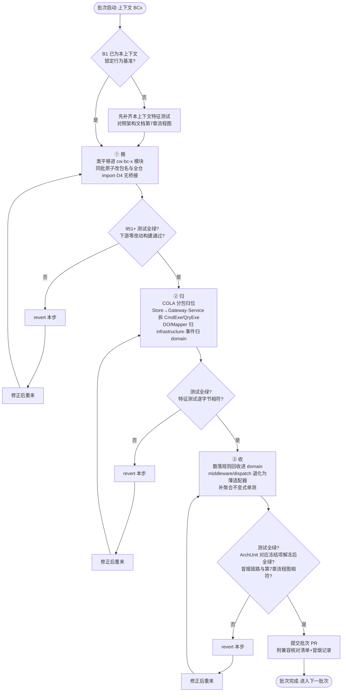
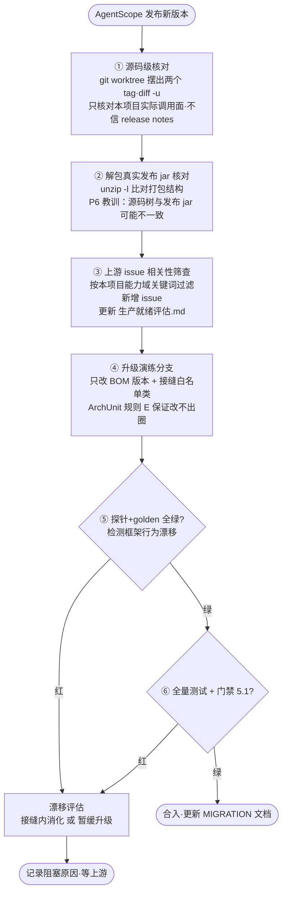

# customer-work DDD 演进技术路线图

> **文档状态：v0.5 评审稿（未定稿，禁止据此开发）**
> 配套《DDD架构设计文档》，架构文档定稿后本路线图才能定稿。**文档没问题才能进入开发，有问题不能开发；理清思路和方向比盲目开发更重要。**
> 本文档以多轮头脑风暴持续演进：每轮讨论的结论进版本表，批次与优先级允许被后续讨论推翻重排。

| 版本 | 日期 | 说明 |
|---|---|---|
| v0.1 | 2026-07-17 | 首版评审稿：8 个批次的绞杀路线 |
| v0.2 | 2026-07-17 | 增补迁移三步法流程图（含"第0步锁行为"）、批次 PR 质量门禁流程图；门禁 G4 统一要求各批次冒烟链路与架构文档第 7 章流程图逐一相符 |
| v0.3 | 2026-07-17 | 对接架构文档 3.5「AgentScope 演进预判」：B0 扩充框架接缝基线；新增「AgentScope 升级应对预案」章；风险 R8；DoD 框架防腐验收项 |
| v0.4 | 2026-07-17 | 对接架构文档 3.5.4「Python 版先行指标」：升级预案触发时机新增"Python 版先行预警" |
| v0.5 | 2026-07-17 | **按三轮讨论结论全面重排优先级**：新增第 0 章价值分层总纲（T0~T4）；行为锁定升格为独立批次 B1；规则回收提前进核心批次（B3/B4）；workspace/identity/sqlconfig 战术重构降入可选池 BX（默认不执行）；批次全部重编号；DoD 分层 |
| v0.6 | 2026-07-18 | **第 1 轮裁决落地**：D4 采备选（不留桥接）→ 三步法/门禁/风险 R1/BX-4 全面改写，出口标准增加旧包名 grep 零命中；D2 采备选（双聚合事件同步）→ B3 改写、R2 风险改写、B3 动工前置 Q1 结论；D5 采备选（BC16 门户聚合）→ B8 改写、DoD 上下文数 15→16；D7 已裁决生效 |
| v0.7 | 2026-07-18 | **第 2 轮裁决落地**：Q1 已裁决（事件+定期对账巡检）→ B3 前置解除、落实设计；Q6 已裁决（analytics 直连只读库表）→ B7 改写；Q8 已裁决（BC17 评测上下文）→ B7 增 BC17、DoD 上下文数 16→17；Q7 挂起转为 B1 动工前置条件 |

---

## 0. 优先级总纲（价值驱动，三轮讨论的直接结论）

### 0.1 为什么重排

前四版路线图按"上下文清单"平铺推进，隐含假设是"每个上下文的重构价值相近"。三轮头脑风暴推翻了这个假设：

| 讨论 | 结论 | 对优先级的影响 |
|---|---|---|
| ① DDD 的真正意义与副作用 | 本项目 DDD 的价值密度排序：**确定性护栏与概率性 AI 分离 > 框架防腐 > 核心域充血标杆 > 结构归位 > CRUD 域 COLA 化**；纯 CRUD 域强行充血是副作用区 | 低价值域（workspace/identity/sqlconfig 战术重构）降入**可选池，默认不执行**；"商业项目只值得 B0+工单+aiconfig"的判断制度化为价值分层 |
| ② AgentScope 演进预判（P1~P6） | middleware/编排范式必再翻转（P2/P4），规则留在胶水层就是把业务押在框架的摇摆上 | **规则回收从收尾批次提前进核心批次**；守护与接缝基线（B0）优先级不可动摇 |
| ③ Python 先行指标（P7、月级补丁流） | Java 2.0.x 补丁流可预期为月级；框架正上探服务层 | **行为锁定（特征测试）升格为独立最早期批次 B1**——它同时是 DDD 重构和高频框架升级两条线的共用安全网；发布语言文档化、薄适配器前置 |

### 0.2 价值分层（T0~T4）

| 层级 | 定位 | 内容 | 承诺强度 |
|---|---|---|---|
| **T0 思想与方向** | **当前所处阶段**：文档多轮头脑风暴、决策点裁决、方向修正 | 两份文档迭代；D1~D8 裁决；开放问题清单（架构文档 9.2）消化 | 无代码；不设截止，讨论透了才出站 |
| **T1 护栏与防腐** | 本项目 DDD 价值密度最高处，且与后续一切解耦、即刻生效 | B0 架构守护基线、B1 行为锁定基线、B9 终验收口 | **必做**，任何范围收缩都不砍 |
| **T2 核心域标杆** | 确定性规则回收 + 充血聚合样板间 + 真实缺陷修复 | B2 骨架、B3 工单试点、B4 风控与审批、B5 aiconfig（G5） | **必做**，是"标杆"称号的主要来源 |
| **T3 结构归位** | 价值中等，跟随执行，模式照抄样板间 | B6 调度与领域事件、B7 支撑域归位、B8 admin 轻收尾 | 做，但允许被 T0 后续讨论降级或简化 |
| **T4 可选池** | 价值低或副作用区，做了不加分、做坏了减分 | BX：workspace/identity 战术重构、sqlconfig COLA 化 | **默认不执行**；每项需届时单独立项评审 |

### 0.3 头脑风暴驱动的文档演进机制

- 每轮讨论产出 → 两份文档改版（版本表记录"改了什么、为什么"）→ 你评审 → 下一轮；
- 决策点（D 系列）与开放问题清单（架构文档 9.2）是讨论的弹药库：讨论可以新增、推翻、合并决策点；
- **进入开发的唯一闸门**：你明确确认"文档没问题"。在此之前所有批次（含 B0）都不动工；
- 进入开发后本机制不停：每批次的实施发现反哺文档（As-Built 修订），T0 与 T1~T3 并行存在。

---

## 1. 演进总纲（绞杀者规则）

每个批次必须满足以下全部约束，违反任何一条即中止该批次并回滚：

1. **一批一个 PR**，PR 只做本批次范围内的事，禁止夹带；
2. **全量测试通过**：批次前后 951 个测试（含门控跳过项）结果一致，批次内新增测试只增不减；
3. **可独立回滚**：revert 单个 PR 即可回到上一批次终态，批次之间无隐藏耦合；
4. **兼容承诺逐项核对**：下游 GAV / 包名原子变更（D4：不留桥接，旧包名 grep 零命中）/ Bean 覆盖点 / DB Schema / REST API / 配置 Key 六项，每批 PR 描述里附核对清单；
5. **先立规矩后搬家**：ArchUnit 冻结规则（FreezingArchRule）从 B0 上线，存量违规冻结、新增违规即 CI 红——绞杀期间架构不倒退；
6. **迁移三步法**（每个上下文统一）：
   - ① **搬**：类平移进新模块，**同批原子更新全仓 import**（D4 已裁决：不留桥接，编译期 fail-fast），测试全绿；
   - ② **归**：按 COLA 分包归位（Store→Gateway、Service 拆 CmdExe/QryExe、事件归位），测试全绿；
   - ③ **收**：回收散落规则进 domain（middleware/dispatch 里的业务规则），补聚合不变式单测，解冻对应 ArchUnit 冻结项。

> 构建命令、`-gs`+`-s` 同传、`clean`、`-Djacoco.skip=true`、模块间 `mvn install` 等坑照 CLAUDE.md 执行，不再重复。
> v0.5 起"第0步锁行为"不再是各批次的前置步骤——已升格为独立批次 B1，全局一次做完。

### 1.1 迁移三步法流程图（每个上下文统一执行）

---

## 2. 批次总览（v0.5 重排后）

| 批次 | 层级 | 名称 | 范围 | 前置依赖 | 风险 | 预估规模 |
|---|---|---|---|---|---|---|
| B0 | T1 | 架构守护基线 | ArchUnit A~E + enforcer + 冻结 + 接缝白名单校准 + 发布语言文档化 | 两份文档定稿 | 低 | 小 |
| B1 | T1 | **行为锁定基线（新）** | 架构文档第 7 章六图的全局特征测试 + 高波动接缝探针扩充 | B0 | 低 | 中 |
| B2 | T2 | Maven 骨架 | `customer-work-bc/` 空模块 + starter 聚合门面（不搬业务代码） | B1 | 中 | 小 |
| B3 | T2 | 工单上下文试点（样板间） | BC1：ticket + handoff（D2）+ dispatch 规则回收 | B2、D2 裁决 | 高 | 大 |
| B4 | T2 | 内容风控与人工审批 | BC5 敏感词策略回收 + SelfCorrection/DynamicOptions 规则回收 + BC3 审批 | B3 | 中 | 中 |
| B5 | T2 | AI 配置运营 | BC11 aiconfig COLA 化 + **G5 修复**（Nacos 发布事件化）+ ca-bc 骨架 | B3（方法论） | 高 | 大 |
| B6 | T3 | 坐席调度与领域事件统一 | BC2 routing + `DomainEvent`/`DomainEventPublisher` 统一 + 增强器挂载点事件化 | B3 | 中 | 中 |
| B7 | T3 | 支撑域归位 | BC4 conversation + BC6 record + BC7 account + BC8 analytics 只读归位（Q6）+ BC17 评测归位（Q8） | B4 | 中 | 大 |
| B8 | T3 | admin 轻收尾 | BC14 BFF 形态固化 + BC16 门户聚合独立成型（D5）修 G6 + 发布语言终稿 | B5 | 低 | 小 |
| B9 | T1 | 终验与定稿 | 全链路回归 + 架构符合性终验 + 文档竣工版 + 技术债移交 | B3~B8 | 低 | 小 |
| BX | T4 | **可选池（默认不执行）** | BC12 workspace 战术重构 / BC13 identity 战术重构 / BC15 sqlconfig COLA 化 | 各自单独立项评审 | — | — |

> 与 v0.4 的对照：原 B1 骨架→B2；原 B2 工单→B3；原 B5 规则回收拆入 B3（dispatch）与 B4（middleware 三规则）；原 B3 调度并入 B6 并与事件统一同批（调度事件化本就依赖事件机制）；原 B4 支撑域集群中 moderation 提前到 B4（护栏密度高）、其余入 B7；原 B6 aiconfig→B5；原 B7 admin 收尾拆解：BFF/menu 留 B8（轻），workspace/identity 战术重构降入 BX。

---

## 3. 批次详情

### B0 架构守护基线（T1）

**做什么：**
- 新增 `customer-work-arch-test` 模块，落地架构文档第 6 章规则 A~E，全部以 `FreezingArchRule` 上线（存量违规进冻结清单 `archunit_store/`，提交入库）——**规则 E（agentscope import 白名单）是框架防腐的第一道闸**，上线时先全仓 `grep -rln "io.agentscope"` 核出真实 import 清单与架构文档 3.5.3 白名单比对，白名单缺漏在此批修正文档而非放宽规则；
- 根 pom 加 maven-enforcer 依赖收敛规则（此时只对既有模块生效）；
- 把 Nacos `customer-work-runtime-config` 的 JSON Schema 显式写进 `docs/`（发布语言文档化，BC11↔BC10 契约基线，P7 对策的一部分）；
- 登记既有 2 个 P0 探针测试（`MiddlewareInvocationVerificationTest` / `TenantIsolationVerificationTest`）进第 7 章升级预案必跑清单；
- CI（如有）挂上 arch-test。

**出口标准：** 951 测试全绿；ArchUnit 全绿（靠冻结）；冻结清单入库可追踪；接缝白名单与代码实际 import 清单一致。
**回滚：** revert 即可，零业务代码变更。

### B1 行为锁定基线（T1，v0.5 新增）

零重构、纯加测试的批次。原先分散在各批次的"第0步锁行为"全局一次做完，理由（讨论③）：这张行为网**同时服务两条线**——DDD 迁移的每一步和月级频率的框架升级，越早织好收益越大。

**做什么：**
- 对照架构文档第 7 章六张流程图，逐图补特征测试（golden test）：工单 19 条状态转换表驱动、分发路由全分支（含错误路径）、转人工-推荐-抢单闭环、审批终态与超时、配置发布现状行为、敏感词三档处置；
- 为高波动接缝（状态模型、编排门面、模型装饰链）补 2~3 个行为探针（B0 只登记既有 2 个，本批扩充）；
- 特征测试标注 `@Tag("golden")`，升级预案与各批次门禁均以该标签全量执行。

**前置条件：** Q7（golden 测试脆弱性治理：快照粒度、契约字段白名单）当前挂起，**本批动工前需有结论**——否则六图全量特征测试可能建成高维护成本的脆弱资产。

**出口标准：** 六图全部有对应特征测试且全绿；探针清单入 `MIGRATION-2.0.md` 惯例文档。
**回滚：** 纯测试代码，revert 无风险（一般不需回滚，留着无害）。

### B2 Maven 骨架（T2）

- 建 `customer-work-bc/` 聚合 pom 与 8 个空 `cw-bc-*` 模块（仅 pom + 空包结构 + `package-info.java` 声明上下文职责）；
- `customer-work-starter` 改造为聚合门面：pom 增加对 `cw-bc-*` 的依赖（GAV 不变），验证下游（admin-server / app-server / channel）**不改一行**的前提下构建、测试、启动全部正常；
- 父 pom `mvn -N install` 后全仓 `clean test` 验证（CLAUDE.md 已知坑）。

**出口标准：** 951+ 测试全绿；admin-server(8082)/app-server(8080) 本地启动冒烟通过；下游 pom 零改动。
**回滚：** revert；空模块无业务逻辑，风险仅在构建结构。

### B3 工单上下文试点（T2，全路线的样板间）

选 BC1 试点的理由：领域最成熟（充血聚合已就位，主要工作是"归位"而非"改写"），且是核心域——样板间立得住，后面批次照抄。**dispatch 规则回收放在本批**（v0.5 提前）：它是"确定性护栏从概率性链路剥离"的第一仗。

**做什么（三步法）：**
1. **搬**：`ticket/`、`handoff/` 全部类平移 `cw-bc-ticket`，同批原子更新全仓 import（D4 无桥接）；`TicketStore`→`TicketGateway` 直接改名，下游引用一并更新；
2. **归**：`TicketService` 拆为 app 层 CmdExe/QryExe；`TicketEvent` 归位 `domain/event`；DO/Mapper/InMemory/Mybatis 实现归位 infrastructure；装配类归位 starter 门面；
3. **收**：
   - 落实 D2+Q1 裁决（**独立聚合 + 事件同步 + 定期对账巡检**）：`Ticket` 与 `HandoffTicket` 保持两个聚合，主链路走同步领域事件；兜底建对账巡检（模式复用 `TicketSlaScheduler`，以 `Ticket` 为主数据源修复，`log.error` 带错误码留痕，巡检周期做成配置项），原 REST/WS 契约不变；
   - app-server `ChatDispatchService#prepare` 的路由规则（工单状态+关键词→AI/排队/转坐席）抽为 `domain/service/DispatchPolicy`，`HandoffKeywordDetector` 一并下沉，app-server 侧退化为调用端口的薄适配器（P7 对策：接入层保持可换底座）；
   - 补 `Ticket` 聚合不变式单测与 `DispatchPolicy` 表驱动单测（B1 特征测试此时转为对新结构的回归网）；解冻 BC1 相关 ArchUnit 冻结项。

**出口标准：** 951+新增测试全绿（含 golden 全量）；工单 7 态全链路手工冒烟（用户发起→转人工→坐席抢单→挂起/恢复→解决→确认→关闭）；WS 帧协议回归（对照 `docs/生产接口使用手册.md`）；admin BFF（BC14）调用 app-server 工单 API 回归通过。
**回滚：** revert 子 PR（搬/归/收各自可 revert）。
**样板间产出：** 迁移三步法操作手册化（checklist 附在 PR 模板），后续批次复用。

### B4 内容风控与人工审批（T2）

护栏规则密度仅次于工单的两个域，v0.5 提前（讨论②：规则留在 middleware 就是押注框架不摇摆）。

- BC5 moderation：`sensitiveword/` 迁移；Aho-Corasick 引擎留 infrastructure，BLOCK/MASK/REVIEW 处置策略进 domain（`ModerationPolicy`），`SensitiveWordMiddleware` 变薄；**同批回收另两条 middleware 规则**：`SelfCorrectionMiddleware` 越权承诺检测 → BC5/BC1 domain，`DynamicOptionsMiddleware` 关键词切档 → BC1 domain 策略；
- BC3 approval：`approval/` 平移归位，超时调度器归 adapter（Job）+ domain（超时决议规则）；固化架构原则：审批闸门正确性永不依赖框架 HITL/Permission 语义（P4）。

**出口标准：** 测试全绿 + 敏感词三档处置行为回归（middleware 行为逐字节不变，B1 特征测试验证）+ HITL 审批链路冒烟；middleware 层业务规则清零核对（规则 E 白名单里的 middleware 从此只剩"取策略→应用"胶水）。

### B5 AI 配置运营（T2，可与 B4/B6 并行）

- 建 `customer-admin-bc/ca-bc-aiconfig` 模块（admin 侧骨架随本批建立），`aiconfig/` 六个子包按三步法迁移；
- 重点：`AgentProfile` 聚合成型（收拢 `AiAgent` + 4 张关联表的一致性规则：发布前完整性校验、引用中配置禁删）；
- **修 G5**：`CustomerWorkConfigPublisher` 改为 `ConfigPublishRequested` 领域事件 + `AFTER_COMMIT` 监听发布，连通性探测逻辑保持；
- admin-server 排除 starter 自动装配的既有约定保持不变（CLAUDE.md 规范）。

**出口标准：** admin-server 317 测试全绿 + 配置发布→Nacos→app-server 热生效端到端冒烟 + 事务回滚时不发布的负向测试（新增）。

### B6 坐席调度与领域事件统一（T3）

- BC2：`routing/` 平移 + `SeatRoutingScorer` 归位 domain.service；`TicketClassifier` 拆为 domain 端口 `TicketClassifierPort`，实现放平台侧经 Spring 装配注入（**D7 已裁决：完全禁止**，`cw-bc-routing` 模块 pom 零 agentscope 依赖）；
- 领域事件统一：`DomainEvent`/`DomainEventPublisher` 端口落地，`TicketEventListener` 机制兼容迁移；
- 工单进池→调度增强的挂载点事件化：`HandoffCreatedEnricher` 从挂 `HandoffService.create` 改为消费 BC1"转人工完成"领域事件（行为不变，B1 特征测试验证）。

**出口标准：** 测试全绿 + 抢单原子性并发测试（InMemory `synchronized` / Mybatis 条件 UPDATE 两版）保持通过 + 推荐链路 fail-open 行为回归（增强失败不影响转人工主链路）。

### B7 支撑域归位（T3）

BC4（slotfilling+dialog 合并 conversation）、BC6（chatlog+feedback）、BC7（user）、BC8（analytics 只读投影归位——**Q6 已裁决：直连只读库表**，配独立只读数据源/账号，ArchUnit 加"禁止反向写"规则，数据级穿透在架构文档 3.2 显式登记）、**BC17（评测归位——Q8 已裁决：`eval/` 迁出平台进 `cw-bc-eval`，评测标准/阈值/流程进 domain，`JudgeModel` 端口化、实现放平台侧遵 D7）**。体量小、模式同构，按样板间 checklist 流水作业，允许拆 2~3 个子 PR。充血力度克制：只有不变式进聚合，纯 CRUD 不强行充血（讨论①副作用规避）。

**出口标准：** 测试全绿；各域行为与 B1 特征测试逐一相符。

### B8 admin 轻收尾（T3）

- BC14 ticket BFF：**不做聚合设计**，固化为 ACL 形态（ArchUnit 规则：BFF 包禁止出现 @TableName/Mapper）；
- menu 按 **D5 裁决独立为 BC16 门户聚合上下文**：跨上下文读改走对方 client 接口（`MenuAggregationService → AgentService` 直调改为 BC11 client 接口，修 G6），保持展现聚合定位、不做战术设计；identity 的战术重构在可选池 BX 视 D8 裁决；
- 发布语言（Nacos JSON Schema）随 G5 修复后的实际行为出终稿。

**出口标准：** admin 全部测试全绿 + 登录/RBAC/菜单/坐席工单链路冒烟。

### B9 终验与定稿（T1）

- 全仓 `clean test`（预期 951+新增全绿）+ 双端启动全链路回归；
- ArchUnit 冻结清单清零核对（允许残留项显式移入技术债清单，注明原因与摘除计划）；
- 两份文档更新为竣工版（As-Built）：修正演进中与设计稿的偏差；
- 技术债清单移交：残留冻结项、未充血 CRUD 域清单、可选池 BX 各项的当时评估。

### BX 可选池（T4，默认不执行）

以下各项**不在本路线图承诺范围内**，届时单独立项、单独评审、单独决定做不做：

| 项 | 内容 | 当前判断（可被头脑风暴推翻） |
|---|---|---|
| BX-1 | BC12 workspace 战术重构（VibeCoding 等 6 个互调 Service 拆用例） | 编排复杂但多为流程编排而非不变式，充血收益待议 |
| BX-2 | BC13 identity 战术重构（RBAC 充血） | 标准 RBAC，CRUD 密度高，收益低 |
| BX-3 | BC15 sqlconfig COLA 化 | 低代码引擎，通用域，收益低 |

---

## 4. 并行策略与关键路径

```mermaid
gantt
    dateFormat X
    axisFormat %s
    section T1 护栏与防腐
    B0 守护基线        :b0, 0, 1
    B1 行为锁定基线    :crit, b1, after b0, 2
    section T2 核心域标杆
    B2 Maven骨架       :b2, after b1, 1
    B3 工单试点(样板间) :crit, b3, after b2, 3
    B4 风控+审批       :b4, after b3, 2
    B5 aiconfig+G5    :b5, after b3, 3
    section T3 结构归位
    B6 调度+事件统一   :b6, after b3, 2
    B7 支撑域归位      :b7, after b4, 3
    B8 admin轻收尾     :b8, after b5, 1
    section 收口
    B9 终验定稿       :b9, after b7 b8 b6, 1
```

- **关键路径**：B0→B1→B2→B3（样板间）；B3 之后三线并行：B4→B7（护栏与支撑域）、B5→B8（admin 线）、B6（调度事件线）；
- 单位为"批次相对工作量"，不承诺日历工期（依赖评审节奏与并行度）；
- **T0 不在图内**：当前阶段是文档头脑风暴，无日程压力，讨论透了才放行 B0。

## 5. 测试与质量门禁

### 5.1 批次 PR 质量门禁流程图

```mermaid
flowchart LR
    PR(["批次 PR 就绪"]) --> G1{"全量单测<br/>951+ 只增不减<br/>门控跳过清单与基线一致"}
    G1 -- 红 --> STOP(["禁止合入<br/>修复或 revert"])
    G1 -- 绿 --> G2{"ArchUnit<br/>无新增违规<br/>本批冻结项已解冻"}
    G2 -- 红 --> STOP
    G2 -- 绿 --> G3{"兼容六项核对<br/>GAV/包名原子变更/Bean覆盖点<br/>Schema/API/配置Key"}
    G3 -- 有缺口 --> STOP
    G3 -- 全勾 --> G4{"golden 特征测试全量绿<br/>冒烟链路与架构文档<br/>第7章流程图逐一相符"}
    G4 -- 不符 --> STOP
    G4 -- 相符 --> G5{"人工评审<br/>过度设计检查·R5<br/>是否越界做了 BX 池的事"}
    G5 -- 有异议 --> STOP
    G5 -- 通过 --> MERGE(["合入 main·打批次标记"])
    MERGE --> NEXT(["下一批次入口"])
```

| 门禁 | 基线 | 批次要求 |
|---|---|---|
| 全量单测 | 951（starter 549 + app 77 + channel 8 + admin 317） | 只增不减，门控跳过项清单不变 |
| golden 特征测试 | B1 建立 | 每批全量执行，行为逐字节相符 |
| ArchUnit | B0 起全绿（冻结机制） | 每批解冻对应项，禁止新增违规 |
| 聚合不变式单测 | 无 | 每个迁移批次为其聚合补状态机/不变式表驱动测试 |
| 冒烟清单 | `docs/生产接口使用手册.md` | 每批 PR 描述附本批相关链路的冒烟记录 |
| 兼容核对清单 | 架构文档 5.2 六项 | 每批 PR 描述逐项打勾 |
| 范围核查 | 第 0 章价值分层 | PR 不得夹带 BX 可选池内容（G5 人工评审项） |

## 6. 风险登记册

| # | 风险 | 概率 | 影响 | 缓解 |
|---|---|---|---|---|
| R1 | 一步到位改包名（D4）使单批 PR 改动面变大（搬+全仓 import 同批完成） | 中 | 中 | IDE 级重构工具执行改名；编译期 fail-fast（改漏即编译失败，无运行时暗雷）；出口标准旧包名 grep 零命中；批内仍可拆"搬/归/收"子 PR 分步回滚 |
| R2 | Ticket↔Handoff 双聚合事件同步（D2）引入不一致窗口（事件丢失/乱序时 3 态与 7 态漂移） | 中 | 高 | B1 特征测试锁定现有映射行为；**Q1 已裁决**：事件主链路 + 定期对账巡检兜底（Ticket 为主数据源），B3 落实并补一致性表驱动测试；不一致窗口上界 = 巡检周期（配置项） |
| R3 | middleware 规则回收后行为漂移（脱敏/自纠错语义变化） | 中 | 高 | B1 特征测试先锁行为；middleware 只做"取策略→应用"，策略计算全部可单测 |
| R4 | Maven 结构变更踩本机镜像/增量编译坑 | 高 | 中 | 严格执行 CLAUDE.md 构建约定（-gs+-s 同传、clean、-N install），B2 单独批次专门消化 |
| R5 | 贫血→充血用力过猛（过度设计） | 中 | 中 | 价值分层制度化：BX 池默认不做；门禁 G5 增加"是否越界做了 BX 的事"检查项 |
| R6 | 双线并行时 starter 门面 pom 冲突 | 中 | 低 | 门面 pom 变更集中在各批次第①步（搬），三线错峰提交 |
| R7 | 951 基线中门控测试（MySQL/Redis/Nacos/OCR/MinIO）环境不齐导致假绿 | 中 | 中 | 每批出口标准要求记录门控跳过清单并与基线比对，跳过项增多即视为红 |
| R8 | 演进期间 AgentScope 发布新的破坏性版本，与 DDD 迁移撞车 | 中 | 高 | 第 7 章预案随时可执行且与批次解耦（升级只碰接缝白名单，DDD 批次不碰接缝内部）；若撞车，升级演练分支与批次分支各自独立验证后再合并；规则 E 从 B0 起就保证两类改动物理不重叠 |
| R9 | 多轮头脑风暴反复重排导致路线图失去稳定性、迟迟不动工 | 中 | 中 | T0 无截止但有出口条件（D 系列全裁决 + 开放问题清单清空或显式挂起）；文档版本表让每次重排可追溯、有理由；T1/T2 为"任何重排都不砍"的稳定锚 |

## 7. AgentScope 升级应对预案（常备作战流程）

> 本章不属于某个批次，是 DDD 演进交付的**常备机制**：AgentScope 每次发版（minor/major/新 extension）都按此流程执行。方法论不是新发明——RC4→GA 升级实战验证过每一步（`MIGRATION-2.0.md` 第 9 章），此处制度化。

### 7.1 升级作战流程

### 7.2 升级影响半径表（规则 E 生效后的制度保证）

| 变更类型 | 允许改动的范围 | 业务上下文 |
|---|---|---|
| 依赖坐标/包名变更（P1 型，如 GA 模型外置） | starter 门面 pom + 接缝类 import | **零改动，零重编译**（D7 完全禁止方案下） |
| Builder/调用签名变更（P2 型） | Agent/模型工厂、编排门面内部 | 零改动 |
| 范式翻转（P3 型，如 Session→StateStore 级别） | 接缝门面内部重写 + 平台包 | 零改动（门面契约不变）；若门面契约被迫变化，同批原子适配全部调用方（D4：不留桥接，编译期兜底） |
| 能力移除（如 TTS 下线） | 接缝类退化为文档化空实现 | 零改动 |
| Middleware/Permission 语义变化（P4 型） | middleware 胶水层 | 零改动——**前提是 B4 已完成规则回收**，这是 B4 提前进 T2 的价值另一面 |

### 7.3 触发时机与责任

- 上游发 minor/major 版本、或本项目要用的新 extension 出现 → 走 7.1 全流程；
- 上游安全通告（如 MCP SDK [#2075](https://github.com/agentscope-ai/agentscope-java/issues/2075) 类）→ 立即走 7.1，③ 前置；
- **Python 版先行预警**（架构文档 3.5.4）：AgentScope **Python 先行、Java 跟进**（Python 2.0 早 Java 两个月，且 Python 侧 2.0→2.0.4 仅用两个月、月级发版）。Python release notes 出现新能力或破坏性变更 → 视为 Java 侧提前约一个版本周期的预警，只做**桌面预研**（评估落到哪个接缝、要不要用），不动代码；Java 版实际发版时再走 7.1 全流程。这也要求 7.1 流程保持低成本——探针测试自动化，单次演练目标控制在小时级；
- 每次执行的产出：`MIGRATION-2.0.md` 追加章节（沿用现有文档惯例）+ `生产就绪评估.md` issue 结论刷新。

## 8. 完成定义（DoD，v0.5 起分层）

**必达项（T1+T2，"标杆"的底线）：**

- [ ] B0/B1 护栏就位：ArchUnit 五规则上线、golden 特征测试覆盖第 7 章六图、接缝白名单与代码一致；
- [ ] 确定性护栏与概率性 AI 完成分离：middleware/dispatch 业务规则清零，全部规则可脱离 Spring/LLM 单测；
- [ ] BC1 工单、BC3 审批、BC5 风控、BC11 aiconfig 四个高价值上下文完成三步法迁移，聚合有不变式单测；
- [ ] G5（事务内发布脏配置）修复并有负向测试；
- [ ] 六项兼容承诺终验通过（下游零改动构建+启动）；951+ 测试全绿；
- [ ] 框架防腐验收：规则 E 无冻结项全绿；升级预案经一次桌面推演（或实际上游发版实战）验证可执行。

**目标项（T3，允许被 T0 讨论降级）：**

- [ ] BC2/BC4/BC6/BC7/BC8/BC17 完成归位；17 个上下文全部战略落位（含 5 个定位固化不迁移的：BC9/BC10/BC14/BC15/BC16）；
- [ ] 领域事件统一机制落地；G6（menu 跨域直调）修复。

**收口项（T1）：**

- [ ] 两份文档更新为竣工版；`CLAUDE.md` 补充 DDD 分包与依赖规则约定 + 升级预案入口（供后续 AI 会话遵守）；
- [ ] BX 可选池各项留有届时评估记录（做/不做都要有理由）。
