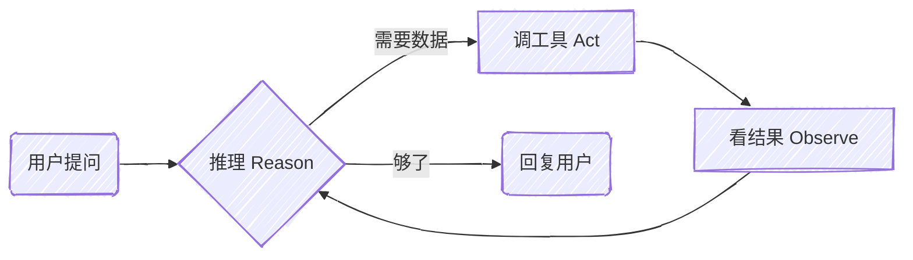
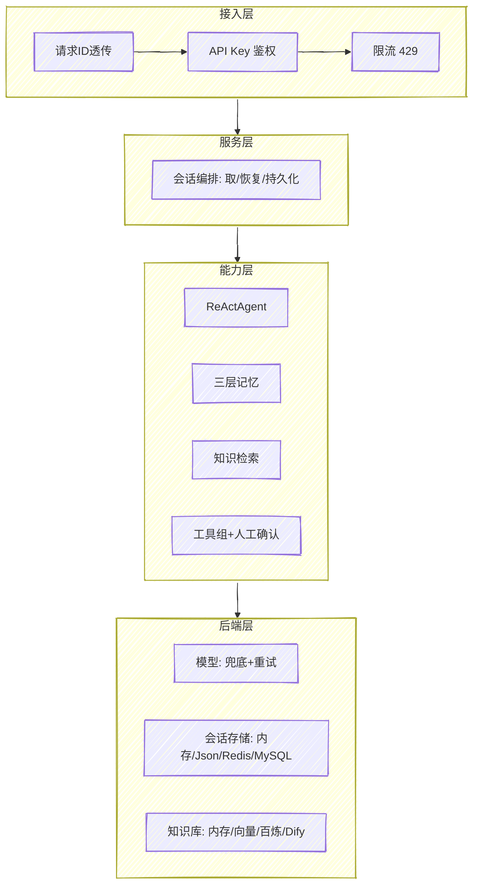
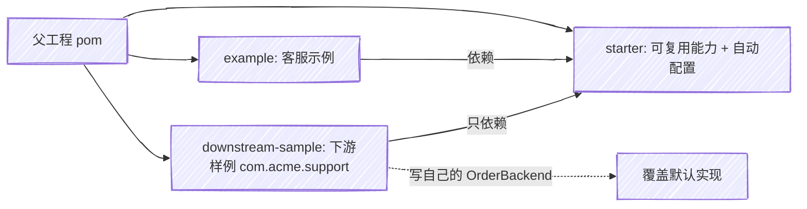
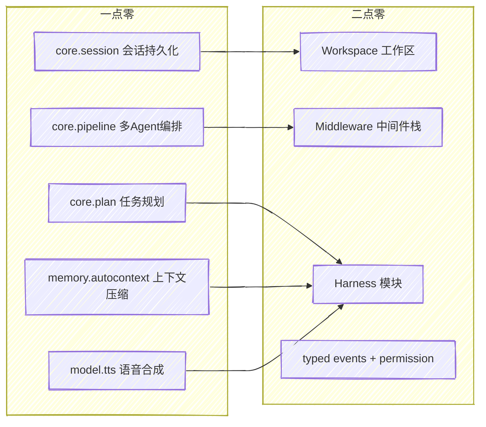
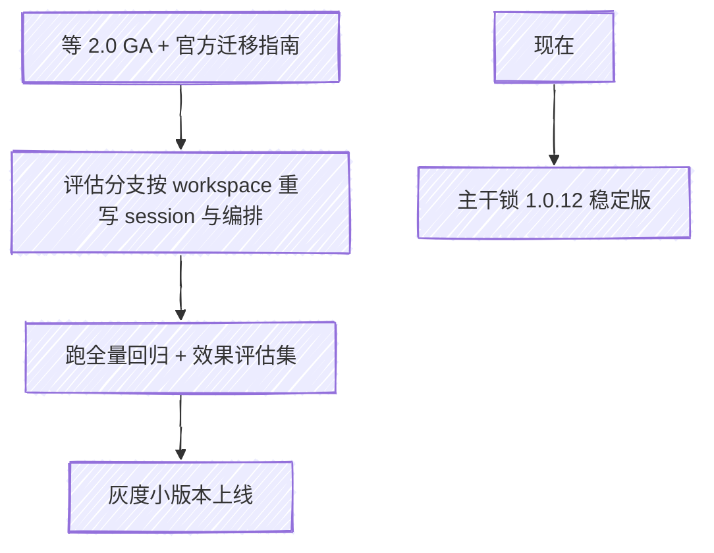

---
config:
  look: handDrawn
  theme: neutral
---

# AgentScope 客服智能系统：一套能上生产的落地方案，外加一笔讲清楚的 2.0 迁移账

很多人写 Agent，停在“能对话”那一步就截图发朋友圈了。真把它塞进客服系统，问题立刻变样：会话重启就丢、退款敢不敢让模型直接打款、上百个工具把上下文撑爆、模型抖一下整条链路就挂。这些不是模型问题，是工程问题。

这篇讲两件事。第一，用 AgentScope Java 把一个客服 Agent 从“能跑”做到“能上生产”，每一层补了什么、为什么补。第二，AgentScope 2.0 已经到 RC，它改了什么、我实测踩到哪些坑、现在该不该升。全程结合我开源的这套项目，代码和结论都能复算。

---

## 一、先把核心跑起来：ReAct 三步循环

AgentScope 的 Agent 范式是 ReAct，不是写死的流程图。让模型当大脑，自己决定什么时候调哪个工具，循环“推理 → 调工具 → 看结果 → 再推理”，直到给出答复或撞到轮次上限。



落到代码，最小形态就三块：准备工具、配模型、跑 Agent。我项目里的订单工具长这样，注解一标，框架自动把方法抽成 JSON Schema 喂给模型：

```java
public class OrderTools {
    @Tool(description = "按订单号查询订单状态、金额、时间")
    public Mono<String> queryOrder(
        @ToolParam(name = "orderId", description = "订单号") String orderId) {
        // 真实环境这里换成调你的订单微服务
        return Mono.just("订单 " + orderId + "：已发货，金额 299 元");
    }
}

Toolkit toolkit = new Toolkit();
toolkit.registerTool(new OrderTools());

ReActAgent agent = ReActAgent.builder()
    .name("客服助手")
    .sysPrompt("你是电商客服，订单问题先查工具再回答")
    .model(DashScopeChatModel.builder().apiKey(key).modelName("qwen-max").stream(true).build())
    .toolkit(toolkit)
    .maxIters(10)
    .build();

Msg reply = agent.call(userMsg).block();
```

到这里你有了一个会查订单的客服。但这只是“能跑”，离“能上生产”差着一整套工程。

---

## 二、从 demo 到生产，差的全是工程

我把生产要的东西按层补齐了。看图，从上到下五层，每一层解决一类真实事故。



挑几个最容易翻车的点说透。

**会话不能一重启就没。** 客服是多轮的，容器一重启、一扩容，上下文丢了体验就断。我用框架的 Session/State 把会话状态外置，按 sessionId 存取，本地内存、单机 Json、Redis、MySQL 四种存储改一行配置就切。多实例共享会话走 Redis，强一致可审计走 MySQL。

**涉钱的动作不能让模型自己拍板。** 退款这种操作，模型判断失误就是资金事故。我在工具执行后挂了一道人工确认闸门，受控工具(比如生成退款单)执行完直接把 Agent 安全暂停，交人工复核，框架保留上下文，复核完能接着跑。这条不是写在提示词里靠模型自觉，是框架级强约束。

**上下文会爆，token 会烧钱。** 长对话上下文无限涨，成本失控。框架的自动上下文压缩在超过阈值时压缩历史、卸载大工具结果、保留最近几轮原文，让上下文始终有界。我还在观测里加了单请求 token 超阈值告警，成本当 SLO 盯。

**模型会抖。** 我在统一的 Model 抽象外面包了两层：私有化兜底(主模型挂了自动切本地 Ollama)、退避重试(瞬时错误指数退避重发)。两层可叠加，先重试，仍失败再兜底。对上层 Agent 完全透明。

**知识检索要可溯源。** RAG 四档可切：内存关键词(离线可测)、真实向量(百炼 Embedding 加内存向量库)、百炼企业知识库、Dify。回答带来源，减少幻觉。

再加上接入层的鉴权限流、Actuator 健康检查与 Prometheus 指标、优雅停机、X-Request-Id 全链路关联、Nacos 配置中心做系统提示词热更新(运营改话术不重启)，这一圈下来才叫能上生产。

这些能力全是“配置开关加可替换实现”：默认实现保证离线开箱即用、单测全绿；生产改一行配置或丢一个 Bean，就换成真实后端。整套 123 个单元测试，外部依赖(Redis/MySQL/Nacos/百炼)不在线就自动跳过，任何环境 mvn test 都绿。

---

## 三、我把它做成了“别人能抄”的形态

光自己能跑没意思。我把可复用的能力抽成了一个 Spring Boot 自动配置 starter，业务示例单独一个模块，再加一个完全不同包名的下游接入样例做活文档。



关键设计就一句话：业务工具不写死。订单、售后、知识三个能力都拆成接口(`OrderBackend` 这类)，默认给内存 Mock 实现，并用 `@ConditionalOnMissingBean` 注册。你在自己的工程里声明一个同类型的 Bean，默认实现自动让位，工具就调到你的真实系统，框架代码一行不用动。

下游接入是教科书式的三步：加 starter 依赖、写自己的 Backend、起服务。我专门写了个 `com.acme.support` 包的样例工程，和框架包名完全不重叠，靠 starter 的 `@AutoConfiguration` 自动装配，零 `@ComponentScan`。还配了一条契约测试,持续校验“引入即用加可覆盖默认”这个接入承诺,CI 里一直在跑。

顺手填的工程坑也都补了：用 HikariCP 而不是 spring-jdbc，避免触发 DataSourceAutoConfiguration 逼下游配 url；密钥全走环境变量，仓库里零密钥；Docker Compose 一键起 Redis/MySQL/Nacos；CI 用服务容器让持久化测试真跑而不是跳过。

---

## 四、2.0 来了，它到底改了什么

AgentScope Java 现在主线是 v2.0.0-RC2(2026 年 6 月)，正式 GA 还没出。模块拆成 core、extensions、examples、harness、distribution 五块。

2.0 不是版本号往上抬，是范式升级。官方明确的破坏性变更有四样：类型化事件(typed events)、权限系统(permission)、中间件栈(Middleware)、工作区抽象(Workspace)。最核心的新角色是 HarnessAgent，它在 ReActAgent 这个核心之上，用 Middleware 和 Toolkit 叠了一整套长任务工程脚手架：workspace 作为人格、知识、技能的磁盘载体，分层记忆加自动压缩，子 Agent，沙箱，Plan Mode，技能。依赖坐标是 `io.agentscope:agentscope-harness`。

我直接把项目依赖从 1.0.12 改到 2.0.0-RC2 试了一次，把账算清楚了。下面这张是能力搬家对照，左边是 1.0 我在用的包，右边是 2.0 的去向。



实测结论：把版本一换，编译直接挂。`session`、`plan`、`pipeline`、`memory.autocontext`、`model.tts` 这几个我正在用的包，在 2.0 的聚合包和 core 里都不见了，运行期直接报 `NoClassDefFoundError: io/agentscope/core/session/Session`。而 2.0 新冒出来 `core.workspace`、`core.middleware`、`core.permission`、`core.chat`、`core.embedding`，harness 独立成了 `io.agentscope.harness` 模块。翻译成人话：会话、状态、规划、编排被并进了 Harness 的 workspace 加 middleware 新抽象，记忆模型也换成了 workspace 那套。这不是改方法名能糊弄过去的，是换了一套上下文与持久化范式。

所以 2.0 要做的活，清单很明确：
- 会话持久化要从 Session/State 迁到 workspace 持久化模型。
- 多 Agent 编排从 pipeline 迁到 middleware 或 Harness 子 Agent。
- 上下文压缩、PlanNotebook、TTS 找 2.0 对应 API 重接。
- 模型层、工具、RAG、Hook、安全、可观测、Nacos 这些大概率小改就行。

---

## 五、现在到底升不升

我的判断是：现在不升，等 GA。理由两条，都摆得上台面。

一，2.0 还是 RC，API 没冻结，typed events 和 permission 这种底层改动落到生产是给自己埋雷。二，2.0 拆模块之后，session、plan、pipeline 这些到底搬到了哪个 artifact，现在缺一份官方迁移指南或 BOM，硬猜坐标不靠谱。稳妥做法是主干继续锁 1.0.12 稳定版，单独开一个评估分支把迁移账记着，等 GA 加官方文档再动手。

但这里恰恰是我这套项目结构的价值所在。会话、记忆、RAG、模型全是 Provider 加接口加配置开关的形态，换底层实现的时候，业务层、接入层基本不动，改动集中在 starter 内部那几个装配类。同样一次大版本迁移，分层好的工程改十几个文件，耦合死的工程要动全身。2.0 这种范式级重构，正是检验工程分层成色的时候。



---

## 写在最后

Agent 工程化这件事，模型决定上限，工程决定能不能上生产。AgentScope 给的是能力积木，把积木拼成一台能跑、可观测、可审计、能被别人复用的车，是工程的活。2.0 把记忆和持久化收进了 Harness 的 workspace，方向是对的，代价是一次范式迁移。提前把账算清楚、把分层做扎实，等 GA 那天你只改几个装配类，而不是推倒重来。

这套客服系统(多模块 starter、业务后端 SPI、四档存储与知识库、兜底重试、鉴权限流、可观测、Nacos 热更新、123 个测试、下游接入样例、2.0 迁移评估)我都开源了，可以直接抄去改成你自己的业务 Agent。

参考资料：
- [AgentScope Java 仓库(main，v2.0.0-RC2)](https://github.com/agentscope-ai/agentscope-java)
- [Create ReAct Agent · AgentScope Java](https://java.agentscope.io/en/quickstart/agent.html)
- [AgentScope Java v2 文档站](https://java.agentscope.io/v2/en/intro.html)
