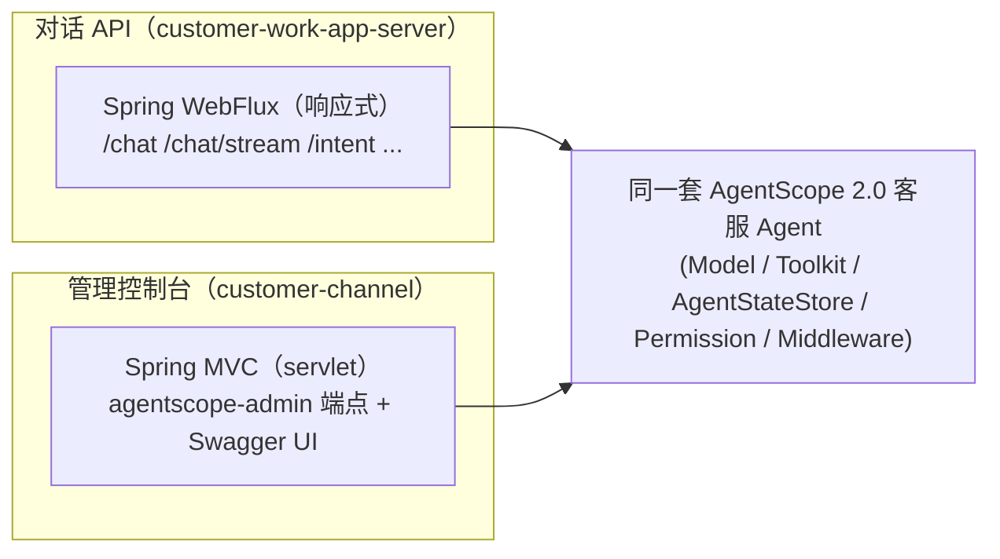

# customer-channel 操作文档（AgentScope 2.0 配套前端 · 客服 Agent 控制台 + 对话入口）

> 模块：`customer-channel` ｜ 依赖：`agentscope-admin` + `agentscope-chat-completions-web` + `agentscope-agui`（均 2.0.0 GA starter，`ga2.0` 分支）｜ Web 栈：Spring **MVC** ｜ JDK 17
>
> **模块定位**：多渠道接入演示模块（官方五套前端能力接入），非主链路必需。

`customer-channel` 把 customer-work 的客服 Agent 同时接到**三套官方前端能力**（复用同一个 `ReActAgent` Bean）：

1. **agentscope-admin（管理控制台）**：管控/观测已部署 agent——会话查看与导出、工具与权限巡检、用量统计、子智能体任务、
   优雅 drain 等，集成 **AgentEvent** 与 **Permission** 三态权限的 HITL 流程。开发者无需写 UI 即可体验已部署的 agent。
2. **agentscope-chat-completions-web（OpenAI 兼容对话）**：把客服 Agent 包成 **OpenAI API**（`POST /v1/chat/completions`，
   同步 + SSE 流式），任意 OpenAI 客户端 / 聊天前端均可对话。本模块另附一个最简内置聊天页（`/`），开箱即可在浏览器对话。
3. **agentscope-agui（AG-UI 富事件协议）**：标准 Agent↔前端事件协议（`POST /agui/run`，SSE 类型化事件
   `RUN_STARTED / TEXT_MESSAGE_* / TOOL_CALL_* / RUN_FINISHED`），供 AG-UI/CopilotKit 生态前端渲染推理、工具调用、状态与 HITL。
4. **Studio 观测台（可视化调试）**：复用 starter 的 `StudioConfigurer`（`StudioManager`），把 agent 运行轨迹推送到
   **外部 AgentScope Studio 应用**做可视化调试 / 回放。这是"看 agent 怎么跑"的研发/排障工具，**不是嵌入页面**。
5. **Channel · 钉钉 / 飞书（IM 平台接入）**：把客服 Agent 包成 `HarnessAgent` 后挂上对应 `Channel`，用户在 IM 平台
   与客服 agent 对话。
   - **钉钉**（`DingTalkChannelConfigurer`）：钉钉 **Stream 模式**（出站 WebSocket，无需公网回调），群内 @ 机器人对话。
   - **飞书 inbound**（`FeishuChannelConfigurer` + `FeishuCallbackController`）：**应用 + 事件回调**——飞书把用户消息
     POST 到 `/api/channels/feishu/{channelId}/callback`，经 channel 派发给 agent，回复经飞书 API 下发。需飞书应用
     事件订阅指向**公网可达**的该回调地址。
   - **飞书 outbound**（`FeishuWebhookNotifier` + `POST /push/feishu`）：通过飞书**自定义机器人 Webhook** 主动把消息
     推送到群（运营通知 / 告警 / 人工转接提醒）。机器人若配了关键词安全校验，填 `webhook-keyword` 自动带上。
   - **企业微信**（`WeComChannelConfigurer` + `WeComCallbackController`）：**应用 + 回调**——企业微信把用户消息
     POST 到 `/api/channels/wecom/{channelId}/callback`（首次配置 GET 做 URL 验证），经 channel 派发给 agent，回复经
     企业微信 API 下发。需企业微信自建应用回调地址指向**公网可达**的该地址。

> 前三者是"前端入口"，Studio 是"可观测连接器"，Channel 是"IM 平台入口"。同一个 `customerServiceAgent` Bean 被各自接管：
> admin 按 `Agent` 类型、chat 按 `ReActAgent` 类型、AG-UI 按 **Spring bean 名**（`customerServiceAgent`）、
> Channel 经 `HarnessAgent.fromAgent(...).channel(...)` 的 gateway 路由；Studio 把运行轨迹经 WebSocket 推给外部 Studio。

---

## 1. 架构定位（为什么是独立模块）



- `agentscope-admin` 是 **Spring MVC**（依赖 `spring-boot-starter-web` + `springdoc-webmvc`）；customer-work 主链路是
  **WebFlux**（+ `springdoc-webflux`）。二者同上下文会因"双 Web 类型 + 双 Swagger"冲突，故 **按 Web 类型拆为独立模块**——
  对话走响应式、管理走 servlet，是合理的工程边界。
- customer-channel 以 `spring.autoconfigure.exclude` 关闭 starter 的 WebFlux 自动装配，**只复用其 web 无关的 Agent 能力叶子类**
  （`ModelConfig` / `SessionConfig` / `ToolRegistrar` / `PermissionConfig` / `ObservabilityMiddleware`），与 admin 的 MVC 栈零冲突。

---

## 2. 集成原理（admin 如何接管你的 Agent）

`AgentscopeAdminAutoConfiguration` 从容器里**收集所有 `io.agentscope.core.agent.Agent` 类型的 Bean** 构建 `AgentRegistry`，
并吸收 `Toolkit` / `Model` / `AgentStateStore` Bean 丰富管理面。因此集成只需在 `CustomerWebAgentConfig` 暴露：

| Bean | 作用 |
| --- | --- |
| `@Bean Agent customerServiceAgent` | 客服 ReActAgent（系统提示词 + 业务工具 + 状态存储 + 三态权限 + 可观测中间件）→ 被 AgentRegistry 自动接管 |
| `@Bean Model chatModel` | 模型层（复用 `ModelConfig`，多厂商 + 兜底/重试）→ admin 模型巡检 |
| `@Bean Toolkit customerToolkit` | 业务工具集（复用 `ToolRegistrar` + Mock 后端）→ admin 工具巡检 |
| `@Bean AgentStateStore agentStateStore` | 状态外置存储（复用 `SessionConfig`）→ admin 会话管理 |

> 无需手工调用 `register()`：声明 Bean 即接管。生产换真实工具后端只需提供对应 `OrderBackend` 等 Bean。

---

## 3. 启动与访问

### 3.1 前置条件
- JDK 17；可访问的大模型（默认百炼 DashScope）。
- 环境变量注入模型密钥：`export DASHSCOPE_API_KEY=你的百炼密钥`（缺省启动会报错并提示）。

### 3.2 启动
```bash
export JAVA_HOME=$(/usr/libexec/java_home -v 17)
export DASHSCOPE_API_KEY=sk-xxxx
# 首次构建依赖（绕开会拦截 Central 的镜像）
mvn -s settings-central-direct.xml -pl customer-channel -am -DskipTests install
# 启动控制台（默认端口 8081）
mvn -s settings-central-direct.xml -pl customer-channel spring-boot:run
# 或打包后运行
java -jar customer-channel/target/customer-channel-1.0.0.jar
```

### 3.3 访问入口（已实测，端口 8081）

> **主页面 = Swagger UI**（admin starter 未打包独立 SPA 仪表盘，交互页面即 Swagger UI；根路径 `/` 返回 404）。

| 入口 | 地址 | 说明 |
| --- | --- | --- |
| **内置聊天页（对话）** | `http://localhost:8081/` | 最简聊天页，直接在浏览器与客服 Agent 对话（调 `/v1/chat/completions`） |
| **对话 API（OpenAI 兼容）** | `POST http://localhost:8081/v1/chat/completions` | 同步 + SSE 流式；任意 OpenAI 客户端/前端可接入；绑定客服 `ReActAgent` |
| **AG-UI 事件流** | `POST http://localhost:8081/agui/run`<br/>（或 `/agui/run/{agentId}` 显式路由） | SSE 类型化 AG-UI 事件（消息增量/工具调用/状态/HITL）；请求体为 AG-UI `RunAgentInput` |
| **Swagger UI（管理主页面）** | `http://localhost:8081/swagger-ui/index.html`<br/>（`/swagger-ui.html` 会 302 跳到此） | 浏览 / 在线调试全部管理 REST 端点 |
| OpenAPI 文档 | `http://localhost:8081/v3/api-docs` | OpenAPI JSON |
| 健康检查 | `http://localhost:8081/actuator/health` | 含 AgentStateStore 后端探测 |
| Agent 清单 | `http://localhost:8081/actuator/agentscope-agents` | 已接管的 Agent（返回本项目 `CustomerServiceAgent`） |
| 工具/权限/用量/状态 | `/actuator/agentscope-tools`、`-permissions`、`-usage`、`-status` | 工具、三态权限、用量、运行状态 |
| 子智能体/巡检/排干/模型/命令 | `/actuator/agentscope-subagents`、`-doctor`、`-drain`、`-models`、`-commands` | 子智能体、健康巡检、优雅 drain、模型、命令 |
| 会话管理（REST） | `GET /admin/sessions`、`/admin/sessions/{id}/messages`、`/state`、`/plan`、`/tasks`、`/subagent-tasks`；动作 `/admin/sessions/{id}:compact` `:abort` `:undo` `:redo` `:export` `:enter-plan-mode` `:exit-plan-mode` | `SessionAdminController`/`SubagentTaskController`，前缀由 `agentscope.admin.base-path`（默认 `/admin`）控制 |
| **Studio 观测台（外部应用）** | 你单独运行的 Studio 实例（如 `ws://localhost:8501`） | 开 `customer-work.observability.studio.enabled` 并配 `url` 后，本应用把 agent 轨迹推送到该 Studio 做可视化；**不是本应用的页面** |
| **Channel · 钉钉（IM 平台）** | 钉钉客户端（群 @ 机器人） | 开 `customer-channel.channel.dingtalk.enabled` 并配 `app-key/app-secret/robot-code` 后，本应用 Stream 模式连钉钉；在群里 @ 机器人即可对话 |
| **Channel · 飞书 inbound（事件回调）** | `POST /api/channels/feishu/{channelId}/callback` | 开 `customer-channel.channel.feishu.enabled` 并配 `app-id/app-secret(+verification-token)` 后映射；飞书事件订阅填**公网**此地址，url_verification 握手通过即接收用户消息 |
| **Channel · 飞书 outbound（推送）** | `POST /push/feishu?text=...` | 配 `customer-channel.channel.feishu.webhook-url`（+机器人关键词 `webhook-keyword`）后，主动把文本推送到飞书群 |
| **主动服务（复用飞书推送）** | starter `POST /api/customer/notify/order-status\|survey` | customer-channel 的 `FeishuNotificationChannel`（`@Primary`）覆盖 starter 默认 `LoggingNotificationChannel`，把订单状态通知/满意度回访经飞书 webhook 推达；webhook 未配置时优雅降级为日志。即 starter 的主动服务（`ProactiveNotificationService`）在 customer-channel 中自动走飞书通道 |
| **Channel · 企业微信 inbound（回调）** | `GET/POST /api/channels/wecom/{channelId}/callback` | 开 `customer-channel.channel.wecom.enabled` 并配 `corp-id/agent-id/secret/token/encoding-aes-key` 后映射；企业微信自建应用回调地址填**公网**此地址，GET 验证通过即接收用户消息 |

> 实测：10 个 `agentscope-*` actuator 端点均 200；`/actuator/agentscope-agents` 返回
> `{"name":"CustomerServiceAgent","type":"ReActAgent","modelName":"qwen-plus",...}`。
> actuator 端点 id 为<b>带连字符</b>形式（`agentscope-agents` 等）；本模块默认 `management...exposure.include: "*"` 全暴露，
> **生产请收敛暴露面并加鉴权**。

---

## 4. 配置项

```yaml
server:
  port: 8081
spring:
  main:
    web-application-type: servlet        # 类路径同时有 webflux，强制 servlet
  autoconfigure:
    exclude:
      - com.richard.fyoung.customerwork.autoconfigure.CustomerWorkAutoConfiguration  # 关闭 starter 的 WebFlux 装配
agentscope:
  admin:
    enabled: true                        # 必须开启，否则 admin 自动装配不激活
    base-path: /admin                    # 会话管理 REST 前缀
    write-token: ""                      # 写操作保护令牌；调用 compact/abort/drain 等写端点需带 X-Admin-Token
    compact-keep-last-messages: 10
  chat-completions:
    enabled: true                        # 开启 POST /v1/chat/completions（OpenAI 兼容）
  agui:
    default-agent-id: customerServiceAgent  # AG-UI 默认 agent（= Spring bean 名）；亦支持 /agui/run/{agentId}
customer-work:                           # 复用 customer-work 的客服 Agent 配置子集
  model: { provider: dashscope, name: qwen-plus, api-key: ${DASHSCOPE_API_KEY:} }
  session: { mode: memory }              # 控制台默认进程内；生产可切 redis/mysql
  harness:
    permission: { enabled: true, mode: default }   # 三态权限：退款/转人工默认走人工确认(ask)
  observability:
    studio:                              # Studio 观测台：把轨迹推到外部 Studio 应用（默认关，需先跑 Studio）
      enabled: false
      url: ""                            # 例如 ws://localhost:8501（以你的 Studio 实例为准）
      project: customer-channel
      run-name: customer-channel-run
customer-channel:
  channel:
    dingtalk:                            # 钉钉 Channel（Stream 模式，默认关，需钉钉应用凭证）
      enabled: false
      app-key: ${DINGTALK_APP_KEY:}
      app-secret: ${DINGTALK_APP_SECRET:}
      robot-code: ${DINGTALK_ROBOT_CODE:}
    feishu:                              # 飞书 Channel（应用+事件回调，默认关）
      enabled: false
      channel-id: feishu
      app-id: ${FEISHU_APP_ID:}
      app-secret: ${FEISHU_APP_SECRET:}
      encrypt-key: ${FEISHU_ENCRYPT_KEY:}            # 加密回调才需要
      verification-token: ${FEISHU_VERIFICATION_TOKEN:}
      webhook-url: ${FEISHU_WEBHOOK_URL:}            # outbound：自定义机器人 webhook
      webhook-keyword: ${FEISHU_WEBHOOK_KEYWORD:}    # 机器人关键词安全校验
    wecom:                               # 企业微信 Channel（应用+回调，默认关）
      enabled: false
      channel-id: wecom
      corp-id: ${WECOM_CORP_ID:}
      agent-id: ${WECOM_AGENT_ID:0}
      secret: ${WECOM_SECRET:}
      token: ${WECOM_TOKEN:}
      encoding-aes-key: ${WECOM_ENCODING_AES_KEY:}
```

> **写操作保护**：`agentscope.admin.write-token` 非空时，对 compact / abort / drain 等写端点需在请求头带 `X-Admin-Token`。
> 生产务必设置并配合网关鉴权。
>
> **Studio 观测台开启步骤**：① 单独运行一个 AgentScope Studio 实例；② 设 `customer-work.observability.studio.enabled=true`
> 且 `url` 指向它；③ 重启本应用，agent 运行轨迹即推送到 Studio 可视化。**未配置/Studio 不可达时连接失败被兜底，不影响应用启动**
> （实测：开启但无 Studio 时日志输出 `[Studio] 连接失败（忽略）`，应用照常启动、其它前端不受影响）。`StudioManager` 为 2.0
> deprecated-for-removal API，后续版本可能调整。
>
> **钉钉 Channel 开启步骤**：① 在[钉钉开放平台](https://open-dev.dingtalk.com)创建企业内部机器人应用，取 `AppKey/AppSecret/RobotCode`，
> 并开启 **Stream 模式**；② 设 `customer-channel.channel.dingtalk.enabled=true` 并配齐三项凭证（建议用环境变量
> `DINGTALK_APP_KEY/SECRET/ROBOT_CODE` 注入）；③ 重启本应用，在群里 @ 机器人即可与客服 agent 对话。
> **凭证缺失/连接失败被兜底，不影响应用启动**（实测：开启但用假凭证时应用照常启动、其它前端仍 200，真实群对话需有效凭证 + 群内配置机器人）。
>
> **飞书 Channel · inbound（收到用户消息）开启步骤**：① 在[飞书开放平台](https://open.feishu.cn)创建企业自建应用，取 `App ID/App Secret`，
> 配置**事件订阅**，回调地址填 `https://<你的公网域名>/api/channels/feishu/{channel-id}/callback`（如本机调试用内网穿透），
> 并把 `Verification Token`（如开加密再加 `Encrypt Key`）填入配置；② 设 `customer-channel.channel.feishu.enabled=true` + 上述凭证；
> ③ 重启本应用，飞书会先对回调地址做 **url_verification 握手**（通过即接收用户消息，派发给客服 agent）。
> **实测**：开启后回调端点 `/api/channels/feishu/{id}/callback` 已映射，url_verification 握手正确回显 challenge（正确 token→200，错误 token→401）；
> 完整真实消息流转需飞书应用事件订阅指向**公网可达**的该回调地址。
>
> **企业微信 Channel 开启步骤**：① 在企业微信管理后台创建自建应用，取 `CorpID/AgentId/Secret`，在"接收消息"里设置 API 接收，
> 回调 URL 填 `https://<你的公网域名>/api/channels/wecom/{channel-id}/callback`，并取 `Token/EncodingAESKey`；
> ② 设 `customer-channel.channel.wecom.enabled=true` + 上述凭证；③ 重启本应用，企业微信会先 GET 回调地址做 URL 验证（通过即接收用户消息）。
> **实测**：开启后回调端点 `/api/channels/wecom/{id}/callback` 已映射并做签名校验（GET 假参数→401，非 404）；完整消息流转需公网可达回调地址。
>
> **生产边界（诚实声明）**：对照 agentscope-java 框架 [#1966](https://github.com/agentscope-ai/agentscope-java/issues/1966) /
> [#1619](https://github.com/agentscope-ai/agentscope-java/issues/1619)，Channel inbound 链路（钉钉/飞书/企业微信）暂时**无法把
> IM 平台侧的真实用户身份映射进 `RuntimeContext`**——也就是说框架收到消息时识别不到"群里具体是哪个平台用户在说话"这一层身份。
> 如果同一个群/会话里有多个真实用户跟机器人对话，存在**上下文被当作同一租户共享**的风险（串话）。
> **生产建议**：Channel 面按**单租户群**部署（一个群/一个渠道会话只对应一个业务身份，例如客户专属服务群），
> 不要在多用户共享大群场景下依赖框架自动做按人隔离；待框架修复后再评估放开。完整评估见 [docs/生产就绪评估.md](生产就绪评估.md)。

---

## 5. HITL 与 Permission 集成

- 客服 Agent 注入了 `PermissionContextState`（`harness.permission.enabled=true`），`submitRefund`、`transferToHuman`
  默认命中 **ask 规则** → 触发框架的人工确认（`RequireUserConfirmEvent`），可在控制台 `permissions` 端点查看授权策略。
- `usage` / `status` 端点结合 `ObservabilityMiddleware` 的事件埋点，呈现请求 / 工具 / 用量画像。

---

## 6. 单元测试

`CustomerWebIntegrationTest`（`@SpringBootTest`，离线）：
- `contextLoads_andCoreBeansWired`：验证 admin 控制台上下文加载，`Agent`/`Model`/`Toolkit`/`AgentStateStore` 全部装配，
  工具集含业务工具（`queryOrder`）。
- `agent_shouldBeRegisteredInAdminRegistry`：验证客服 Agent 被 `AgentRegistry` 自动接管（`AgentDescriptor.name()` 含
  `CustomerServiceAgent`）。
- 测试用 dummy 模型密钥（构造不联网），`mvn -s settings-central-direct.xml -pl customer-channel test` 全绿。

---

## 7. 注意事项 / FAQ

- **admin 必须 `enabled: true`**：其自动装配由 `@ConditionalOnProperty(agentscope.admin.enabled)` 门控，默认不激活。
- **为什么不与对话 API 合一**：admin(MVC) 与主链路(WebFlux) Web 类型不同，合并会冲突；拆模块是有意为之。
- **端口**：控制台 8081，与 `customer-work-app-server` 对话 API 8080 分开，可同机并行。
- **生产硬化**：收敛 Actuator 暴露面、设置 `write-token`、置于内网 / 加网关鉴权；模型密钥用 Vault/KMS/K8s Secret 注入。
- **换真实业务后端**：在本模块声明自己的 `OrderBackend` 等 Bean 即覆盖默认 Mock（`@ConditionalOnMissingBean` 让位）。
- **升级 HarnessAgent**：如需子智能体/Plan Mode/沙箱的完整管理面，可把 `customerServiceAgent` Bean 换成
  `HarnessAgent`（见 `customer-work-starter` 的 `HarnessAgentFactory`），admin 的 subagents 端点即生效。

---

## 8. 渠道接入层（钉钉机器人 ↔ 后台工作区智能体）

与上文"官方五套前端能力演示"独立的**生产用**能力（包 `com.richard.fyoung.customerchannel.access`，
默认关闭，不影响既有演示）：钉钉用户给机器人发消息，即可与后台「智能体工作区」里的智能体对话。

### 8.1 架构

```
钉钉用户 ↔ 钉钉网关 ←Stream(WebSocket出站)→ customer-channel(8081)
                                              │ ChannelAccessManager 定时(默认30s)拉配置 diff 启停连接器
                                              │ ImChannelConnector SPI（钉钉已实现；企微/微信 = 新增一个实现类）
                                              ↓ AdminOpenApiClient（X-Open-Api-Token）
                       customer-admin-server(8082) /api/open/**
                         ├ GET  /api/open/channel/robots            拉启用中的机器人配置（含解密凭证）
                         ├ POST /api/open/channel/sessions/resolve|reset  外部用户↔会话映射（ai_channel_session）
                         └ POST /api/open/agents/{agentCode}/chat   SSE 对话（复用工作区 ChatService）
```

- 机器人在后台「AI 配置 → 渠道接入」页面维护（表 `ai_channel_robot`，AppSecret AES-GCM 加密存储），
  **一个机器人绑定一个智能体**，多机器人多智能体；改绑/启停后 ≤30s 自动生效，无需重启。
- 会话：每个钉钉用户一个持续会话（群聊按 群+用户 隔离）；发送 `/new` 或 `新会话` 重置。
- 仅支持文本消息；回复以 markdown 下发（经消息回调里的 sessionWebhook）。

### 8.2 接入步骤

1. [钉钉开放平台](https://open-dev.dingtalk.com) 创建**企业内部应用**→ 添加「机器人」能力 →
   消息接收模式选 **Stream 模式**（无需公网回调）→ 发布版本，得到 AppKey / AppSecret / RobotCode。
2. admin-server(8082) 配置开放 API 令牌：`ADMIN_OPEN_API_TOKEN=<随机长字符串>`（未配置则开放 API 全部拒绝）。
3. 后台「AI 配置 → 渠道接入」新增机器人：渠道=钉钉，填 AppKey/AppSecret/RobotCode，绑定智能体，启用。
4. customer-channel(8081) 启动前配置：

| 环境变量 | 说明 |
|---|---|
| `CHANNEL_ACCESS_ENABLED=true` | 启用接入层（默认 false） |
| `CHANNEL_ACCESS_ADMIN_TOKEN` | 与 `ADMIN_OPEN_API_TOKEN` 同值（必填） |
| `CHANNEL_ACCESS_ADMIN_BASE_URL` | admin 地址，默认 `http://localhost:8082` |
| `CHANNEL_ACCESS_REFRESH_SECONDS` | 配置刷新间隔，默认 30 |
| `CHANNEL_ACCESS_CHAT_TIMEOUT_SECONDS` | 单轮对话聚合超时，默认 300 |

5. 钉钉里给机器人发消息（单聊直接发 / 群聊 @机器人）即可对话。

### 8.3 注意事项

- 开放对话 API 有绑定校验：agentCode 必须存在启用中的渠道机器人绑定，未绑定的智能体外部不可调用。
- 传输层复用 AgentScope 的 `DingTalkStreamClient`（JDK 内置 WebSocket 实现 Stream 协议，零新增钉钉 SDK 依赖）。
- 同一用户消息按会话串行处理，不同会话并行；连接器启动失败/admin 不可达均兜底重试，不影响应用启动。
- **SSE 换行安全契约**：admin 开放对话 API 的 `event:message`/`event:error` data 为 **JSON 字符串字面量**
  （`writeValueAsString`，换行转义进字面量，不裸露在 SSE 帧里，避免协议剥掉 data 行末换行导致表格首尾行相接），
  channel 侧 `readValue(String.class)` 解码还原；`done` 仍为固定 `[DONE]`。旧版纯文本 data 客户端兼容兜底。

### 8.4 微信公众号接入

与钉钉「Stream 出站长连接」不同，微信是**入站回调 + 客服消息主动推送**模型：

```
微信用户 → 微信服务器 --POST--> customer-channel(8081) /api/channels/wechat/{AppID}/callback
                                     │ 验签(sha1(sort(Token,timestamp,nonce)))→解析XML→立即回 "success"(5秒内)
                                     │ 文本走统一 ChannelMessagePipeline（与钉钉共用）
                                     ↓ AdminOpenApiClient（X-Open-Api-Token）
              customer-admin-server(8082) /api/open/agents/{agentCode}/chat  SSE 对话
                                     ↑ 回复不走回调响应，而是异步经客服消息 API 主动下发：
                       customer-channel → https://api.weixin.qq.com/cgi-bin/message/custom/send（access_token）
```

**架构差异要点**：

- 回调必须 **5 秒内应答 "success"**，否则微信重试最多 3 次；故消息处理与回复全部异步，回调只做验签+解析+登记。
- 回复经**客服消息 API**（48 小时内可主动下发），单条文本上限保守取 1000 字符，超长自动分段多条发送。
- 微信客服消息是**纯文本**（不渲染 markdown）：表格降级为「表头: 值」列表、剥加粗/行内码/标题符、链接改写为
  `文本(url)`、剥代码围栏保留内容、换行原样保留。
- `access_token` 按 AppID 缓存、提前 5 分钟刷新；客服消息遇 `errcode` 40001/42001（token 失效）强刷一次重试。
- MsgId 做有界 LRU 去重，防微信重试重复触发对话。

**接入步骤**：

1. 申请[微信公众平台测试号](https://mp.weixin.qq.com/debug/cgi-bin/sandbox?t=sandbox/login)（或已认证服务号），拿到 **AppID / AppSecret**。
2. 「接口配置信息」填写：
   - URL = `https://<公网域名>/api/channels/wechat/<AppID>/callback`
   - Token = 自定义字符串（下一步后台「回调 Token」需与此**完全一致**）
   - 回调需**公网可达**；本地开发用内网穿透（ngrok / natapp 等）把 8081 暴露到公网。
3. 后台「AI 配置 → 渠道接入」新增机器人，渠道选**微信**，字段映射：

   | 后台字段 | 微信含义 |
   |---|---|
   | AppKey | 公众号 **AppID** |
   | AppSecret | 公众号 **AppSecret** |
   | RobotCode / 回调 Token | 「接口配置信息」里的 **Token**（必填，参与验签，不自动回填 AppKey） |

4. customer-channel(8081) 环境变量同 8.2（`CHANNEL_ACCESS_ENABLED=true` 等）；启用后 ≤30s 自动拉起微信连接器。
5. 在公众平台保存「接口配置信息」（触发一次 GET 验证，验签通过回显 echostr 即成功），之后给公众号发文本消息即可对话。

**注意**：测试号无需认证即可收发客服消息，但仅对关注者、且受 48 小时客服窗口限制；正式服务号需通过微信认证并具备客服消息权限。
