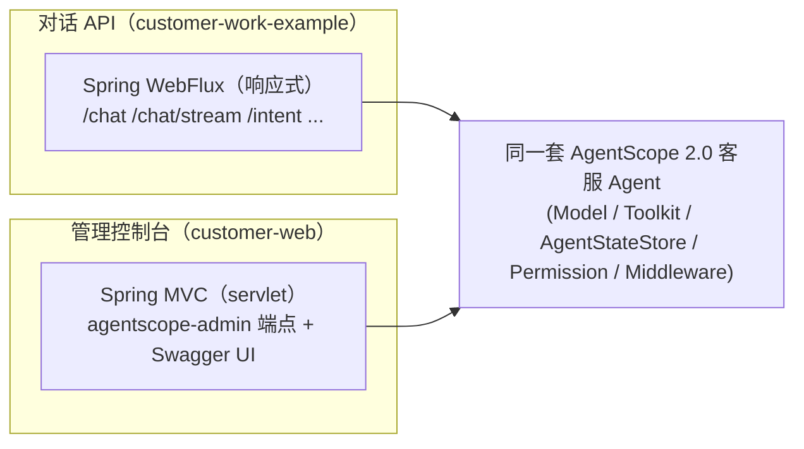

# customer-web 操作文档（AgentScope 2.0 配套前端 · 客服 Agent 管理控制台）

> 模块：`customer-web` ｜ 依赖：`agentscope-admin-spring-boot-starter:2.0.0-RC4` ｜ Web 栈：Spring **MVC** ｜ JDK 17

`customer-web` 是基于 AgentScope 官方 **`agentscope-admin`** 的开箱即用 Web 管理控制台。它复用 customer-work
的客服 Agent 能力（模型层 / 工具 / 权限 / 中间件 / 状态存储），把 Agent 暴露为 Spring Bean 后由 admin **自动接管**，
提供与 ReActAgent 协议对齐的管理界面：会话查看与导出、工具与权限巡检、用量统计、子智能体任务、优雅 drain 等，
并与 **AgentEvent** 事件系统、**Permission** 三态权限的 HITL 流程无缝集成。开发者无需自行写 UI 即可体验已部署的 agent。

---

## 1. 架构定位（为什么是独立模块）



- `agentscope-admin` 是 **Spring MVC**（依赖 `spring-boot-starter-web` + `springdoc-webmvc`）；customer-work 主链路是
  **WebFlux**（+ `springdoc-webflux`）。二者同上下文会因"双 Web 类型 + 双 Swagger"冲突，故 **按 Web 类型拆为独立模块**——
  对话走响应式、管理走 servlet，是合理的工程边界。
- customer-web 以 `spring.autoconfigure.exclude` 关闭 starter 的 WebFlux 自动装配，**只复用其 web 无关的 Agent 能力叶子类**
  （`ModelConfig` / `SessionConfig` / `ToolRegistrar` / `PermissionConfig` / `ObservabilityMiddleware`），与 admin 的 MVC 栈零冲突。

---

## 2. 集成原理（admin 如何接管你的 Agent）

`AgentscopeAdminAutoConfiguration` 从容器里**收集所有 `io.agentscope.core.agent.Agent` 类型的 Bean** 构建 `AgentRegistry`，
并吸收 `Toolkit` / `Model` / `AgentStateStore` Bean 丰富管理面。因此集成只需在 `CustomerWebAgentConfig` 暴露：

| Bean | 作用 |
| --- | --- |
| `@Bean Agent customerServiceAgent` | 客服 ReActAgent（系统提示词 + 业务工具 + 状态存储 + 三态权限 + 可观测中间件）→ 被 AgentRegistry 自动接管 |
| `@Bean Model chatModel` | 模型层（复用 `ModelConfig`，多厂商 + 兜底/重试）→ admin 模型巡检 |
| `@Bean Toolkit customerToolkit` | 业务工具集（复用 `ToolRegistrar` + Mock 后端）→ admin 工具巡检 |
| `@Bean AgentStateStore agentStateStore` | 状态外置存储（复用 `SessionConfig`）→ admin 会话管理 |

> 无需手工调用 `register()`：声明 Bean 即接管。生产换真实工具后端只需提供对应 `OrderBackend` 等 Bean。

---

## 3. 启动与访问

### 3.1 前置条件
- JDK 17；可访问的大模型（默认百炼 DashScope）。
- 环境变量注入模型密钥：`export DASHSCOPE_API_KEY=你的百炼密钥`（缺省启动会报错并提示）。

### 3.2 启动
```bash
export JAVA_HOME=$(/usr/libexec/java_home -v 17)
export DASHSCOPE_API_KEY=sk-xxxx
# 首次构建依赖（绕开会拦截 Central 的镜像）
mvn -s settings-rc2.xml -pl customer-web -am -DskipTests install
# 启动控制台（默认端口 8081）
mvn -s settings-rc2.xml -pl customer-web spring-boot:run
# 或打包后运行
java -jar customer-web/target/customer-web-1.0.0.jar
```

### 3.3 访问入口（已实测，端口 8081）

> **主页面 = Swagger UI**（admin starter 未打包独立 SPA 仪表盘，交互页面即 Swagger UI；根路径 `/` 返回 404）。

| 入口 | 地址 | 说明 |
| --- | --- | --- |
| **Swagger UI（主页面）** | `http://localhost:8081/swagger-ui/index.html`<br/>（`/swagger-ui.html` 会 302 跳到此） | 浏览 / 在线调试全部管理 REST 端点 |
| OpenAPI 文档 | `http://localhost:8081/v3/api-docs` | OpenAPI JSON |
| 健康检查 | `http://localhost:8081/actuator/health` | 含 AgentStateStore 后端探测 |
| Agent 清单 | `http://localhost:8081/actuator/agentscope-agents` | 已接管的 Agent（返回本项目 `CustomerServiceAgent`） |
| 工具/权限/用量/状态 | `/actuator/agentscope-tools`、`-permissions`、`-usage`、`-status` | 工具、三态权限、用量、运行状态 |
| 子智能体/巡检/排干/模型/命令 | `/actuator/agentscope-subagents`、`-doctor`、`-drain`、`-models`、`-commands` | 子智能体、健康巡检、优雅 drain、模型、命令 |
| 会话管理（REST） | `GET /admin/sessions`、`/admin/sessions/{id}/messages`、`/state`、`/plan`、`/tasks`、`/subagent-tasks`；动作 `/admin/sessions/{id}:compact` `:abort` `:undo` `:redo` `:export` `:enter-plan-mode` `:exit-plan-mode` | `SessionAdminController`/`SubagentTaskController`，前缀由 `agentscope.admin.base-path`（默认 `/admin`）控制 |

> 实测：10 个 `agentscope-*` actuator 端点均 200；`/actuator/agentscope-agents` 返回
> `{"name":"CustomerServiceAgent","type":"ReActAgent","modelName":"qwen-plus",...}`。
> actuator 端点 id 为<b>带连字符</b>形式（`agentscope-agents` 等）；本模块默认 `management...exposure.include: "*"` 全暴露，
> **生产请收敛暴露面并加鉴权**。

---

## 4. 配置项

```yaml
server:
  port: 8081
spring:
  main:
    web-application-type: servlet        # 类路径同时有 webflux，强制 servlet
  autoconfigure:
    exclude:
      - com.richard.fyoung.customerwork.autoconfigure.CustomerWorkAutoConfiguration  # 关闭 starter 的 WebFlux 装配
agentscope:
  admin:
    enabled: true                        # 必须开启，否则 admin 自动装配不激活
    base-path: /admin                    # 会话管理 REST 前缀
    write-token: ""                      # 写操作保护令牌；调用 compact/abort/drain 等写端点需带 X-Admin-Token
    compact-keep-last-messages: 10
customer-work:                           # 复用 customer-work 的客服 Agent 配置子集
  model: { provider: dashscope, name: qwen-plus, api-key: ${DASHSCOPE_API_KEY:} }
  session: { mode: memory }              # 控制台默认进程内；生产可切 redis/mysql
  harness:
    permission: { enabled: true, mode: default }   # 三态权限：退款/转人工默认走人工确认(ask)
```

> **写操作保护**：`agentscope.admin.write-token` 非空时，对 compact / abort / drain 等写端点需在请求头带 `X-Admin-Token`。
> 生产务必设置并配合网关鉴权。

---

## 5. HITL 与 Permission 集成

- 客服 Agent 注入了 `PermissionContextState`（`harness.permission.enabled=true`），`submitRefund`、`transferToHuman`
  默认命中 **ask 规则** → 触发框架的人工确认（`RequireUserConfirmEvent`），可在控制台 `permissions` 端点查看授权策略。
- `usage` / `status` 端点结合 `ObservabilityMiddleware` 的事件埋点，呈现请求 / 工具 / 用量画像。

---

## 6. 单元测试

`CustomerWebIntegrationTest`（`@SpringBootTest`，离线）：
- `contextLoads_andCoreBeansWired`：验证 admin 控制台上下文加载，`Agent`/`Model`/`Toolkit`/`AgentStateStore` 全部装配，
  工具集含业务工具（`queryOrder`）。
- `agent_shouldBeRegisteredInAdminRegistry`：验证客服 Agent 被 `AgentRegistry` 自动接管（`AgentDescriptor.name()` 含
  `CustomerServiceAgent`）。
- 测试用 dummy 模型密钥（构造不联网），`mvn -s settings-rc2.xml -pl customer-web test` 全绿。

---

## 7. 注意事项 / FAQ

- **admin 必须 `enabled: true`**：其自动装配由 `@ConditionalOnProperty(agentscope.admin.enabled)` 门控，默认不激活。
- **为什么不与对话 API 合一**：admin(MVC) 与主链路(WebFlux) Web 类型不同，合并会冲突；拆模块是有意为之。
- **端口**：控制台 8081，与 `customer-work-example` 对话 API 8080 分开，可同机并行。
- **生产硬化**：收敛 Actuator 暴露面、设置 `write-token`、置于内网 / 加网关鉴权；模型密钥用 Vault/KMS/K8s Secret 注入。
- **换真实业务后端**：在本模块声明自己的 `OrderBackend` 等 Bean 即覆盖默认 Mock（`@ConditionalOnMissingBean` 让位）。
- **升级 HarnessAgent**：如需子智能体/Plan Mode/沙箱的完整管理面，可把 `customerServiceAgent` Bean 换成
  `HarnessAgent`（见 `customer-work-spring-boot-starter` 的 `HarnessAgentFactory`），admin 的 subagents 端点即生效。
