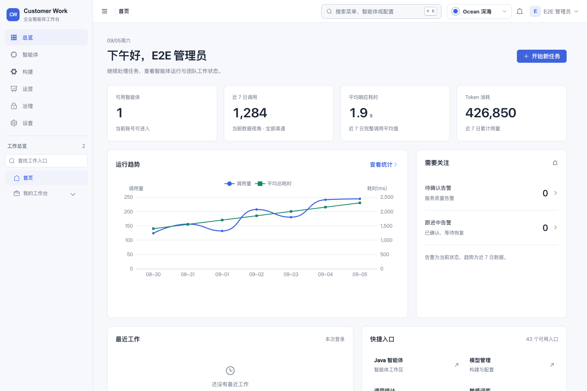
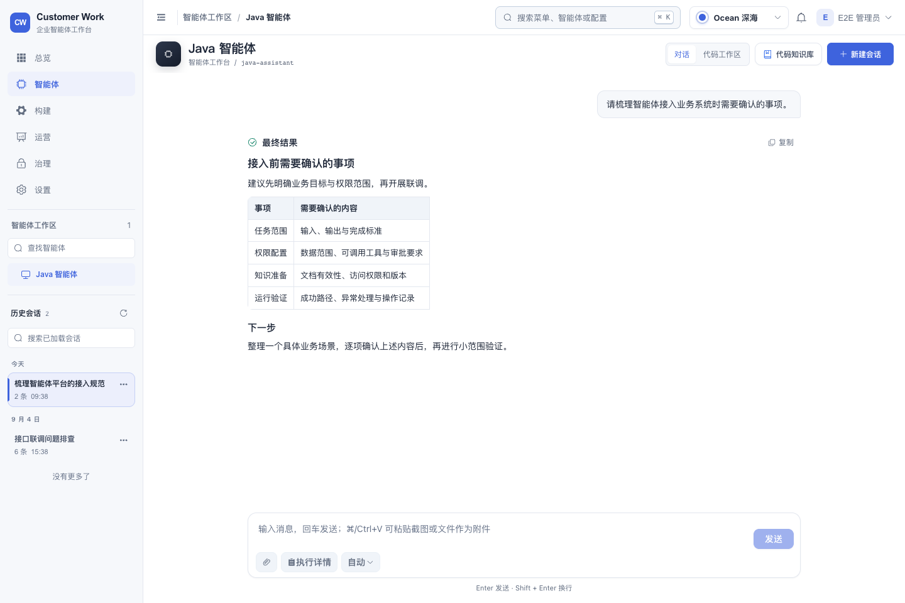
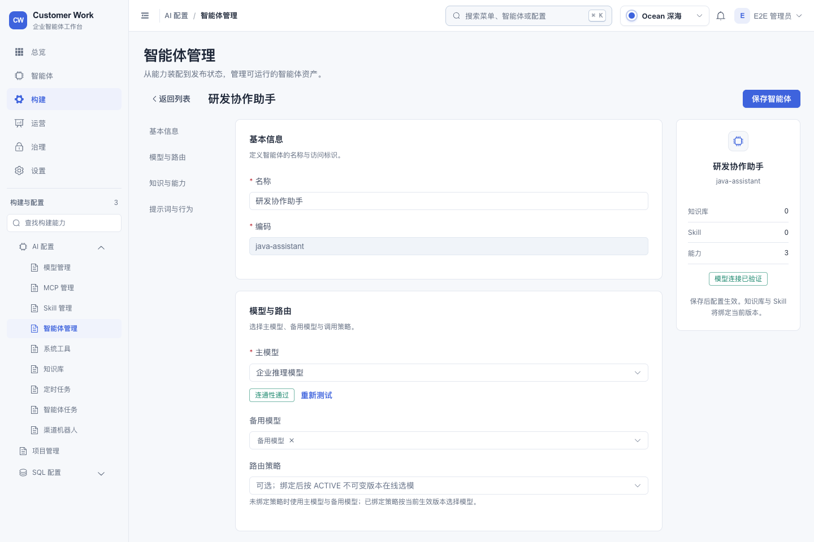
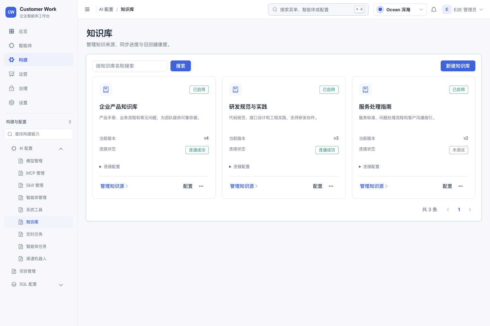
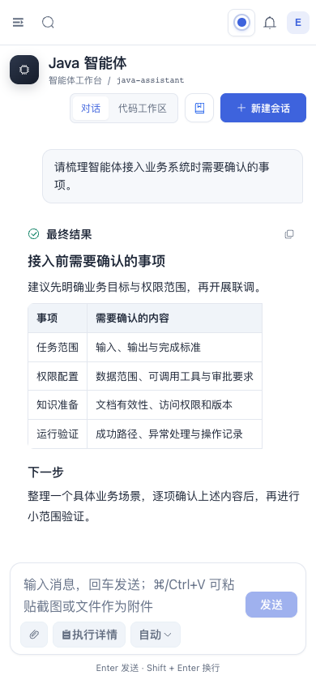
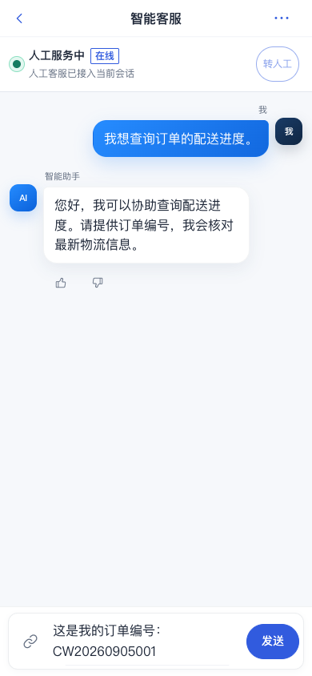

# 企业智能体工作台 UI 实施与验收

本次按已确认的设计调整管理端和 H5：用单列导航组织工作入口，压缩重复标题与标签区域，把主要空间交给任务内容；聊天支持多行输入、连续工作和按需查看执行记录。智能体配置由窄弹窗改为完整编辑页面，知识库改为卡片管理。

## 实现范围

| 区域 | 实际交付 |
| --- | --- |
| 全站框架 | 228px 单列导航、56px 顶栏、顶栏面包屑、统一页面标题和工具栏；保留导航折叠、移动端抽屉、全局搜索、主题、消息、用户与租户入口 |
| 总览 | 紧凑问候、可用智能体、近 7 日调用/耗时/Token、运行趋势、当前告警、最近工作和授权快捷入口 |
| 对话与 VibeCoding | 历史会话归入左侧导航；保留各模式独立会话与草稿；多行输入、中文输入法保护、附件状态、终止与继续 |
| 执行详情 | 对话正文保留简要入口；桌面侧栏和窄屏抽屉展示本轮实际收到的步骤、工具调用与附件 |
| 智能体管理 | 表格聚合名称、模型、知识与能力、状态；新建/配置使用章节导航、完整表单和摘要侧栏 |
| 知识库管理 | 响应式卡片呈现说明、版本、连接状态；连接参数折叠展示；保留配置、知识源、连通性测试与状态管理 |
| 登录与 H5 | 登录页采用简洁品牌区和表单区；H5 对话统一颜色、间距、输入框与状态条 |
| 其余业务页面 | 复用统一壳层、标题、表格、按钮、表单和弹窗样式；静态路由、动态智能体路由与 SQL 查询入口继续使用现有注册机制 |

Ocean 的工作面调整为中性灰白，现有其他命名主题、自定义颜色、暗色、主题持久化与首屏应用逻辑继续使用原主题系统。

执行模式统一显示为“自动、手动确认、接受编辑、计划、跳过确认”，代码模式显示为“代码工作区”，对应的原枚举值不变。登录页默认展示流程品牌区；管理员配置了品牌图片时继续使用可暂停的轮播。

## 调用关系与职责

| 入口/调用方 | 负责的状态与展示 | 下游依赖、业务约束 |
| --- | --- | --- |
| `MainLayout`、`LifecycleNavigation`、`AppHeader` | 全站壳层、服务端菜单归类、移动导航焦点、历史容器 | `menu`、`tabs`、既有路由与权限；不新增客户端授权名单 |
| `HomeOperations` | 统计的加载、失败、无数据、无权限状态 | 调用统计 summary/trend 与 SLO summary；对应入口未授权时不发请求；卸载或权限变化后丢弃旧响应 |
| `WorkspaceView` → 两个 Panel | 当前工作模式、输入与附件、历史的可见位置 | Pinia 会话状态与既有 SSE API；只缓存 WorkspaceView，页面切换不销毁正在运行的任务 |
| `chatConversations`、`vibeConversations` | 按智能体/会话接收增量、保持草稿与任务状态 | 原 stream、interrupt、history、plan 接口；错误单独保存，避免覆盖已生成的回答 |
| `AgentManage` | 列表、完整编辑表单、保存状态 | 原 agent/model/MCP/Skill/系统工具/知识库/路由策略 API；保留原校验、主模型连通性检查和权限指令 |
| `KnowledgeBaseManage` | 卡片布局、可展开的连接信息 | 原 CRUD 组合函数、版本与知识源抽屉；编辑时访问密钥留空仍表示不修改 |
| H5 `Chat` | 会话状态、多行输入、上传与发送反馈 | 原 WebSocket、工单、配额、转人工、评价接口；保持连接和会话状态对发送的约束 |

导航归属放在壳层，会话数据留在 Store，执行详情组件只展示已收到的数据。这样调整布局时不会复制会话状态或改变后端授权与执行链路。

## 关键交互与数据口径

- `Enter` 发送，`Shift+Enter` 换行；输入法确认、组合快捷键和长按回车不会误发消息。任务进行时允许编辑下一条草稿。
- “继续”发送独立续接指令，并保留用户正在编辑的草稿、空白格式和附件。
- 上传中或失败附件阻止发送，并显示处理提示；移除失败附件后可发送原草稿。
- 流式错误先刷新尚未显示的文本增量，再展示独立错误信息。既有内容不会被错误文案替换。
- 历史列表通过延迟 Teleport 挂入壳层。模式切换、离开和返回工作区时只有当前列表可见，草稿与运行任务不随布局丢失。
- 离开缓存工作区时关闭执行详情抽屉，浏览器返回上一页后不会残留遮罩，返回工作区也不会重新弹出。
- 禁用按钮使用组件自身的禁用状态样式，避免局部实心背景覆盖造成“看起来可以发送”。
- 总览使用当前数据视角的真实接口数据。调用统计为近 7 个本地自然日，告警为当前状态；无权限、无数据或请求失败有明确显示。
- 执行详情只展示接口已经提供的步骤与附件。历史消息没有步骤记录时显示缺失状态；不生成虚构引用、成本、成功率或审计记录。
- 智能体表格时间采用接口实际提供的创建时间；知识库版本与连通性采用原有字段。

## 验收记录

验证日期：2026-09-05。以下浏览器截图来自本次应用源码，业务记录为显式构造的合成数据。

| 检查 | 结果 |
| --- | --- |
| 管理端 `npm run test:unit` | 21 个文件，205 项通过 |
| 管理端 `npm run test:e2e` | 105 项通过 |
| 管理端 `npm run build` | 类型检查与生产构建通过 |
| H5 `npm test` | 10 个文件，30 项通过 |
| H5 `npm run build` | 类型检查与生产构建通过 |
| 路由截图巡检 | 43 个页面入口；覆盖现有静态页面以及动态智能体/SQL 查询入口 |
| 有数据的页面检查 | 总览、对话、智能体列表/编辑、知识库、运营、设置；桌面、390px 窄屏与 Night 主题 |
| 网络边界 | 管理端 E2E 阻断未知 API、真实模型请求与外部网络；截图检查无页面异常、无未配置 API 调用 |
| 变更检查 | `git diff --check` 与凭据模式扫描通过；无 Java、数据库迁移、API 契约或依赖变更 |

新增回归重点是交互风险：输入法/换行、失败附件、停止与继续、跨页面草稿、历史容器、流式错误保留内容、权限下的数据请求、完整配置保存参数、窄屏详情抽屉和发送按钮状态。相关缺陷均先通过最小用例确认失败，再修复验证。

移动认证的滚动回归使用 390×600 短视口，保证每个步骤都有真实滚动距离。较高视口中，紧凑表单可能因系统字体度量不同而完整容纳，不能据此判断滚动失败；用例仍要求滚动距离大于零、切换回顶、无嵌套和无横向滚动。

本地运行两端完整前端测试与构建。Java 全量测试及部署镜像检查由现有 PR CI 执行；具体提交的远端结果以 PR Checks 为准。

## 实现截图

### 总览

### 对话工作台

### 智能体配置

### 知识库

### 移动端对话

### H5 客服会话

