# 《详细技术文档》

> ⚠️ **版本说明**：本文描述 **`main` 分支（AgentScope Java 1.0.12）** 的架构与 API（`Session`/`Hook`/
> `PlanNotebook`/`Pipelines` 等）。**`rc2.0` 分支已迁移到 AgentScope 2.0.0-RC4**，核心架构有重大变化
> （`AgentStateStore` 无状态会话、五段 `Middleware`、Plan Mode、Compaction、Sandbox 等）：2.0 的 API 映射、
> 新增能力与不可迁移项请以 **[docs/MIGRATION-2.0.md](MIGRATION-2.0.md)** 为准。本深度文档的 2.0 版重写为后续独立工作。

> 适用项目：**customer-work · 基于 AgentScope Java 1.0.12 的生产级智能客服系统**
> 包名：`com.richard.fyoung.customerwork` ｜ 协议：Apache-2.0 ｜ 文档与代码保持一致（截至 122 个单测全绿）

本文面向两类读者：
- **初学者**：先读 [§1 总览](#1-项目总览) → [§2 技术栈原理](#2-技术栈原理与优缺点) → [§3 整体架构](#3-整体架构) → [§5 一次请求的旅程](#5-一次请求的全流程时序)，建立全局认知。
- **资深使用者**：直接看 [§4 分层与模块 UML](#4-模块-uml-类图) / [§6–§14 各子系统原理与扩展点](#6-模型层) / [§16 扩展点总表](#16-扩展点总表)。

> 文中所有图均为 Mermaid，GitHub 原生渲染；类名、方法、配置键均与源码一致。

---

## 目录

1. [项目总览](#1-项目总览)
2. [技术栈原理与优缺点](#2-技术栈原理与优缺点)
3. [整体架构](#3-整体架构)
4. [模块 UML 类图](#4-模块-uml-类图)
5. [一次请求的全流程时序](#5-一次请求的全流程时序)
6. [模型层](#6-模型层)
7. [Agent 装配与 ReAct 循环](#7-agent-装配与-react-循环)
8. [会话持久化](#8-会话持久化)
9. [记忆体系（三层）](#9-记忆体系三层)
10. [RAG 知识检索](#10-rag-知识检索)
11. [工具体系与可替换后端](#11-工具体系与可替换后端)
12. [多 Agent 编排](#12-多-agent-编排)
13. [接入层安全与请求治理](#13-接入层安全与请求治理)
14. [可观测性与运维](#14-可观测性与运维)
15. [Nacos 配置中心](#15-nacos-配置中心)
16. [扩展点总表](#16-扩展点总表)
17. [测试体系](#17-测试体系)
18. [设计取舍与边界](#18-设计取舍与边界)
19. [术语表](#19-术语表)

---

## 1. 项目总览

这是一个把"大模型智能体"工程化落地为**可上生产的客服系统**的参考实现。核心理念贯穿全项目：

> **每个能力 = 一个配置开关 + 一个可替换实现。** 内置实现保证离线开箱即用、单测可过；生产改一行配置或提供一个 Bean，即可切到云端 / 私有化后端，业务代码零改动。

能力域一览：

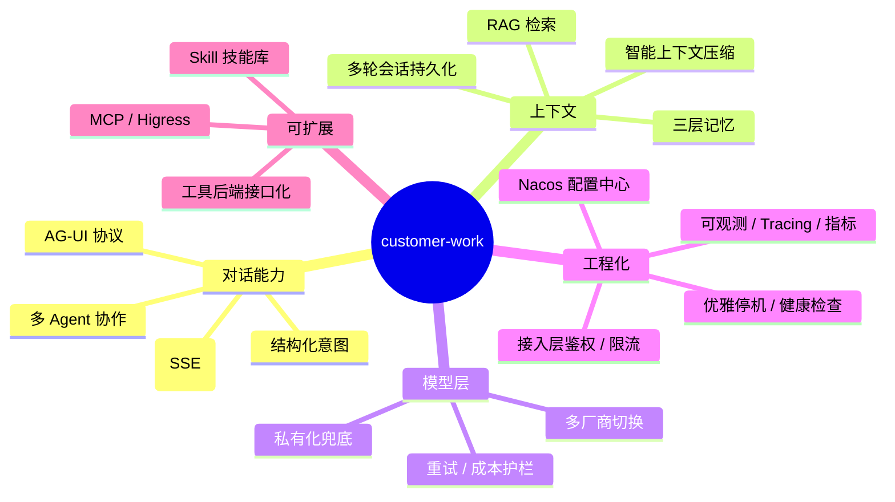
```mermaid
mindmap
  root((customer-work))
    对话能力
      同步 / 流式(SSE)
      结构化意图
      多 Agent 协作
      AG-UI 协议
    上下文
      多轮会话持久化
      三层记忆
      智能上下文压缩
      RAG 检索
    模型层
      多厂商切换
      私有化兜底
      重试 / 成本护栏
    工程化
      接入层鉴权 / 限流
      可观测 / Tracing / 指标
      优雅停机 / 健康检查
      Nacos 配置中心
    可扩展
      工具后端接口化
      Skill 技能库
      MCP / Higress
```

---

## 2. 技术栈原理与优缺点

| 技术 | 在本项目的角色 | 原理简述 | 优点 | 缺点 / 注意 |
|---|---|---|---|---|
| **Spring Boot 3.2 (WebFlux)** | Web 框架 + 依赖注入 | 基于 Reactor 的异步非阻塞 Web 栈，事件循环少量线程处理高并发 | 高吞吐、与 Agent 的响应式天然契合、SSE 流式友好 | 调试链路较命令式难；`block()` 误用会拖垮事件循环；MDC 透传需借助 Reactor Context |
| **Project Reactor** | 异步编程模型（`Mono`/`Flux`） | 声明式数据流 + 背压；`retryWhen`/`onErrorResume`/`contextWrite` 等算子 | 组合性强、背压、内建重试/超时 | 学习曲线陡；冷热流、订阅时机易踩坑（本项目重试 bug 即源于此，见 §6） |
| **AgentScope Java 1.0.12** | 智能体框架 | ReActAgent（推理-行动循环）+ Toolkit + Memory + Session/State + Hook + Model 抽象 | 纯 Java、Spring 友好、抽象完整可插拔 | 高速迭代，部分能力需扩展依赖；流式协议等细节仍在演进 |
| **DashScope（百炼）** | 默认大模型 | 通义千问 OpenAI 兼容/原生协议；`stream` 增量返回 | 国产、合规、Embedding/TTS 齐全 | 需 API Key、计费；联网搜索/思考为厂商特有参数 |
| **Jedis** | Redis 会话存储 | `UnifiedJedis` 连接池，惰性连接 | 多实例共享会话 | 单机限流不分布式（见 §13） |
| **HikariCP + MySQL** | MySQL 会话存储 | JDBC 连接池；`MysqlSession` 自动建表 | 强一致、可审计 | 需运维 DB |
| **Nacos Client 3.0.2** | 配置中心 | `ConfigService` 长轮询监听配置变更 | 提示词热更新、灰度 | AI/A2A API 需更高版本（见 §16） |
| **Micrometer + Actuator** | 指标 / 健康 | 维度化指标 + `/actuator` 端点 | Prometheus 生态、运维就绪 | 指标基数需控制 |
| **springdoc-openapi 2.3** | API 文档 | 扫描注解生成 OpenAPI + Swagger UI | 在线调试、契约 | 与 Boot 版本需匹配 |
| **okhttp** | Mem0/ReMe 客户端依赖 | HTTP 客户端 | 框架记忆扩展所需 | 仅特定 provider 用 |
| **JaCoCo** | 覆盖率 | 字节码插桩统计 | 质量度量 | 报告非门禁（本项目仅产出报告） |

---

## 3. 整体架构

### 3.0 工程模块（多模块 Maven 工程）

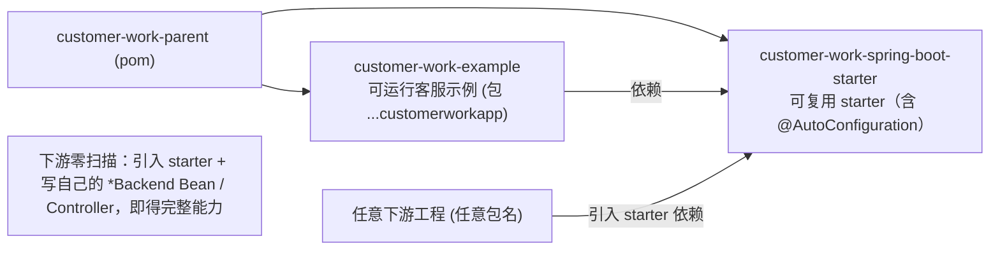
```mermaid
flowchart LR
    PARENT["customer-work-parent (pom)"] --> ST["customer-work-spring-boot-starter<br/>可复用 starter（含 @AutoConfiguration）"]
    PARENT --> EX["customer-work-example<br/>可运行客服示例 (包 ...customerworkapp)"]
    EX -->|依赖| ST
    DOWN["任意下游工程 (任意包名)"] -->|引入 starter 依赖| ST
    note["下游零扫描：引入 starter + 写自己的 *Backend Bean / Controller，即得完整能力"]
```

- `starter`：配置/装配/模型层/记忆/RAG/工具 SPI/安全/可观测/Nacos 等**可复用基础设施**，
  通过 `@AutoConfiguration`（`CustomerWorkAutoConfiguration`，注册于
  `META-INF/spring/org.springframework.boot.autoconfigure.AutoConfiguration.imports`）自动装配。
- `example`：`CustomerWorkApplication`（包 `com.richard.fyoung.customerworkapp`）+ Controller + 业务资源。

**自动装配原理与边界**：

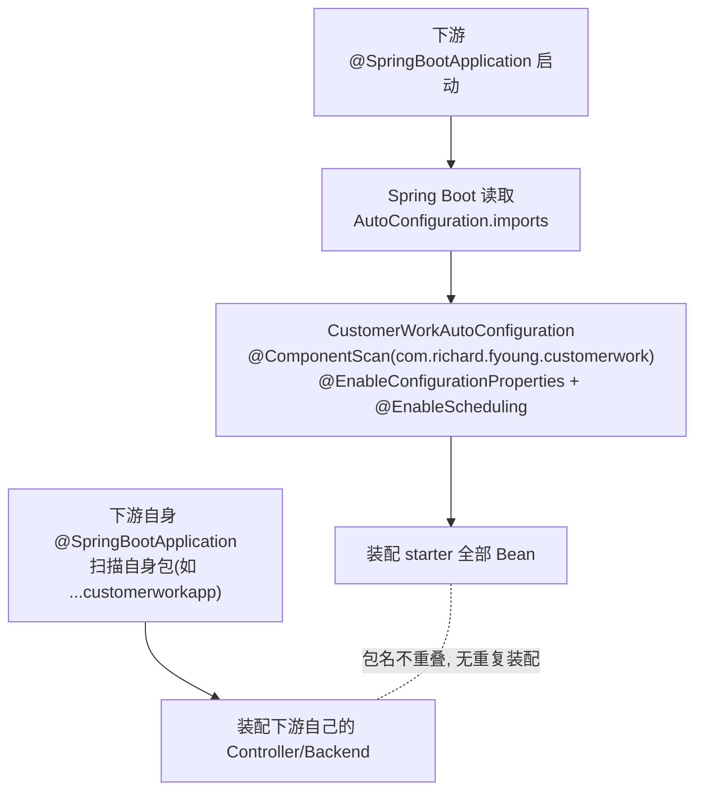
```mermaid
flowchart TB
    BOOT["下游 @SpringBootApplication 启动"] --> AC["Spring Boot 读取<br/>AutoConfiguration.imports"]
    AC --> CWA["CustomerWorkAutoConfiguration<br/>@ComponentScan(com.richard.fyoung.customerwork)<br/>@EnableConfigurationProperties + @EnableScheduling"]
    CWA --> BEANS["装配 starter 全部 Bean"]
    APP["下游自身 @SpringBootApplication<br/>扫描自身包(如 ...customerworkapp)"] --> OWN["装配下游自己的 Controller/Backend"]
    BEANS -. 包名不重叠, 无重复装配 .- OWN
```

- starter 固定扫描自身包 `com.richard.fyoung.customerwork`；example 在独立包 `com.richard.fyoung.customerworkapp`，
  两者不重叠 → 下游自身扫描与 starter 自动装配各管各的，**不会重复注册**。
- starter 用 **HikariCP** 而非 `spring-jdbc`，因此不触发 `DataSourceAutoConfiguration`，下游无需排除它。

### 3.1 运行时分层

自上而下五层；右侧标注对应的核心类与"配置开关"。

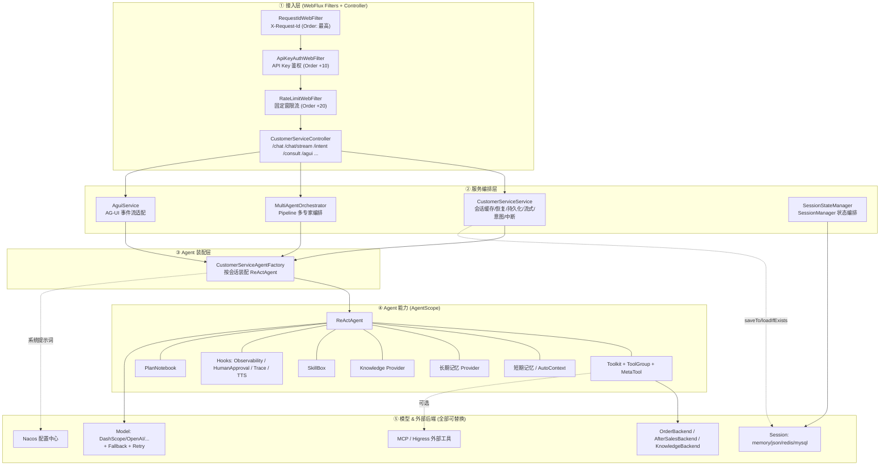
```mermaid
flowchart TB
    subgraph 接入层["① 接入层 (WebFlux Filters + Controller)"]
        direction TB
        RID["RequestIdWebFilter<br/>X-Request-Id (Order: 最高)"]
        AUTH["ApiKeyAuthWebFilter<br/>API Key 鉴权 (Order +10)"]
        RL["RateLimitWebFilter<br/>固定窗限流 (Order +20)"]
        CTRL["CustomerServiceController<br/>/chat /chat/stream /intent /consult /agui ..."]
        RID --> AUTH --> RL --> CTRL
    end

    subgraph 服务层["② 服务编排层"]
        SVC["CustomerServiceService<br/>会话缓存/恢复/持久化/流式/意图/中断"]
        ORCH["MultiAgentOrchestrator<br/>Pipeline 多专家编排"]
        AGUI["AguiService<br/>AG-UI 事件流适配"]
        SSM["SessionStateManager<br/>SessionManager 状态编排"]
    end

    subgraph 装配层["③ Agent 装配层"]
        FACT["CustomerServiceAgentFactory<br/>按会话装配 ReActAgent"]
    end

    subgraph 能力层["④ Agent 能力 (AgentScope)"]
        AGENT["ReActAgent"]
        TK["Toolkit + ToolGroup + MetaTool"]
        MEM["短期记忆 / AutoContext"]
        LTM["长期记忆 Provider"]
        RAG["Knowledge Provider"]
        SKILL["SkillBox"]
        HOOK["Hooks: Observability / HumanApproval / Trace / TTS"]
        PLAN["PlanNotebook"]
    end

    subgraph 后端层["⑤ 模型 & 外部后端 (全部可替换)"]
        MODEL["Model: DashScope/OpenAI/...<br/>+ Fallback + Retry"]
        BACKENDS["OrderBackend / AfterSalesBackend / KnowledgeBackend"]
        STORE["Session: memory/json/redis/mysql"]
        NACOS["Nacos 配置中心"]
        MCP["MCP / Higress 外部工具"]
    end

    CTRL --> SVC & ORCH & AGUI
    SVC --> FACT
    ORCH --> FACT
    AGUI --> FACT
    SVC -. saveTo/loadIfExists .-> STORE
    SSM --> STORE
    FACT --> AGENT
    AGENT --- TK & MEM & LTM & RAG & SKILL & HOOK & PLAN
    AGENT --> MODEL
    TK --> BACKENDS
    TK -. 可选 .-> MCP
    FACT -. 系统提示词 .-> NACOS
```

---

## 4. 模块 UML 类图

### 4.1 接入与服务编排

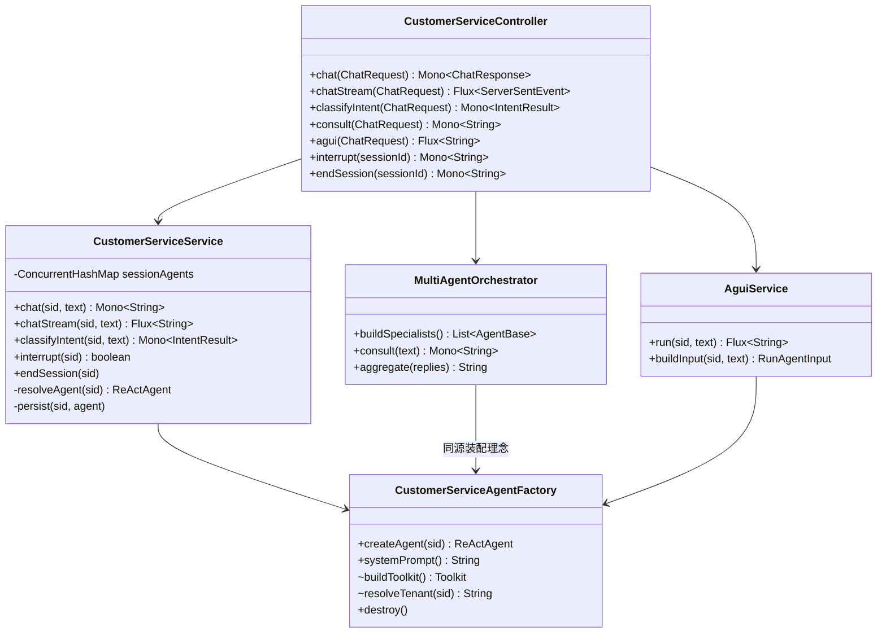
```mermaid
classDiagram
    class CustomerServiceController {
        +chat(ChatRequest) Mono~ChatResponse~
        +chatStream(ChatRequest) Flux~ServerSentEvent~
        +classifyIntent(ChatRequest) Mono~IntentResult~
        +consult(ChatRequest) Mono~String~
        +agui(ChatRequest) Flux~String~
        +interrupt(sessionId) Mono~String~
        +endSession(sessionId) Mono~String~
    }
    class CustomerServiceService {
        -ConcurrentHashMap sessionAgents
        +chat(sid, text) Mono~String~
        +chatStream(sid, text) Flux~String~
        +classifyIntent(sid, text) Mono~IntentResult~
        +interrupt(sid) boolean
        +endSession(sid)
        -resolveAgent(sid) ReActAgent
        -persist(sid, agent)
    }
    class MultiAgentOrchestrator {
        +buildSpecialists() List~AgentBase~
        +consult(text) Mono~String~
        +aggregate(replies) String
    }
    class AguiService {
        +run(sid, text) Flux~String~
        +buildInput(sid, text) RunAgentInput
    }
    class CustomerServiceAgentFactory {
        +createAgent(sid) ReActAgent
        +systemPrompt() String
        ~buildToolkit() Toolkit
        ~resolveTenant(sid) String
        +destroy()
    }
    CustomerServiceController --> CustomerServiceService
    CustomerServiceController --> MultiAgentOrchestrator
    CustomerServiceController --> AguiService
    CustomerServiceService --> CustomerServiceAgentFactory
    MultiAgentOrchestrator --> CustomerServiceAgentFactory : 同源装配理念
    AguiService --> CustomerServiceAgentFactory
```

### 4.2 模型层（统一抽象 + 装饰器）

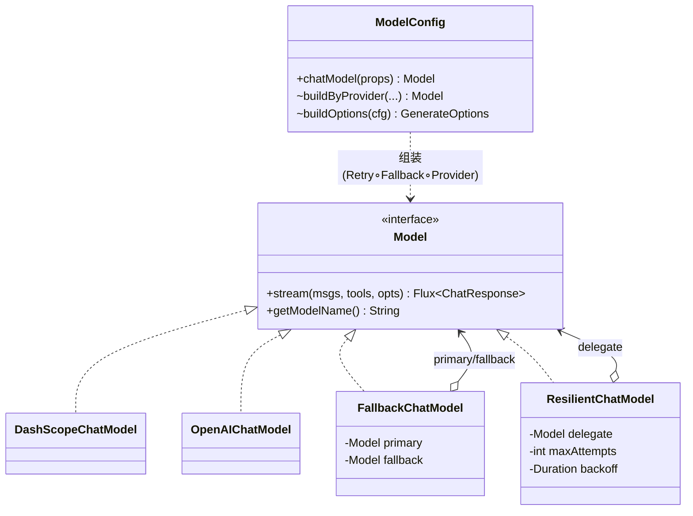
```mermaid
classDiagram
    class Model {
        <<interface>>
        +stream(msgs, tools, opts) Flux~ChatResponse~
        +getModelName() String
    }
    class DashScopeChatModel
    class OpenAIChatModel
    class FallbackChatModel {
        -Model primary
        -Model fallback
    }
    class ResilientChatModel {
        -Model delegate
        -int maxAttempts
        -Duration backoff
    }
    class ModelConfig {
        +chatModel(props) Model
        ~buildByProvider(...) Model
        ~buildOptions(cfg) GenerateOptions
    }
    Model <|.. DashScopeChatModel
    Model <|.. OpenAIChatModel
    Model <|.. FallbackChatModel
    Model <|.. ResilientChatModel
    FallbackChatModel o--> Model : primary/fallback
    ResilientChatModel o--> Model : delegate
    ModelConfig ..> Model : 组装(Retry∘Fallback∘Provider)
```

### 4.3 工具体系与可替换后端（核心扩展点）

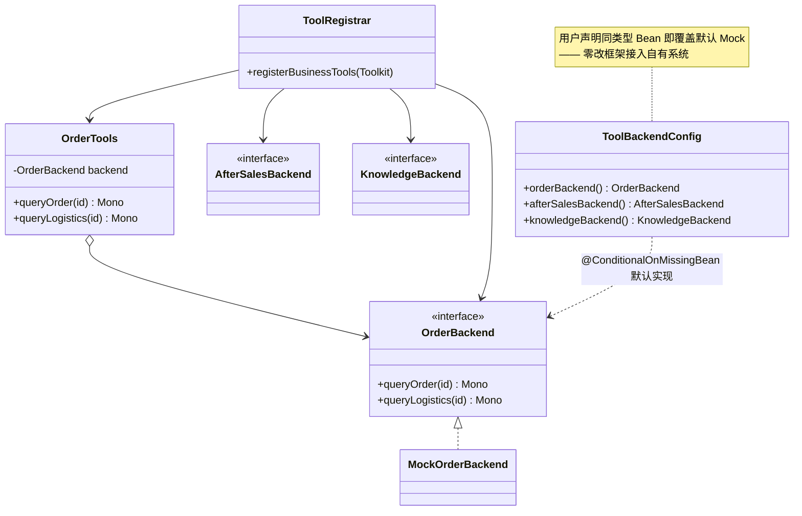
```mermaid
classDiagram
    class ToolRegistrar {
        +registerBusinessTools(Toolkit)
    }
    class OrderTools {
        -OrderBackend backend
        +queryOrder(id) Mono
        +queryLogistics(id) Mono
    }
    class OrderBackend {
        <<interface>>
        +queryOrder(id) Mono
        +queryLogistics(id) Mono
    }
    class MockOrderBackend
    class AfterSalesBackend {
        <<interface>>
    }
    class KnowledgeBackend {
        <<interface>>
    }
    class ToolBackendConfig {
        +orderBackend() OrderBackend
        +afterSalesBackend() AfterSalesBackend
        +knowledgeBackend() KnowledgeBackend
    }
    OrderBackend <|.. MockOrderBackend
    OrderTools o--> OrderBackend
    ToolRegistrar --> OrderTools
    ToolRegistrar --> OrderBackend
    ToolRegistrar --> AfterSalesBackend
    ToolRegistrar --> KnowledgeBackend
    ToolBackendConfig ..> OrderBackend : @ConditionalOnMissingBean 默认实现
    note for ToolBackendConfig "用户声明同类型 Bean 即覆盖默认 Mock<br/>—— 零改框架接入自有系统"
```

### 4.4 记忆与 RAG 提供方

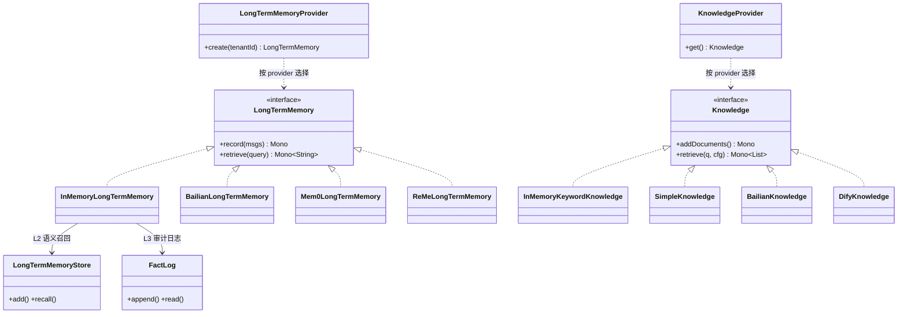
```mermaid
classDiagram
    class LongTermMemory {
        <<interface>>
        +record(msgs) Mono
        +retrieve(query) Mono~String~
    }
    class InMemoryLongTermMemory
    class BailianLongTermMemory
    class Mem0LongTermMemory
    class ReMeLongTermMemory
    class LongTermMemoryProvider {
        +create(tenantId) LongTermMemory
    }
    class LongTermMemoryStore { +add() +recall() }
    class FactLog { +append() +read() }
    LongTermMemory <|.. InMemoryLongTermMemory
    LongTermMemory <|.. BailianLongTermMemory
    LongTermMemory <|.. Mem0LongTermMemory
    LongTermMemory <|.. ReMeLongTermMemory
    LongTermMemoryProvider ..> LongTermMemory : 按 provider 选择
    InMemoryLongTermMemory --> LongTermMemoryStore : L2 语义召回
    InMemoryLongTermMemory --> FactLog : L3 审计日志

    class Knowledge {
        <<interface>>
        +addDocuments() Mono
        +retrieve(q, cfg) Mono~List~
    }
    class InMemoryKeywordKnowledge
    class SimpleKnowledge
    class BailianKnowledge
    class DifyKnowledge
    class KnowledgeProvider { +get() Knowledge }
    Knowledge <|.. InMemoryKeywordKnowledge
    Knowledge <|.. SimpleKnowledge
    Knowledge <|.. BailianKnowledge
    Knowledge <|.. DifyKnowledge
    KnowledgeProvider ..> Knowledge : 按 provider 选择
```

### 4.5 Hook 体系

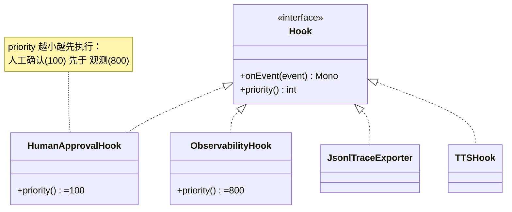
```mermaid
classDiagram
    class Hook {
        <<interface>>
        +onEvent(event) Mono
        +priority() int
    }
    class HumanApprovalHook { +priority()=100 }
    class ObservabilityHook { +priority()=800 }
    class JsonlTraceExporter
    class TTSHook
    Hook <|.. HumanApprovalHook
    Hook <|.. ObservabilityHook
    Hook <|.. JsonlTraceExporter
    Hook <|.. TTSHook
    note for HumanApprovalHook "priority 越小越先执行：<br/>人工确认(100) 先于 观测(800)"
```

---

## 5. 一次请求的全流程时序

### 5.1 同步对话 `POST /chat`

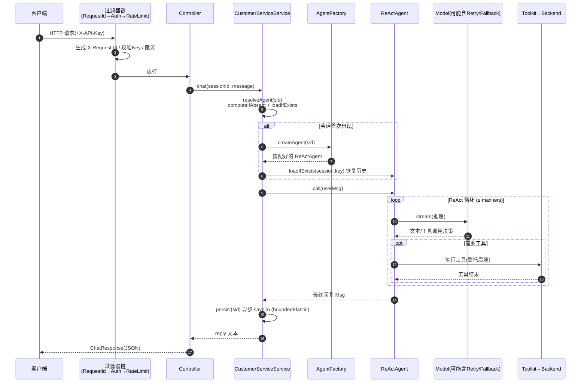
```mermaid
sequenceDiagram
    autonumber
    participant C as 客户端
    participant F as 过滤器链<br/>(RequestId→Auth→RateLimit)
    participant Ctrl as Controller
    participant Svc as CustomerServiceService
    participant Fac as AgentFactory
    participant Ag as ReActAgent
    participant M as Model(可能含Retry/Fallback)
    participant T as Toolkit→Backend

    C->>F: HTTP 请求(+X-API-Key)
    F->>F: 生成 X-Request-Id / 校验Key / 限流
    F->>Ctrl: 放行
    Ctrl->>Svc: chat(sessionId, message)
    Svc->>Svc: resolveAgent(sid)<br/>computeIfAbsent + loadIfExists
    alt 会话首次出现
        Svc->>Fac: createAgent(sid)
        Fac-->>Svc: 装配好的 ReActAgent
        Svc->>Ag: loadIfExists(session,key) 恢复历史
    end
    Svc->>Ag: call(userMsg)
    loop ReAct 循环 (≤ maxIters)
        Ag->>M: stream(推理)
        M-->>Ag: 文本/工具调用决策
        opt 需要工具
            Ag->>T: 执行工具(委托后端)
            T-->>Ag: 工具结果
        end
    end
    Ag-->>Svc: 最终回复 Msg
    Svc->>Svc: persist(sid) 异步 saveTo (boundedElastic)
    Svc-->>Ctrl: reply 文本
    Ctrl-->>C: ChatResponse(JSON)
```

### 5.2 流式对话 `POST /chat/stream`（SSE）

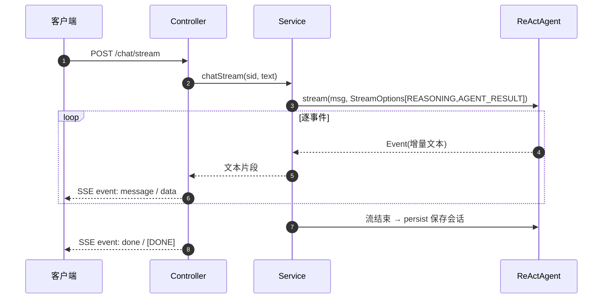
```mermaid
sequenceDiagram
    autonumber
    participant C as 客户端
    participant Ctrl as Controller
    participant Svc as Service
    participant Ag as ReActAgent
    C->>Ctrl: POST /chat/stream
    Ctrl->>Svc: chatStream(sid, text)
    Svc->>Ag: stream(msg, StreamOptions[REASONING,AGENT_RESULT])
    loop 逐事件
        Ag-->>Svc: Event(增量文本)
        Svc-->>Ctrl: 文本片段
        Ctrl-->>C: SSE event: message / data
    end
    Svc->>Ag: 流结束 → persist 保存会话
    Ctrl-->>C: SSE event: done / [DONE]
```

---

## 6. 模型层

`ModelConfig.chatModel()` 用**装饰器模式**按配置层层包装：`Retry( Fallback( Provider ) )`。

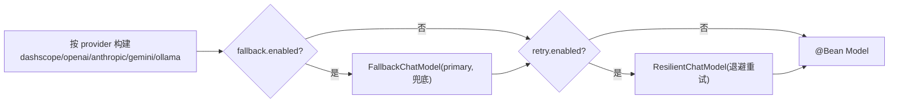
```mermaid
flowchart LR
    P["按 provider 构建<br/>dashscope/openai/anthropic/gemini/ollama"] --> FBQ{fallback.enabled?}
    FBQ -- 是 --> FB["FallbackChatModel(primary, 兜底)"]
    FBQ -- 否 --> RTQ
    FB --> RTQ{retry.enabled?}
    RTQ -- 是 --> RT["ResilientChatModel(退避重试)"]
    RTQ -- 否 --> OUT
    RT --> OUT["@Bean Model"]
```

**调用期行为**（兜底 + 重试叠加）：

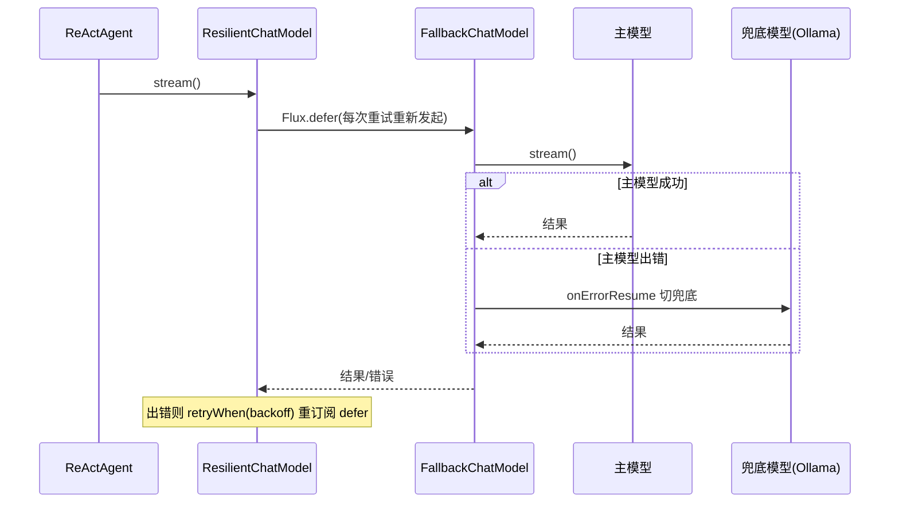
```mermaid
sequenceDiagram
    participant A as ReActAgent
    participant R as ResilientChatModel
    participant FB as FallbackChatModel
    participant P as 主模型
    participant S as 兜底模型(Ollama)
    A->>R: stream()
    R->>FB: Flux.defer(每次重试重新发起)
    FB->>P: stream()
    alt 主模型成功
        P-->>FB: 结果
    else 主模型出错
        FB->>S: onErrorResume 切兜底
        S-->>FB: 结果
    end
    FB-->>R: 结果/错误
    Note over R: 出错则 retryWhen(backoff) 重订阅 defer
```

> **原理要点（也是踩坑点）**：Reactor 的 `retryWhen` 会**重订阅同一个上游**。若直接 `delegate.stream().retryWhen()`，重试只是重订阅"已失败的同一个流"，对真实调用无效。本项目用 `Flux.defer(() -> delegate.stream(...))` 保证**每次重试重新发起底层调用**——这正是 `ResilientChatModelTest` 守护的语义。
> **优点**：统一抽象屏蔽厂商差异；私有化兜底满足数据主权；重试提升高可用。**缺点/边界**：anthropic/gemini 需各自 SDK；多模态/工具 schema 在不同厂商表现有差异，切换需回归评估（见 `docs/EVAL.md`）。

---

## 7. Agent 装配与 ReAct 循环

`CustomerServiceAgentFactory.createAgent(sessionId)` 是装配中枢：

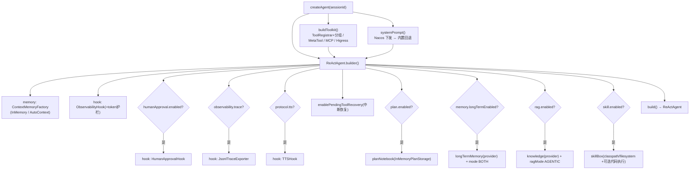
```mermaid
flowchart TB
    START["createAgent(sessionId)"] --> TK["buildToolkit()<br/>ToolRegistrar+分组 / MetaTool / MCP / Higress"]
    START --> SP["systemPrompt()<br/>Nacos 下发 ↔ 内置回退"]
    START --> B["ReActAgent.builder()"]
    TK --> B
    SP --> B
    B --> MEM["memory: ContextMemoryFactory<br/>(InMemory / AutoContext)"]
    B --> H1["hook: ObservabilityHook(+token护栏)"]
    B --> H2{humanApproval.enabled?}
    H2 -- 是 --> HA["hook: HumanApprovalHook"]
    B --> H3{observability.trace?}
    H3 -- 是 --> TR["hook: JsonlTraceExporter"]
    B --> H4{protocol.tts?}
    H4 -- 是 --> TTS["hook: TTSHook"]
    B --> PTR["enablePendingToolRecovery(中断恢复)"]
    B --> PLAN{plan.enabled?}
    PLAN -- 是 --> PN["planNotebook(InMemoryPlanStorage)"]
    B --> LTMC{memory.longTermEnabled?}
    LTMC -- 是 --> LTM["longTermMemory(provider) + mode BOTH"]
    B --> RAGC{rag.enabled?}
    RAGC -- 是 --> KN["knowledge(provider) + ragMode AGENTIC"]
    B --> SKC{skill.enabled?}
    SKC -- 是 --> SB["skillBox(classpath/filesystem +可选代码执行)"]
    B --> BUILD["build() → ReActAgent"]
```

**ReAct（Reasoning + Acting）原理**：让 LLM 做"大脑"，循环【推理→决定调工具→观察结果→再推理】，直到给出最终答复或达 `maxIters` 上限。相比写死的 Workflow，自主性强、能吃模型能力红利；本项目用 `maxIters`、`HumanApprovalHook`（高风险工具暂停）、`interrupt()`（安全中断）、`enablePendingToolRecovery`（中断恢复）四件套约束其"自主性失控"风险。

---

## 8. 会话持久化

`SessionConfig` 按 `session.mode` 提供 `Session` Bean；`CustomerServiceService` 进程内缓存热 Agent，并用框架 `State` 能力跨请求/跨进程恢复。

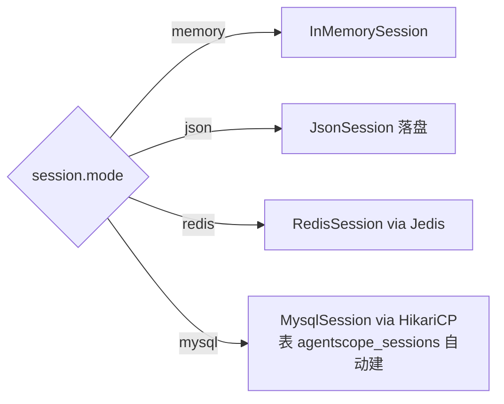
```mermaid
flowchart LR
    MODE{session.mode} -->|memory| IM[InMemorySession]
    MODE -->|json| JS[JsonSession 落盘]
    MODE -->|redis| RS[RedisSession via Jedis]
    MODE -->|mysql| MS[MysqlSession via HikariCP<br/>表 agentscope_sessions 自动建]
```

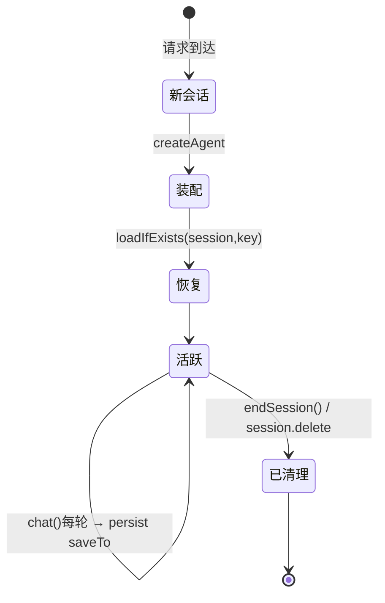
```mermaid
stateDiagram-v2
    [*] --> 新会话: 请求到达
    新会话 --> 装配: createAgent
    装配 --> 恢复: loadIfExists(session,key)
    恢复 --> 活跃
    活跃 --> 活跃: chat()每轮 → persist saveTo
    活跃 --> 已清理: endSession() / session.delete
    已清理 --> [*]
```

> `SessionStateManager` 进一步用框架 `SessionManager` 把多个 `StateModule`（记忆/计划/工具状态）作为整体 save/load，替代逐个手工编排。**优点**：内存零运维、json 单机可恢复、redis 多实例共享、mysql 强一致可审计。**边界**：redis/mysql 需运维；持久化在 `boundedElastic` 异步执行避免阻塞事件循环。

---

## 9. 记忆体系（三层）

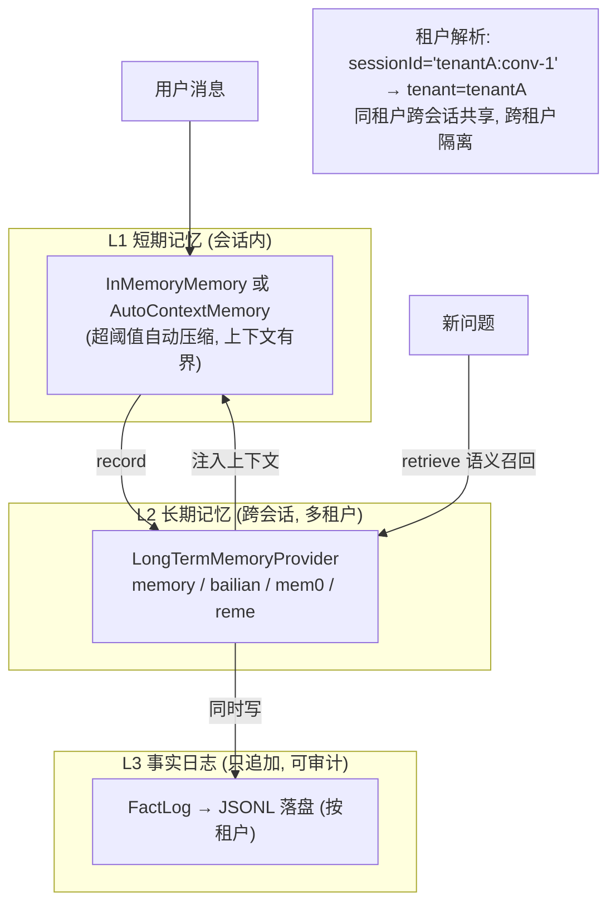
```mermaid
flowchart TB
    subgraph L1["L1 短期记忆 (会话内)"]
        A["InMemoryMemory 或 AutoContextMemory<br/>(超阈值自动压缩, 上下文有界)"]
    end
    subgraph L2["L2 长期记忆 (跨会话, 多租户)"]
        B["LongTermMemoryProvider<br/>memory / bailian / mem0 / reme"]
    end
    subgraph L3["L3 事实日志 (只追加, 可审计)"]
        C["FactLog → JSONL 落盘 (按租户)"]
    end
    U[用户消息] --> A
    A -->|record| B
    B -->|同时写| C
    Q[新问题] -->|retrieve 语义召回| B
    B -->|注入上下文| A
    note1["租户解析: sessionId='tenantA:conv-1' → tenant=tenantA<br/>同租户跨会话共享, 跨租户隔离"]
```

L2 内存实现 `InMemoryLongTermMemory` 在 `record` 时同时写入 L2 召回库（`LongTermMemoryStore`）与 L3 审计日志（`FactLog`），`retrieve` 走轻量字符重合度打分（可替换为真实向量库 / 百炼托管召回）。

---

## 10. RAG 知识检索

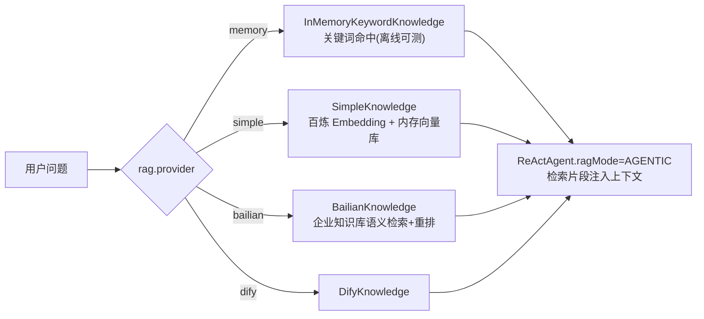
```mermaid
flowchart LR
    Q[用户问题] --> RM{rag.provider}
    RM -->|memory| K1["InMemoryKeywordKnowledge<br/>关键词命中(离线可测)"]
    RM -->|simple| K2["SimpleKnowledge<br/>百炼 Embedding + 内存向量库"]
    RM -->|bailian| K3["BailianKnowledge<br/>企业知识库语义检索+重排"]
    RM -->|dify| K4["DifyKnowledge"]
    K1 & K2 & K3 & K4 --> AG["ReActAgent.ragMode=AGENTIC<br/>检索片段注入上下文"]
```

> `KnowledgeProvider` 懒加载并缓存单例。memory 默认灌入预置政策文档；simple 因嵌入需调用服务，启动不灌库（由运维 `addDocuments`）。**优点**：检索增强降低幻觉、来源可溯。**边界**：simple/bailian/dify 需密钥与外部服务。

---

## 11. 工具体系与可替换后端

这是"改成你自己的业务 Agent"的关键。工具壳只承载暴露给 LLM 的 **Schema**，业务逻辑委托给接口后端：

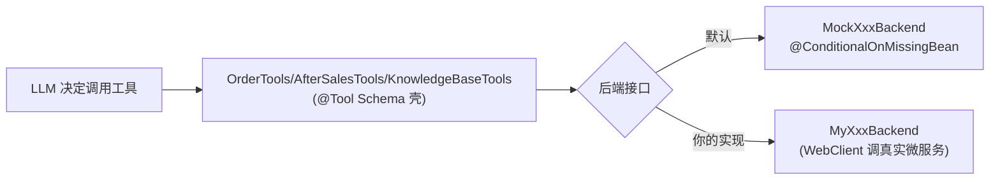
```mermaid
flowchart LR
    LLM[LLM 决定调用工具] --> Tools["OrderTools/AfterSalesTools/KnowledgeBaseTools<br/>(@Tool Schema 壳)"]
    Tools --> BE{后端接口}
    BE -->|默认| MOCK["MockXxxBackend<br/>@ConditionalOnMissingBean"]
    BE -->|你的实现| MINE["MyXxxBackend<br/>(WebClient 调真实微服务)"]
```

**扩展方式**（零改框架）：
```java
@Component
public class MyOrderBackend implements OrderBackend {
    public Mono<String> queryOrder(String id) { /* 调你的订单服务 */ }
    public Mono<String> queryLogistics(String id) { /* ... */ }
}
```
`ToolBackendConfig` 的默认 `@Bean` 标了 `@ConditionalOnMissingBean`，你的 Bean 一出现，默认 Mock 自动让位。

> **原理**：`@ConditionalOnMissingBean` 只在 `@Bean` 方法（配置类）上可靠生效，不能放在 `@Component` 扫描类上——这是本项目修过的真实 bug（冒烟测试 `ApplicationContextTest` 抓到）。
> 工具组（Tool Group）+ 可选 Meta-Tool 让 Agent 在大量工具时按需激活，缓解上下文窗口压力。

---

## 12. 多 Agent 编排

`MultiAgentOrchestrator` 构建订单/售后/知识库三个专家 Agent，用框架 `Pipelines` 编排：

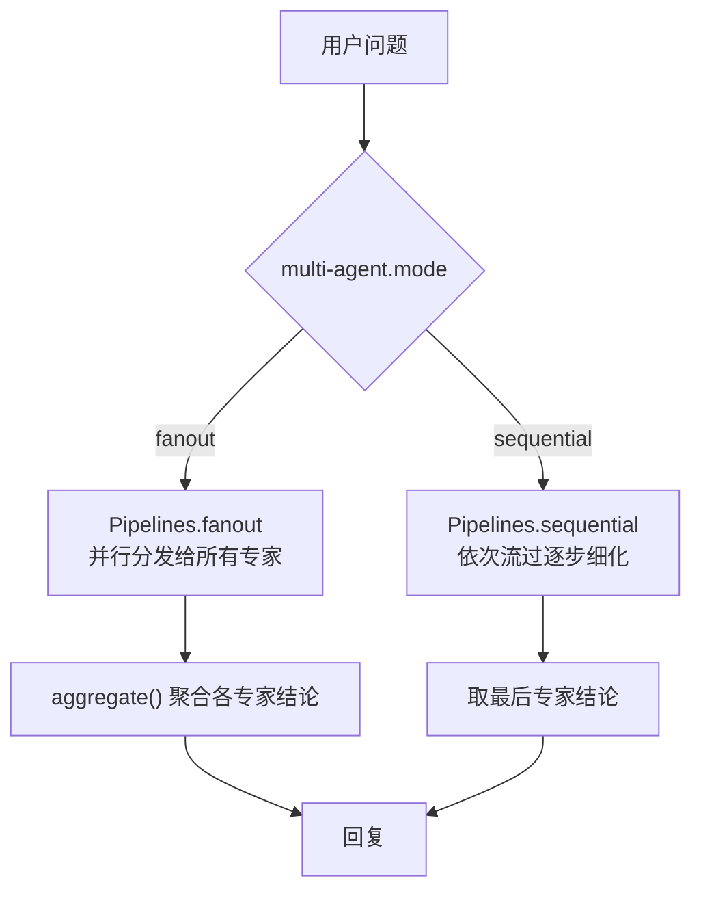
```mermaid
flowchart TB
    Q[用户问题] --> MODE{multi-agent.mode}
    MODE -->|fanout| FO["Pipelines.fanout<br/>并行分发给所有专家"]
    MODE -->|sequential| SE["Pipelines.sequential<br/>依次流过逐步细化"]
    FO --> AGG["aggregate() 聚合各专家结论"]
    SE --> LAST["取最后专家结论"]
    AGG & LAST --> R[回复]
```

> **优点**：主从分层、职责单一、可并行会诊。**边界**：进程内编排；跨进程多 Agent 互通需 A2A + Nacos 注册发现（扩展点，见 §16）。

---

## 13. 接入层安全与请求治理

WebFilter 按 `@Order` 串成链（数字越小越先）：

```mermaid
flowchart LR
    REQ[请求] --> F0["RequestIdWebFilter<br/>HIGHEST_PRECEDENCE"]
    F0 --> F1["ApiKeyAuthWebFilter<br/>+10"]
    F1 --> F2["RateLimitWebFilter<br/>+20"]
    F2 --> CTRL[Controller]
    F0 -. 写回 X-Request-Id + Reactor 上下文 .-> RESP
    F1 -. 401 .-> RESP[响应]
    F2 -. 429 .-> RESP
```

- **鉴权**：校验 `X-API-Key`；健康/Actuator/Swagger 路径豁免。
- **限流**：固定时间窗，按 API Key 或客户端 IP 计数，超限 429。分布式部署应换 Redis 限流（接口不变可平滑替换）。
- **请求关联**：生成/透传 `X-Request-Id` 进响应头与 Reactor Context，便于全链路排障。
- 默认鉴权/限流关闭，生产开启（见 README §6.14）。

---

## 14. 可观测性与运维

```mermaid
flowchart TB
    AG[ReActAgent 生命周期] --> OH["ObservabilityHook<br/>推理/工具/请求/异常/token"]
    OH -->|日志| LOG[logback + requestId]
    OH -->|指标| MM["Micrometer<br/>customerwork.agent.*"]
    MM --> PROM["/actuator/prometheus"]
    AG -. tracing.enabled .-> TR["LoggingTracer→TracerRegistry<br/>(可换 OTel TelemetryTracer)"]
    SVC[应用] --> HI["SessionHealthIndicator → /actuator/health"]
    LIFE[容器停机] --> GS["GracefulShutdownService<br/>停收新请求+排干在途"]
    SCHED[定时] --> MS["MaintenanceScheduler 巡检"]
    PROM --> GRAF["Grafana (docs/grafana-dashboard.json)"]
```

指标：`customerwork.agent.requests / reasoning / tool.calls{tool} / errors / tokens.total`。`token-warn-threshold` 提供单请求成本护栏告警。

---

## 15. Nacos 配置中心

系统提示词托管 Nacos，运营改提示词无需重启即热更新：

```mermaid
sequenceDiagram
    autonumber
    participant App as NacosPromptService
    participant N as Nacos ConfigService
    participant Ops as 运营/控制台
    App->>N: 启动 getConfig(dataId,group) 拉取
    App->>N: addListener(dataId,group)
    N-->>App: 初始提示词 → 缓存
    Ops->>N: 修改 dataId 配置内容
    N-->>App: receiveConfigInfo(新内容)
    App->>App: 更新缓存(热更新)
    Note over App: AgentFactory.systemPrompt()<br/>= currentPrompt().orElse(内置)
```

> 默认关闭；Nacos 不可用/未配置时回退内置提示词，保证可用性。A2A Agent Card 注册发现需 Nacos AI API + `io.a2a` SDK（扩展点）。

---

## 16. 扩展点总表

| 扩展点 | 怎么扩展 | 默认 |
|---|---|---|
| 业务工具 | 实现 `OrderBackend`/`AfterSalesBackend`/`KnowledgeBackend` 并声明 Bean | Mock |
| 模型厂商 | `model.provider`；或自定义 `Model` Bean | DashScope |
| 私有化兜底/重试 | `model.fallback.*` / `model.retry.*` | 关 |
| 会话存储 | `session.mode`；分布式可扩展自定义 `Session` | memory |
| 长期记忆 | `memory.provider`；或实现 `LongTermMemory` | memory |
| RAG | `rag.provider`；或实现 `Knowledge` | memory |
| 上下文压缩 | `context.compression-enabled` | 关 |
| Skill | `skill.repository`(classpath/filesystem) / 代码执行 / 运行时加载 | classpath |
| 工具发现 | MCP `mcp.*` / Higress `higress.*` | 关 |
| 提示词管理 | Nacos `nacos.*` 热更新 | 关 |
| 可观测 | `observability.tracing-enabled` / Studio | 关 |
| 安全 | `security.auth.*` / `security.rate-limit.*` | 关 |
| **需外部基础设施**（A2A/Nacos AI、RocketMQ、Quartz/XXL-JOB、Runtime 沙箱、Training/Trinity、Anthropic/Gemini SDK、RAGFlow/Haystack、Harness@1.1+） | 引依赖 + 部署服务后按各自 API 接入 | 文档化 |

---

## 17. 测试体系

```mermaid
flowchart TB
    subgraph 离线单测["离线单测 (mvn test 默认全绿)"]
        U1["Mockito 隔离模型/框架"]
        U2["StepVerifier 校验响应式链路"]
        U3["WebTestClient 驱动 Web 层"]
        U4["@SpringBootTest 冒烟全 Bean 装配"]
    end
    subgraph 条件集成["条件集成测试 (服务可达才跑, 否则 assumeTrue 跳过)"]
        I1["Redis / MySQL 会话往返"]
        I2["Nacos 提示词发布→拉取"]
        I3["Bailian 真实调用 (RUN_BAILIAN_IT)"]
    end
    subgraph CI
        G["GitHub Actions: 起 Redis/MySQL/Nacos 容器<br/>mvn test + JaCoCo + 打包"]
    end
```

设计原则：**任何环境 `mvn test` 都绿**——外部依赖用 `assumeTrue(reachable)` 条件执行，CI 用服务容器让它们真实跑。

---

## 18. 设计取舍与边界

- **响应式全链路无 `.block()`**：业务链路严格异步；仅持久化落盘放 `boundedElastic`，演示/测试边界处除外。
- **配置开关 + 可替换实现**：以少量"默认 Mock"换取离线可跑、可测、易采用；代价是初次阅读需理解 provider/配置分发。
- **效果非确定性**：AI 输出不确定，单测覆盖"工程正确性"，"效果正确性"靠评估（`docs/EVAL.md`）。
- **框架版本**：锁定 `agentscope 1.0.12`；Harness 等 1.1+ 能力为升级后扩展点。
- **安全**：仓库零密钥，全部环境变量注入；生产建议 Vault/KMS/K8s Secret。

---

## 19. 术语表

| 术语 | 含义 |
|---|---|
| ReAct | Reasoning+Acting，LLM 推理-行动循环范式 |
| Tool Group / Meta-Tool | 工具分组 / 让 Agent 运行时启停工具组的元工具 |
| Hook | Agent 生命周期拦截扩展点（推理/工具/请求前后） |
| Session/State | 框架的会话与状态持久化抽象 |
| LongTermMemory | 跨会话长期记忆抽象（record/retrieve） |
| Knowledge / RAG | 知识库抽象 / 检索增强生成 |
| AG-UI | 标准 Agent-UI 事件协议 |
| MCP | Model Context Protocol，存量系统零改造接成工具 |
| A2A | Agent-to-Agent 协议，跨 Agent 互通 |
| Fallback / Retry | 私有化兜底 / 退避重试（模型高可用） |

---

> 本文随代码演进持续更新；若发现文档与代码不一致，以代码为准并欢迎提 Issue/PR。
