# 《详细技术文档 · AgentScope 2.0 版》

> 适用项目：**customer-work · 基于 AgentScope Java 2.0.0-RC4 的生产级智能客服系统**（`rc2.0` 分支）
> 包名：`com.richard.fyoung.customerwork` ｜ 协议：Apache-2.0 ｜ 文档与代码保持一致（rc2.0 共 147 个单测全绿）
> 依赖坐标：`io.agentscope:agentscope-harness:2.0.0-RC4`（经 `agentscope-bom` 管理）｜ JDK 17

> 📌 本文是 `rc2.0` 分支（AgentScope 2.0）的深度架构文档。1.x→2.0 的逐项 API 映射、不可迁移能力见
> **[MIGRATION-2.0.md](MIGRATION-2.0.md)**；`main` 分支（1.0.12）的老版深度文档见该分支历史。

本文面向两类读者：
- **初学者**：先读 [§1 总览](#1-项目总览) → [§2 技术栈原理](#2-技术栈原理与优缺点) → [§3 整体架构](#3-整体架构) → [§5 一次请求的旅程](#5-一次请求的全流程时序)，建立全局认知。
- **资深使用者**：直接看 [§4 模块 UML](#4-模块-uml-类图) / [§6–§17 各子系统原理与扩展点](#6-模型层) / [§19 扩展点总表](#19-扩展点总表)。

> 文中所有图均为 Mermaid，GitHub 原生渲染；类名、方法、配置键均与源码一致。

---

## 目录

1. [项目总览](#1-项目总览)
2. [技术栈原理与优缺点](#2-技术栈原理与优缺点)
3. [整体架构](#3-整体架构)
4. [模块 UML 类图](#4-模块-uml-类图)
5. [一次请求的全流程时序](#5-一次请求的全流程时序)
6. [模型层](#6-模型层)
7. [Agent 装配：ReActAgent 与 HarnessAgent](#7-agent-装配reactagent-与-harnessagent)
8. [会话与状态持久化（无状态模型）](#8-会话与状态持久化无状态模型)
9. [记忆体系（三层 + 上下文压缩）](#9-记忆体系三层--上下文压缩)
10. [RAG 知识检索](#10-rag-知识检索)
11. [工具体系与可替换后端](#11-工具体系与可替换后端)
12. [五段 Middleware 体系（取代 Hook）](#12-五段-middleware-体系取代-hook)
13. [多 Agent 编排与子智能体](#13-多-agent-编排与子智能体)
14. [权限系统 / Plan Mode / 沙箱（Harness 新能力）](#14-权限系统--plan-mode--沙箱harness-新能力)
15. [接入层安全与请求治理](#15-接入层安全与请求治理)
16. [可观测性与运维](#16-可观测性与运维)
17. [Nacos 配置中心](#17-nacos-配置中心)
18. [测试体系](#18-测试体系)
19. [扩展点总表](#19-扩展点总表)
20. [设计取舍与边界](#20-设计取舍与边界)
21. [术语表](#21-术语表)

---

## 1. 项目总览

这是一个把"大模型智能体"工程化落地为**可上生产的客服系统**的参考实现，已迁移到 **AgentScope 2.0**。核心理念贯穿全项目：

> **每个能力 = 一个配置开关 + 一个可替换实现。** 内置实现保证离线开箱即用、单测可过；生产改一行配置或提供一个 Bean，即可切到云端 / 私有化后端，业务代码零改动。

2.0 带来的架构升级（相对 1.x）：

> **Agent 无状态化**：状态按 `(userId, sessionId)` 外置到 `AgentStateStore`，单实例并发服务多租户多会话；
> **五段 Middleware** 取代松散 Hook；**HarnessAgent** 在 ReActAgent 之上叠加 Plan Mode / Compaction / Sandbox / Subagent；
> **Permission System** 成为框架原生的工具权限闸门。

能力域一览：

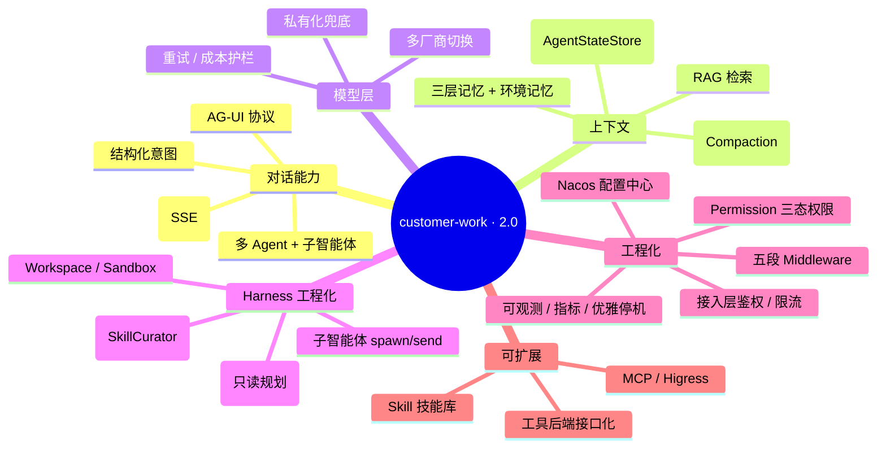

---

## 2. 技术栈原理与优缺点

| 技术 | 在本项目的角色 | 原理简述 | 优点 | 缺点 / 注意 |
|---|---|---|---|---|
| **Spring Boot 3.2 (WebFlux)** | Web 框架 + 依赖注入 | 基于 Reactor 的异步非阻塞 Web 栈 | 高吞吐、与 Agent 响应式契合、SSE 友好 | `block()` 误用拖垮事件循环；MDC 需 Reactor Context 透传 |
| **Project Reactor** | 异步编程模型（`Mono`/`Flux`） | 声明式数据流 + 背压；中间件链即 `Function<Input, Flux<AgentEvent>>` | 组合性强、背压、内建重试/超时 | 学习曲线陡；冷热流易踩坑（见 §6 重试） |
| **AgentScope Java 2.0.0-RC4 (`agentscope-harness`)** | 智能体框架 | ReActAgent + HarnessAgent + Toolkit + **AgentStateStore** + **Middleware** + Permission + Sandbox + Model 抽象 | 纯 Java、Spring 友好、无状态可横扩、Harness 工程底座完整 | RC 阶段；部分扩展（远端沙箱/k8s 等）需引扩展坐标 |
| **DashScope（百炼）** | 默认大模型 | 通义千问 OpenAI 兼容/原生协议；`stream` 增量返回 | 国产、合规、Embedding 齐全 | 需 API Key、计费 |
| **Jedis** | Redis 状态存储 | `JedisPool` 连接池 → `JedisAgentStateStore` | 多实例共享会话状态 | 单机限流不分布式（见 §15） |
| **HikariCP + MySQL** | MySQL 状态存储 | JDBC 连接池 → `MysqlAgentStateStore` 自动建表 | 强一致、可审计 | 需运维 DB |
| **Nacos Client 3.0.2** | 配置中心 | `ConfigService` 长轮询监听 | 提示词热更新 | AI/A2A API 需更高版本 |
| **Micrometer + Actuator** | 指标 / 健康 | 维度化指标 + `/actuator` | Prometheus 生态 | 指标基数需控制 |
| **springdoc-openapi 2.3** | API 文档 | 扫描注解生成 OpenAPI + Swagger UI | 在线调试 | 与 Boot 版本需匹配 |
| **JaCoCo** | 覆盖率 | 字节码插桩 | 质量度量 | 报告非门禁 |

> **依赖编排**：`agentscope-bom` 统一管理 core/harness/extensions 版本；扩展能力（Redis/MySQL 状态、
> Mem0/ReMe/百炼记忆、Dify/百炼 RAG、AG-UI、Higress、Studio、Nacos 提示词）走 `agentscope-extensions-*`，
> 且多数沿用 `io.agentscope.core.*` 包名，迁移时整合层代码零改动。

---

## 3. 整体架构

### 3.0 工程模块（多模块 Maven 工程）

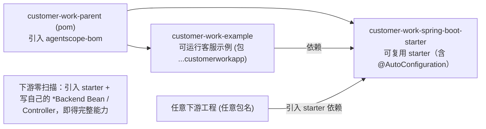

- `starter`：配置/装配/模型层/记忆/RAG/工具 SPI/**五段 Middleware**/**Permission**/安全/可观测/Nacos 等可复用基础设施，
  通过 `@AutoConfiguration`（`CustomerWorkAutoConfiguration`）自动装配。
- `example`：`CustomerWorkApplication`（包 `com.richard.fyoung.customerworkapp`）+ Controller + 业务资源。
- starter 固定扫描自身包 `com.richard.fyoung.customerwork`；与 example 包名不重叠 → 无重复装配。
- starter 用 **HikariCP** 而非 `spring-jdbc`，不触发 `DataSourceAutoConfiguration`，下游零排除即插即用。

### 3.1 运行时分层（2.0）

自上而下五层；右侧标注对应的核心类与"配置开关"。**与 1.x 的关键差异已加粗**。

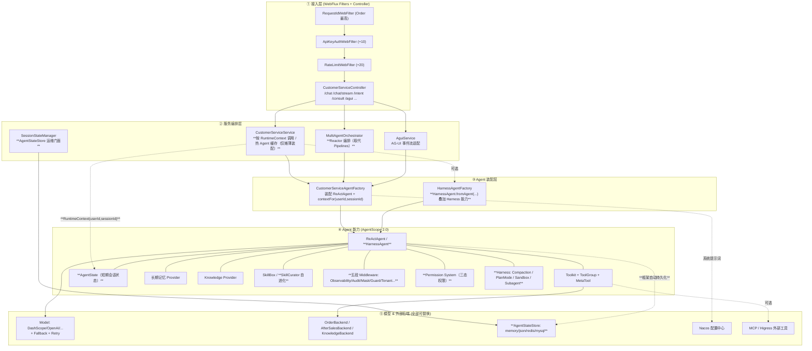

> **2.0 状态模型**：Agent 不再持有会话；状态以 `(userId, sessionId, key, State)` 由框架在 `call/stream`
> 链路自动加载/持久化到 `AgentStateStore`。服务层不再有 `saveTo/loadIfExists` 与"淘汰即落盘"。

---

## 4. 模块 UML 类图

### 4.1 接入与服务编排

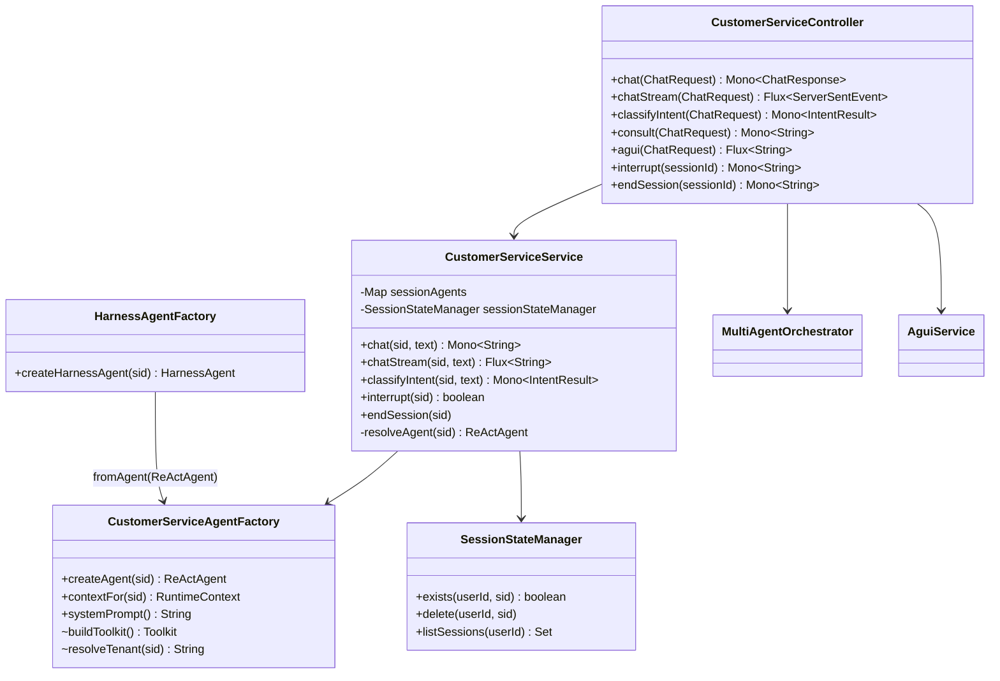

> 关键差异：`CustomerServiceService` 删除了 `persist/saveTo`，改为 `contextFor(sid)→RuntimeContext` 调用；
> `endSession` 经 `SessionStateManager.delete(userId, sid)` 清理状态。

### 4.2 模型层（统一抽象 + 装饰器）

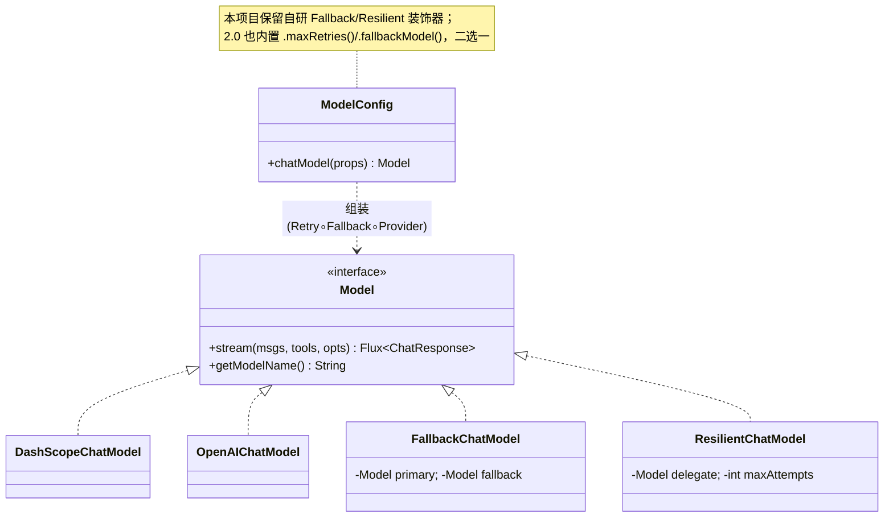

### 4.3 工具体系与可替换后端（核心扩展点）

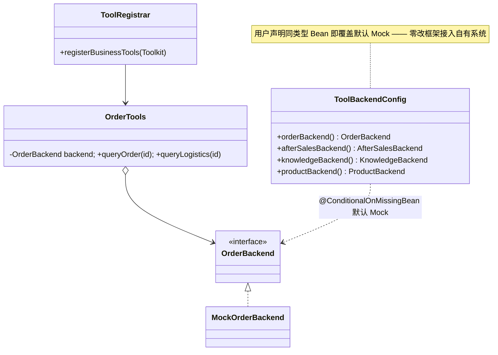

业务工具按客服旅程分 **7 个 Tool Group**，覆盖售前→售中→售后全链路：

| Tool Group | 工具 | 后端接口 |
|---|---|---|
| presale（售前导购）| queryProduct / recommendProducts / checkStock / queryPromotions | `ProductBackend` |
| order（订单+售中）| queryOrder / queryLogistics / modifyAddress / cancelOrder / urgeShipment | `OrderBackend`（售中方法 default 演进）|
| after_sales（售后）| checkRefundEligibility / submitRefund / queryRefundProgress / submitReturn / submitExchange / checkPriceProtection / requestInvoice | `AfterSalesBackend` |
| member（会员/账户）| queryPoints / queryMemberLevel / resolveAccountIssue | `MemberBackend` |
| complaint（投诉工单）| fileComplaint / queryComplaint | `ComplaintBackend` |
| knowledge（知识）| searchKnowledge | `KnowledgeBackend` |
| human（人工）| transferToHuman | — |

> 退款仍守资金红线（只生成待人工确认工单，见 §14.1.1 审批闭环）；新增后端方法只需在自定义 Bean 实现，零改框架。

### 4.4 五段 Middleware 体系（取代 Hook）

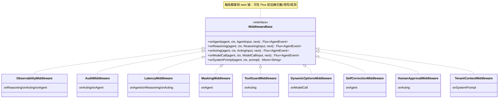

### 4.5 记忆与 RAG 提供方

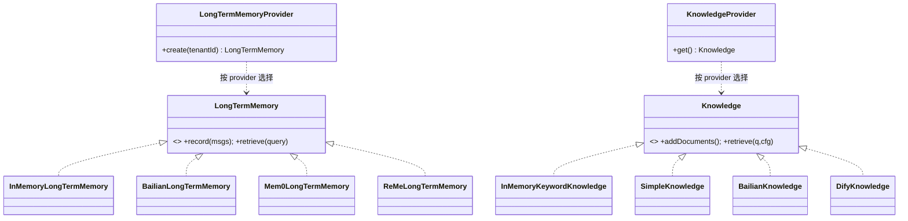

---

## 5. 一次请求的全流程时序

### 5.1 同步对话 `POST /chat`（2.0）

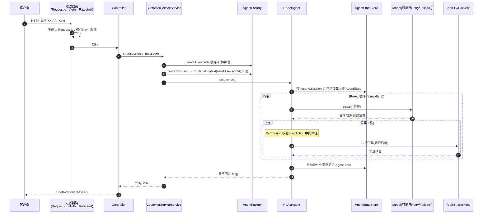

> 与 1.x 的差异：**无 `loadIfExists/saveTo` 手工调用**；加载/持久化由框架在 `call` 链路按 `RuntimeContext`
> 自动完成。热 Agent 缓存仅用于摊薄"按会话装配 Agent"的构建开销，淘汰不丢数据（状态在 Store）。

### 5.2 流式对话 `POST /chat/stream`（SSE）

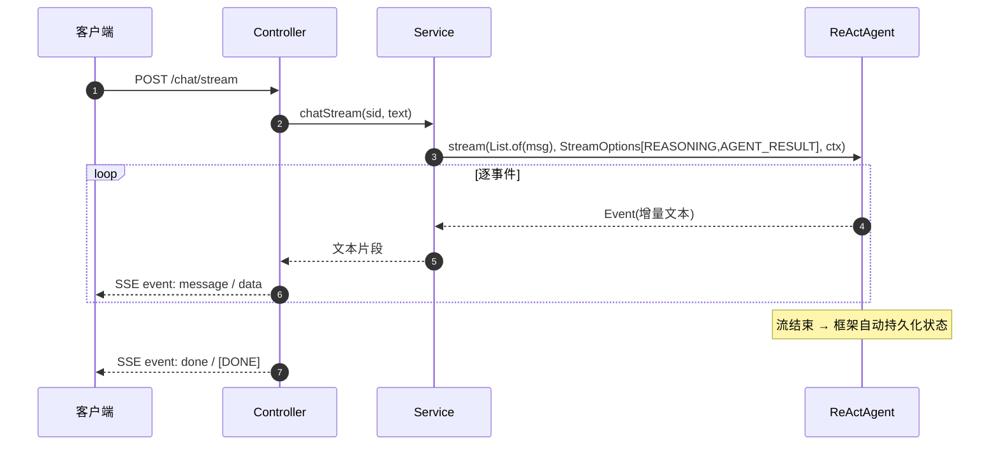

---

## 6. 模型层

`ModelConfig.chatModel()` 用**装饰器模式**按配置层层包装：`Retry( Fallback( Provider ) )`。

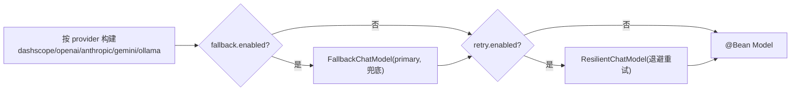

> **原理要点（也是踩坑点）**：Reactor 的 `retryWhen` 会**重订阅同一个上游**。若直接
> `delegate.stream().retryWhen()`，重试只是重订阅"已失败的同一个流"，对真实调用无效。本项目用
> `Flux.defer(() -> delegate.stream(...))` 保证**每次重试重新发起底层调用**——`ResilientChatModelTest` 守护此语义。
>
> **2.0 内置替代**：`ReActAgent/HarnessAgent.Builder` 原生支持 `.maxRetries(int)` 与 `.fallbackModel(Model/String)`，
> 可替代自研装饰器。本项目保留自研版以演示"装饰器组合"原理，二者择一即可。
>
> **优点**：统一抽象屏蔽厂商差异；私有化兜底满足数据主权；重试提升高可用。**缺点/边界**：anthropic/gemini
> 需各自 SDK；多模态/工具 schema 在不同厂商表现有差异，切换需回归评估（见 `docs/EVAL.md`）。

---

## 7. Agent 装配：ReActAgent 与 HarnessAgent

### 7.1 ReActAgent 装配（主链路）

`CustomerServiceAgentFactory.createAgent(sessionId)` 是装配中枢（2.0）：

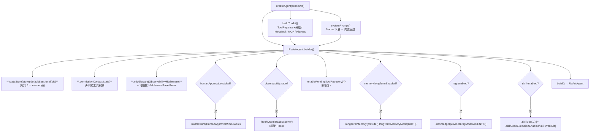

**ReAct（Reasoning + Acting）原理**：让 LLM 做"大脑"，循环【推理→决定调工具→观察结果→再推理】直到给出最终答复
或达 `maxIters`。本项目用 `maxIters`、**Permission ask/deny**（高风险工具闸门）、`interrupt(ctx)`（安全中断）、
`enablePendingToolRecovery`（中断恢复）约束其"自主性失控"风险。

### 7.2 HarnessAgent 装配（统一叠加 Harness 能力）

`HarnessAgentFactory.createHarnessAgent(sessionId)` 用 `HarnessAgent.Builder.fromAgent(reActAgent)` 在内层
ReActAgent 之上叠加 Harness 专属能力（均 `customer-work.harness.*` 配置化）：

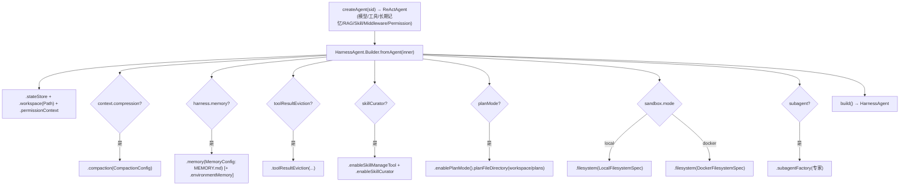

> HarnessAgent 实现 `Agent`，`call/stream/interrupt` 与 ReActAgent 同签名，服务层可无缝切换。
> Subagent 默认开启（`AgentSpawnTool` + `InboxMiddleware` 反向推送），仅 `disableSubagents()` 可关。

---

## 8. 会话与状态持久化（无状态模型）

2.0 中 Agent 无状态：状态按 `(userId, sessionId)` 外置到 `AgentStateStore`，由框架在 `call/stream` 链路自动
加载/持久化。`SessionConfig` 按 `session.mode` 提供 `AgentStateStore` Bean。

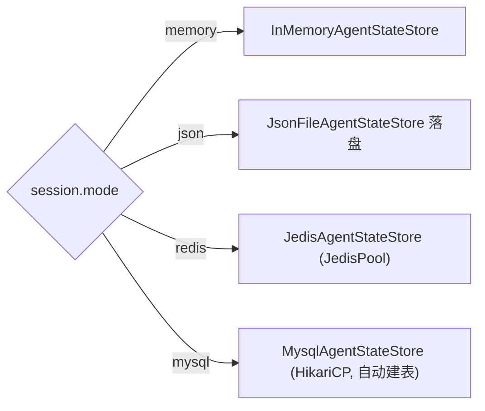

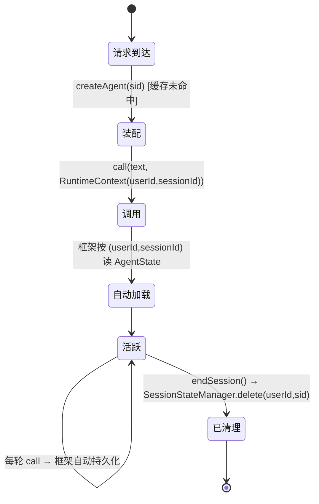

> **会话 ID 映射**：`tenantA:conv-1` → `userId=tenantA`（多租户隔离）、`sessionId=完整会话 ID`、可选 `org` 写入
> `RuntimeContext` KV，实现 session/user/org 多维隔离。`SessionStateManager` 退化为对 `AgentStateStore` 的运维门面
> （exists / delete / listSessions），不再承担"保存/恢复"。
>
> **优点**：单实例并发服务多会话、零停机滚动发布、任意进程可恢复。**边界**：redis/mysql 需运维；`Msg` 在 2.0
> 实现 `State`，可直接作为状态值持久化。

---

## 9. 记忆体系（三层 + 上下文压缩）

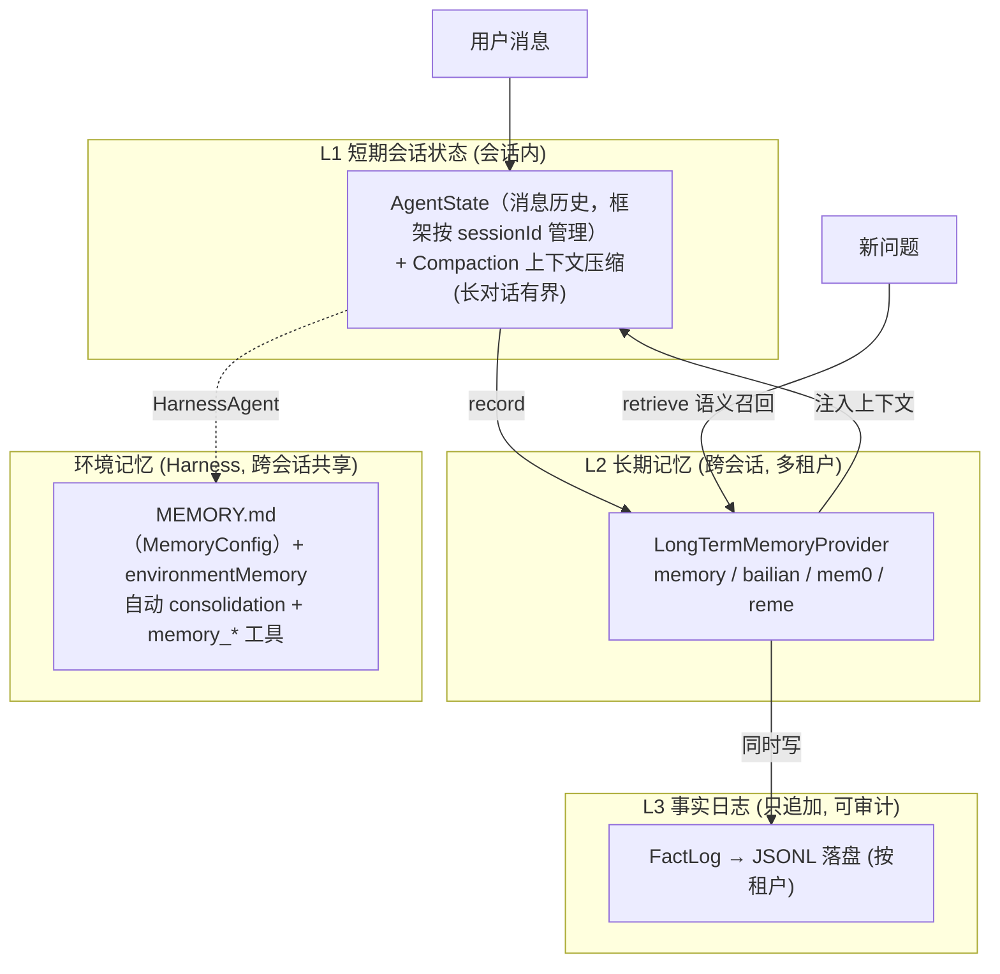

- **L1**：会话内消息历史即 `AgentState`，由框架按 `sessionId` 管理；长对话由 **Compaction**（`CompactionConfig`，
  取代 1.x `AutoContextMemory`）自动压缩历史、卸载大工具结果、保留最近若干轮，保证上下文有界。
- **L2**：`InMemoryLongTermMemory` 在 `record` 时同时写 L2 召回库与 L3 审计日志；`retrieve` 轻量打分（可替换
  为真实向量库 / 百炼托管召回）。多租户按 `userId=租户` 隔离。
- **环境记忆**（HarnessAgent）：`MemoryConfig` 提供 `MEMORY.md` 持久画像 + 自动 consolidation + `memory_*` 工具，
  `environmentMemory` 提供跨会话共享的环境级记忆。

---

## 10. RAG 知识检索

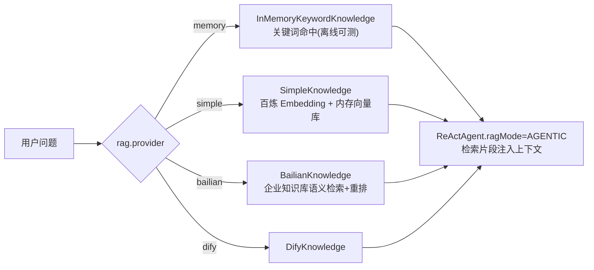

> `KnowledgeProvider` 懒加载并缓存单例；memory 默认灌入预置政策文档。**优点**：检索增强降低幻觉、来源可溯。
> **边界**：simple/bailian/dify 需密钥与外部服务。2.0 中这些整合沿用 `io.agentscope.core.rag.*` 包名，
> 仅需补 `agentscope-extensions-rag-*` 依赖。

---

## 11. 工具体系与可替换后端

工具壳只承载暴露给 LLM 的 **Schema**，业务逻辑委托给接口后端：

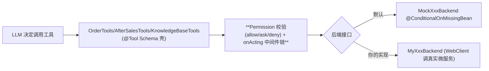

**扩展方式**（零改框架）：
```java
@Component
public class MyOrderBackend implements OrderBackend {
    public Mono<String> queryOrder(String id) { /* 调你的订单服务 */ }
    public Mono<String> queryLogistics(String id) { /* ... */ }
}
```

> **原理**：`@ConditionalOnMissingBean` 只在 `@Bean`（配置类）上可靠生效；工具组 + 可选 Meta-Tool 让 Agent
> 在大量工具时按需激活，缓解上下文窗口压力。2.0 新增 **Permission System** 在工具执行前做声明式授权校验
> （见 §14），与 `ToolGuardMiddleware`（入参治理）协同。

---

## 12. 五段 Middleware 体系（取代 Hook）

2.0 用 `MiddlewareBase` 五段中间件取代 1.x 的扁平 `Hook`，每段都拿到 `next` 链，可在事件流前后做拦截/改写/观测。
8 个业务 Hook 已全部迁移（见 [MIGRATION-2.0.md §7.1](MIGRATION-2.0.md)）。

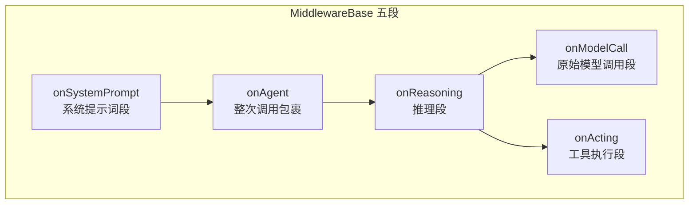

| 中间件 | 段 | 职责 |
|---|---|---|
| `ObservabilityMiddleware` | onReasoning+onActing+onAgent | 请求/工具/错误指标 + 日志 |
| `AuditMiddleware` | onActing+onAgent | 逐条审计轨迹（工具调用 / 最终答复 / 异常） |
| `LatencyMiddleware` | onAgent/onReasoning/onActing | 分段延迟 Timer（P50/P95/P99） |
| `MaskingMiddleware` | onAgent | 出站脱敏（对 `AgentResultEvent` 文本掩码） |
| `ToolGuardMiddleware` | onActing | 工具入参注入 + 数值上限钳制 |
| `DynamicOptionsMiddleware` | onModelCall | 按意图切"精确档"生成参数 |
| `SelfCorrectionMiddleware` | onAgent | 检测越权打款承诺并告警（硬约束交 Permission） |
| `HumanApprovalMiddleware` | onActing | 高风险工具观测（闸门交 Permission ask 规则） |
| `TenantContextMiddleware` | onSystemPrompt | 把租户/会话注入系统提示词 |
| `DialogStageMiddleware` | onSystemPrompt | 按对话阶段动态注入聚焦指令（动态 Prompt 状态机）|

> 装配：`CustomerServiceAgentFactory` 用 `.middleware(...)` 织入，可插拔 Middleware 经
> `ObjectProvider<MiddlewareBase>` 自动收集（下游自定义 `MiddlewareBase` Bean 即接入）。框架级
> `JsonlTraceExporter` 仍走 `.hook()`；系统级热插拔 `GlobalHookRegistry` 保留（`AgentBase.addSystemHook`）。
>
> **语义降级**：1.x `SelfCorrectionHook.gotoReasoning(强制重推理)`、`HumanApprovalHook.stopAgent()` 在中间件
> 模型下无等价语义 → 退化为"检测 + 告警"，真正的硬闸门由 **Permission ask/deny 规则** 承担。

---

## 13. 多 Agent 编排与子智能体

### 13.1 进程内多专家（Reactor 编排）

`MultiAgentOrchestrator` 构建订单/售后/知识库三专家 Agent，用 **Reactor 直接编排**（取代已移除的 `Pipelines`）：

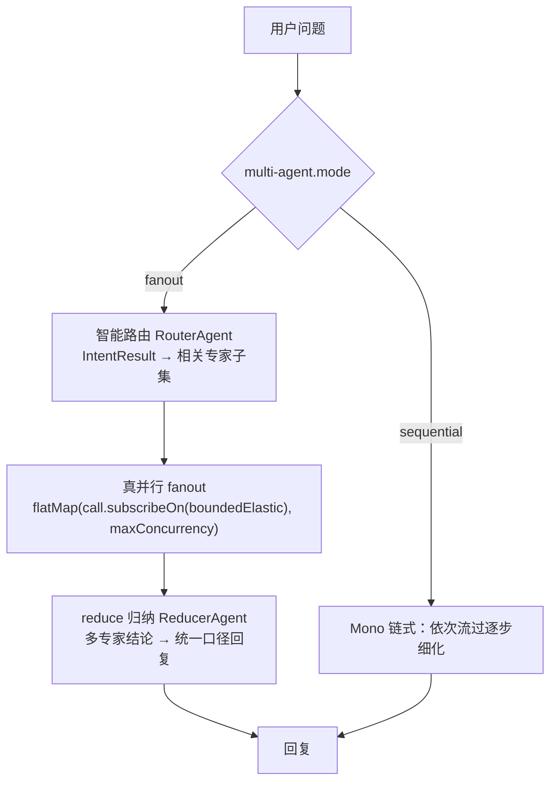

**路由 → 并行 → 归纳**三段（fanout 模式）：

| 段 | 开关 | 行为 | 退化 |
|---|---|---|---|
| 智能路由（快车道）| `fast-route-enabled` | 关键词规则命中**唯一**意图→直路由，跳过 LLM | 命中多类/无命中 → 交慢车道 |
| 智能路由（慢车道）| `routing-enabled` | RouterAgent 分诊意图，`expertsForIntent` 纯映射只挑相关专家 | 分诊失败 / other → 广播全部，保证不漏 |
| 真并行 fanout | 总是 | 各专家 `subscribeOn(boundedElastic)` 真并发 + 限流 + 超时/错误隔离 | 单专家时即一个任务 |
| reduce 归纳 | `reduce-enabled` | ReducerAgent 把多结论合成统一口径回复（去重/消解冲突） | 单专家 / 关闭 → `aggregate` 拼接 |

> **可观测**（Micrometer → `/actuator/prometheus`）：`customerwork.mas.route{intent}`、
> `customerwork.mas.fanout.experts`、`customerwork.mas.expert{expert,outcome=success/timeout/failure}`、
> `customerwork.mas.reduce{triggered}`，无 Micrometer 时降级为 no-op。

**真并行的关键（第一性原理）**：`agent.call()` 返回 `Mono<Msg>`，但底层模型调用很可能是**阻塞式**。若只写
`flatMap(agent -> agent.call(...))`，三个专家会在同一条订阅线程上**依次阻塞**——是"并行的写法、串行的执行"。
本编排器给每个任务挂 `subscribeOn(Schedulers.boundedElastic())`，把阻塞调用挪到独立线程，才是**真并发**；
再叠加三道工程保障：

| 机制 | 实现 | 作用 |
|---|---|---|
| 并发限流 | `flatMap(task, maxConcurrency)` | 同时在跑的专家数上限（默认 8），防资源打满 |
| 超时隔离 | `.timeout(timeoutSeconds)` | 慢专家不无限拖累整体 |
| 错误隔离 | `.onErrorResume(→占位 Msg)` | 单专家失败降级为"暂不可用"占位，其余照常聚合 |

> 离线确定性单测（`MultiAgentOrchestratorTest`）：用可控阻塞 `Mono` 记录运行期**峰值并发度**——
> `fanout` 断言峰值 ≥ 2（证明真并发），`concurrency=1` 断言峰值 == 1（限流退化为串行），并验证错误隔离。
>
> **备注（测试边界）**：单测证明的是"并发是真实发生的"（峰值并发度 ≥ 2），不依赖网络、确定性可重复；
> 但**三专家同时打真实大模型的端到端墙钟加速比**需配置真实 `DASHSCOPE_API_KEY` 跑 `POST /consult` 现场观测——
> 离线覆盖的是**并发度**，而非真实网络延迟下的**加速倍数**（后者随模型 RTT、限流与重试波动，不适合做断言）。

### 13.2 HarnessAgent 子智能体（spawn/send）

HarnessAgent 默认开启子智能体：`subagentFactory` 注册命名专家，框架经 `AgentSpawnTool`（`agent_spawn`）
按需派生、`InboxMiddleware` 做反向推送（`agent_send`），支持同步与后台委派。

> **优点**：主从分层、职责单一、可后台委派。**边界与并行说明**：HarnessAgent 的子智能体由主智能体在
> ReAct 循环里**自行逐个 spawn**，本质串行、不可编程控制其并发；需要"主 + 子智能体"**可控并行**会诊时，
> 走 §13.1 的 `MultiAgentOrchestrator`（它构造的正是注册为 subagent 的同一批专家）。跨进程多 Agent 互通需
> A2A + Nacos 注册发现（扩展点，见 §19）。

### 13.3 多轮槽位收集（事项收集，借鉴 AliGo）

退货/退款等任务型对话需逐步收集关键信息。`SlotFillingService` 按 (sessionId, form) 维护进度：

```mermaid
flowchart LR
    U[用户输入] --> EX["抽取：带正则槽位任意句抽取<br/>自由文本槽位追问轮整句取值"]
    EX --> Q{required 槽位齐了?}
    Q -->|否| ASK["追问 nextPrompt"] --> U
    Q -->|是| DONE["complete + values"] --> AP["串接 HITL：生成待审退款单"]
```

- 退款表单：`orderId`（正则 `GMLOC\w+|\d{6,}`）+ `reason`（自由文本）；`RefundFormController` 收齐后调
  `PendingApprovalService` 生成待审单，与 §14.1.1 审批闭环串成 **收集 → 待审 → 人工放行 → 打款** 完整链路。
- 抽取规则确定性，离线可测（`SlotFillingServiceTest`：多轮 / 首句抽取 / 完成清理）。

### 13.4 自动化意图评测框架（借鉴 AliGo 测评系统）

`IntentEvalRunner` 对 classpath 评测集 `eval/intent-eval-cases.json` 逐用例打分，量化**规则快车道**质量：

| 指标 | 含义 |
|---|---|
| accuracy | 判定正确数 / 总用例（明确用例命中正确意图 + 模糊用例正确地交 LLM）|
| fastLaneCoverage | 快车道命中数 / 明确意图用例数（规则能直接处理的占比）|

- **离线确定性**（只用 `fastRouteIntent`，不触发模型）、可 CI 跑、可版本对比；`EvalReport.format()` 输出文本报告。
- 评测集外置 JSON = AliGo 强调的"用例沉淀复用"；新增用例只改 JSON、不动代码。
- **边界**：真实回复的相关性/准确性评测需 LLM-as-judge（真实模型 Key），不在离线评测范围。
- 测试：`IntentEvalRunnerTest`（数据集加载 + 准确率≥95% / 覆盖率≥80% 质量基线）。

### 13.5 对话阶段状态机（动态 Prompt，借鉴 AliGo）

AliGo 把"全量规则塞一个大 Prompt"改为"状态机式动态组装"，是其准确率 50%→90% 的关键之一。本项目用
`onSystemPrompt` 中间件落地：`DialogStageService` 按会话维护 `DialogStage`，`DialogStageMiddleware`
在每次调用前把**当前阶段**的聚焦指令片段动态追加到系统提示词。

```mermaid
stateDiagram-v2
    [*] --> GREETING: 接待识别
    GREETING --> COLLECTING: 信息收集
    COLLECTING --> PROCESSING: 业务处理
    PROCESSING --> CONFIRMING: 确认收尾
    GREETING --> ESCALATED: 转人工
    COLLECTING --> ESCALATED
    PROCESSING --> ESCALATED
```

- 每阶段只注入"当前主链路"指令（如 COLLECTING 阶段："缺什么问什么，一次只问最关键一项"），而非全量规则——降 token、提准。
- 阶段流转由业务事件驱动（`set`）或主链路顺序推进（`advance`）；与 `TenantContextMiddleware` 同段叠加。
- 测试：`DialogStageServiceTest`（默认态 / 流转 / 片段非空 / 中间件注入当前阶段片段）。

### 13.6 主动服务（订单通知 / 满意度回访，复用 Channel 推送）

`ProactiveNotificationService` 组装主动消息，推送委托给可替换的 `NotificationChannel`：

```mermaid
flowchart LR
    EV["订单状态变更 / 定时任务 / 运营后台"] --> SVC["ProactiveNotificationService<br/>notifyOrderStatus / sendSatisfactionSurvey"]
    SVC --> CH{NotificationChannel}
    CH -->|starter 默认| LOG["LoggingNotificationChannel（仅日志）"]
    CH -->|customer-web 覆盖| FS["FeishuNotificationChannel @Primary<br/>复用飞书 webhook，未配置降级日志"]
```

- starter 以 `@ConditionalOnMissingBean` 注册默认 `LoggingNotificationChannel`；customer-web 提供
  `FeishuNotificationChannel`（`@Primary`，包装 `FeishuWebhookNotifier`）即**复用已有 Channel 推送**。
- 端点：`POST /api/customer/notify/order-status|survey`。测试：`ProactiveNotificationServiceTest`（文案组装 + 通道委托）。

### 13.7 坐席辅助 + 会话质检（借鉴 AliGo 坐席辅助 / 质检）

- **坐席辅助** `AgentAssistService`：按用户消息规则匹配，给人工坐席输出「建议话术 + 知识提示 + 推荐工具」
  （旁挂提示，不直接发用户）。端点 `POST /api/customer/assist`。
- **会话质检** `QualityInspectionService`：对坐席/Agent 回复做合规打分——**资金违规承诺**（已打款/马上到账/保证退）
  单条 -40 且直接判不通过，绝对化表述 -10、服务禁语 -15；输出 `QualityReport(score, passed, issues)`。
  端点 `POST /api/customer/quality/inspect`。
- 均规则化、离线确定性。测试：`AgentAssistServiceTest`、`QualityInspectionServiceTest`。

---

## 14. 权限系统 / Plan Mode / 沙箱（Harness 新能力）

### 14.1 Permission System（三态权限）

`PermissionConfig` 把 `customer-work.harness.permission` 映射为框架原生 `PermissionContextState`，注入主 ReActAgent：

```mermaid
flowchart LR
    TOOL[工具调用] --> ENG{PermissionEngine}
    ENG -->|allow 规则| OK[直接放行]
    ENG -->|ask 规则| CONFIRM[人工确认 RequireUserConfirm]
    ENG -->|deny 规则| BLOCK[拒绝]
    ENG -->|mode| MODE["default/acceptEdits/explore/bypass/dontAsk"]
```

- 三态决策：**允许 / 询问(审批) / 拒绝**；ask 规则默认覆盖 `submitRefund`、`transferToHuman`。
- 与 `HumanApprovalMiddleware` 形成"声明式权限 + 可观测确认"双层，HITL 上升为框架原生能力。

#### 14.1.1 人工审批闭环（退款放行，应用层 HITL）

Permission ASK 把关"是否允许 Agent 调用退款工具"，但**工单生成后是否真打款**需要第二道人工闸门。
`PendingApprovalService` + `ApprovalController` 提供这道闭环：

```mermaid
flowchart LR
    T["submitRefund 工具"] -->|生成待审单 AP-xxx| ST[(PendingApprovalService<br/>PENDING)]
    ST --> Q["GET /approvals?status=pending"]
    Q --> H{人工坐席}
    H -->|approve| AP["APPROVED → onApprove 回调执行打款"]
    H -->|deny| DN["DENIED"]
```

| 设计点 | 说明 |
|---|---|
| 状态机 | `ApprovalRequest` 充血，`PENDING → APPROVED/DENIED` 终态不可变；重复决策 fast-fail（HTTP 409） |
| 互补双层 | Permission ASK（工具调用层）+ 审批闭环（资金执行层），各司其职 |
| 为何应用层 | 框架运行时确认（`RequireUserConfirmEvent` / `ReActAgent.CONFIRM_SINK_KEY`）在 2.0-RC4 **未暴露 Web 友好的公共回填 API**，绑定其内部协议脆弱；而"退款先生成待确认工单、人工放行后执行"本就是更稳健的领域建模 |
| 可扩展 | 进程内存储为演示；生产经 `onApprove` 回调对接真实工单系统/打款服务 |

> 测试：`PendingApprovalServiceTest`（状态机 + 回调 + fast-fail 边界）、`AfterSalesToolsApprovalTest`（退款登记待审单 / 无服务降级）。

### 14.2 Plan Mode（只读规划期）

`HarnessAgent.enablePlanMode()`：先以只读方式产出 markdown 计划（持久化到 `workspace/plans`），获批后再进入写
执行，让"意图与动作解耦"。`allowShellInPlanMode` 控制规划期是否允许 Shell。

### 14.3 安全沙箱执行

`HarnessAgentFactory#applySandbox` 按 `harness.sandbox.mode` 选择文件系统隔离：

```mermaid
flowchart LR
    MODE{sandbox.mode} -->|local| L["LocalFilesystemSpec<br/>子进程隔离 + 超时 (Harness 内置)"]
    MODE -->|docker| D["DockerFilesystemSpec<br/>容器隔离 + 镜像/资源限制 (Harness 内置)"]
    MODE -->|none| N["不隔离(默认)"]
    L & D -. snapshot .-> SNAP["SandboxLifecycleMiddleware<br/>快照跨进程恢复"]
```

- 隔离粒度 `IsolationScope`：session / user / agent / global。
- **远端沙箱**（Kubernetes / e2b / Daytona / AgentRun）需引入 `agentscope-extensions-sandbox-*`，默认未引入。

---

## 15. 接入层安全与请求治理

WebFilter 按 `@Order` 串成链（数字越小越先）：

```mermaid
flowchart LR
    REQ[请求] --> F0["RequestIdWebFilter HIGHEST_PRECEDENCE"]
    F0 --> F1["ApiKeyAuthWebFilter +10"]
    F1 --> F2["RateLimitWebFilter +20"]
    F2 --> CTRL[Controller]
    F1 -. 401 .-> RESP[响应]
    F2 -. 429 .-> RESP
```

- **鉴权**：校验 `X-API-Key`；健康/Actuator/Swagger 路径豁免。
- **限流**：固定时间窗，按 API Key 或客户端 IP 计数，超限 429。分布式部署应换 Redis 限流。
- **请求关联**：生成/透传 `X-Request-Id` 进响应头与 Reactor Context。
- 默认鉴权/限流关闭，生产开启。

---

## 16. 可观测性与运维

```mermaid
flowchart TB
    AG[ReActAgent 生命周期] --> OH["ObservabilityMiddleware<br/>推理/工具/请求/异常"]
    OH -->|日志| LOG[logback + requestId]
    OH -->|指标| MM["Micrometer customerwork.agent.*"]
    MM --> PROM["/actuator/prometheus"]
    AG -. tracing.enabled .-> TR["LoggingTracer→TracerRegistry"]
    SVC[应用] --> HI["SessionHealthIndicator → /actuator/health<br/>(探测 AgentStateStore)"]
    LIFE[容器停机] --> GS["GracefulShutdownService<br/>停收新请求+排干在途"]
    SCHED[定时] --> MS["MaintenanceScheduler 巡检"]
    PROM --> GRAF["Grafana"]
```

指标：`customerwork.agent.requests / reasoning / tool.calls{tool} / errors` 及 `latency.{e2e,reasoning,tool}`
（`LatencyMiddleware`）。`SessionHealthIndicator` 探测 `AgentStateStore.exists` 判断后端可用性。

---

## 17. Nacos 配置中心

系统提示词托管 Nacos，运营改提示词无需重启即热更新：

```mermaid
sequenceDiagram
    autonumber
    participant App as NacosPromptService
    participant N as Nacos ConfigService
    participant Ops as 运营/控制台
    App->>N: 启动 getConfig(dataId,group) 拉取
    App->>N: addListener(dataId,group)
    N-->>App: 初始提示词 → 缓存
    Ops->>N: 修改 dataId 配置内容
    N-->>App: receiveConfigInfo(新内容)
    App->>App: 更新缓存(热更新)
    Note over App: AgentFactory.systemPrompt() = currentPrompt().orElse(内置)
```

> 默认关闭；Nacos 不可用/未配置时回退内置提示词。A2A Agent Card 注册发现需 Nacos AI API + `io.a2a` SDK（扩展点）。

---

## 18. 测试体系

```mermaid
flowchart TB
    subgraph 离线单测["离线单测 (mvn test 默认全绿, rc2.0 共 147)"]
        U1["Mockito 隔离模型/框架"]
        U2["StepVerifier 校验响应式链路"]
        U3["WebTestClient 驱动 Web 层"]
        U4["@SpringBootTest 冒烟全 Bean 装配(含 Middleware/Permission/HarnessAgent)"]
        U5["Middleware 单测：构造 ActingInput/ModelCallInput + next 链断言"]
    end
    subgraph 条件集成["条件集成测试 (服务可达才跑, 否则 assumeTrue/@EnabledIf 跳过)"]
        I1["Redis / MySQL 状态往返 (AgentStateStore + Msg)"]
        I2["Nacos 提示词发布→拉取"]
        I3["Bailian 真实调用 (RUN_BAILIAN_IT)"]
    end
```

设计原则：**任何环境 `mvn test` 都绿**——外部依赖用 `assumeTrue(reachable)` / `@EnabledIfEnvironmentVariable`
条件执行。会话持久化往返测试改为基于 `AgentStateStore` + `Msg`（`Msg` 在 2.0 实现 `State`）。
新增 `PermissionConfigTest`、`HarnessAgentFactoryTest`、`middleware/*Test` 覆盖 2.0 新能力。

---

## 19. 扩展点总表

| 扩展点 | 怎么扩展 | 默认 |
|---|---|---|
| 业务工具 | 实现 `OrderBackend`/`AfterSalesBackend`/`KnowledgeBackend` 并声明 Bean | Mock |
| 模型厂商 | `model.provider`；或自定义 `Model` Bean | DashScope |
| 私有化兜底/重试 | `model.fallback.*` / `model.retry.*`（或 2.0 内置 `.maxRetries/.fallbackModel`） | 关 |
| 状态存储 | `session.mode`（memory/json/redis/mysql `AgentStateStore`） | memory |
| 长期记忆 | `memory.provider`；或实现 `LongTermMemory` | memory |
| RAG | `rag.provider`；或实现 `Knowledge` | memory |
| 上下文压缩 | `context.compression-enabled`（Harness Compaction） | 关 |
| **Middleware** | 声明 `MiddlewareBase` Bean（自动经 ObjectProvider 织入） | 内置 9 个 |
| **Permission** | `harness.permission.*`（mode + ask/deny 规则） | 关 |
| **Harness 能力** | `harness.{plan-mode, memory, tool-result-eviction, skill-curator, subagent, sandbox}` | 关 |
| Skill / 自进化 | `skill.*` + `harness.skill-curator-enabled` | classpath |
| 工具发现 | MCP `mcp.*` / Higress `higress.*` | 关 |
| 提示词管理 | Nacos `nacos.*` 热更新 | 关 |
| 安全 | `security.auth.*` / `security.rate-limit.*` | 关 |
| **需外部基础设施**（A2A/Nacos AI、远端沙箱 k8s/e2b/daytona/agentrun、RocketMQ、Quartz/XXL-JOB、Training、Anthropic/Gemini SDK、RAGFlow/Haystack） | 引 `agentscope-extensions-*` + 部署服务后按各自 API 接入 | 文档化 |

---

## 20. 设计取舍与边界

- **Agent 无状态 + 状态外置**：单实例并发服务多租户多会话、零停机滚动发布；代价是状态语义上移到 `AgentStateStore`，
  需理解 `(userId, sessionId)` 维度。
- **响应式全链路无 `.block()`**：业务链路严格异步；中间件即 `Function<Input, Flux<AgentEvent>>` 组合。
- **配置开关 + 可替换实现**：以少量"默认 Mock"换取离线可跑、可测、易采用。
- **效果非确定性**：AI 输出不确定，单测覆盖"工程正确性"，"效果正确性"靠评估（`docs/EVAL.md`）。
- **框架版本**：锁定 `agentscope-harness 2.0.0-RC4`；远端沙箱 / A2A / 调度等为引扩展坐标后的扩展点。
- **不可迁移**：核心移除的 TTS、`PlanNotebook`、`Pipelines`、`SessionManager/StateModule` 见 [MIGRATION-2.0.md](MIGRATION-2.0.md)。
- **安全**：仓库零密钥，全部环境变量注入；生产建议 Vault/KMS/K8s Secret。

---

## 21. 术语表

| 术语 | 含义 |
|---|---|
| ReAct | Reasoning+Acting，LLM 推理-行动循环范式 |
| HarnessAgent | 2.0 生产 Agent，在 ReActAgent 之上叠加 Workspace/Compaction/PlanMode/Sandbox/Subagent |
| Middleware | 2.0 五段拦截扩展（onAgent/onReasoning/onActing/onModelCall/onSystemPrompt），取代 1.x Hook |
| AgentStateStore | 2.0 状态外置存储，按 `(userId, sessionId, key, State)` 持久化（取代 1.x Session） |
| RuntimeContext | 承载 `userId/sessionId` 及 KV（如 org）的调用上下文 |
| Compaction | 上下文压缩（取代 1.x AutoContextMemory），长对话上下文有界 |
| Permission System | 框架原生工具权限（allow/ask/deny 三态 + 模式） |
| Plan Mode | 只读规划期：先出 markdown 计划、获批后再写 |
| Sandbox | 工具/代码执行隔离（local/docker/远端），快照可跨进程恢复 |
| Subagent | 子智能体（spawn/send + 后台委派 + 反向推送） |
| Tool Group / Meta-Tool | 工具分组 / 让 Agent 运行时启停工具组的元工具 |
| LongTermMemory | 跨会话长期记忆抽象（record/retrieve） |
| Knowledge / RAG | 知识库抽象 / 检索增强生成 |
| AG-UI | 标准 Agent-UI 事件协议 |
| MCP | Model Context Protocol，存量系统零改造接成工具 |
| A2A | Agent-to-Agent 协议，跨 Agent 互通 |
| Fallback / Retry | 私有化兜底 / 退避重试（模型高可用） |

---
